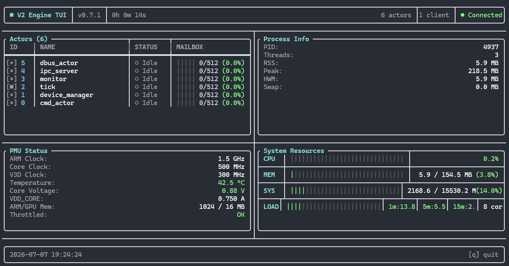

<p align="center">
  
  
  
  
</p>

<h1 align="center">V2 Engine</h1>
<p align="center">
  <b>경량 C++20 액터 모델 기반 서비스 프레임워크</b><br>
  메시지 하나면 끝나는, 공유 메모리 & 뮤텍스 프리 아키텍처
</p>

---

## 목차

- [왜 V2 Engine 인가?](#-왜-v2-engine-인가)
- [한눈에 보기](#-한눈에-보기)
- [데모](#-데모)
- [빠른 시작](#-빠른-시작)
- [기능](#-기능)
- [프로젝트 구조](#-프로젝트-구조)
- [설정](#-설정)
- [개발 환경](#-개발-환경)

---

## 🎯 왜 V2 Engine 인가?

기존 서비스 데몬은 **복잡한 스레드 동기화, 공유 메모리 경쟁, 콜백 지옥**에 시달리기 쉽습니다.
V2 Engine은 **액터 모델**을 채택하여:

- 모든 컴포넌트는 **독립된 액터**로 동작
- 액터 간 통신은 **메시지 전달**만 사용 (뮤텍스 최소화)
- **비동기 이벤트 루프** (epoll) 위에서 협력적 스케줄링
- IPC, D-Bus, I2C 디바이스, 모니터링, TUI를 **하나의 프레임워크**에서 제공

---

## 👀 한눈에 보기

```cpp
ActorSystem sys;

// 액터 생성
sys.createActor<MyActor>("my_actor", mailboxSize);

// 메시지 전송
sys.send("my_actor", MyMessage{42});

// 시스템 시작
sys.start();
sys.run();
```

---

## 🎬 데모

### 시스템 정보 확인

```bash
$ v2 info

  ▶ V2 Engine
    version: 0.7.1
    uptime:  0d 00h 14m 32s
```

### 액터 목록 조회

```bash
$ v2 actor -l

  actor_count: 6

  ID  NAME              STATE      ESSENTIAL
  --- ----------------- ---------- ---------
    0  tick              Opened     no
    1  monitor           Opened     yes
    2  ipc_server        Opened     yes
    3  cmd_actor         Opened     yes
    4  dbus_actor        Opened     yes
    5  device_manager    Opened     yes
```

### 액터 ON/OFF (런타임 제어)

```bash
$ v2 actor -d tick      # tick 액터 비활성화
$ v2 actor -e tick      # 다시 활성화
```

### 데몬 상태 확인

```bash
$ v2 -s

  V2 Engine — Status
    Daemon: running
    Socket: /tmp/v2_ipc.sock
    PID:    222320
```

### TUI 모니터 (실시간)

```bash
$ v2 -m
```



> TUI는 좌/우로 분할된 레이아웃을 제공하며, 각 액터를 체크박스로 ON/OFF 제어 가능합니다.

---

## 🚀 빠른 시작

### 1. 직접 빌드

```bash
# 요구사항: GCC 11+, CMake 3.14+, Ninja, lld
cmake -B build -G Ninja
cmake --build build

# 실행
./build/v2_main &              # 데몬 실행 (백그라운드)
./build/v2_cli info            # 데몬에 정보 요청
./build/v2_cli actor -l        # 액터 목록
./build/v2_tui                 # TUI 모니터 (별도 실행)
```

### 2. 설치 스크립트 (권장)

```bash
# 전체 설치 (의존성 + 빌드 + systemd 등록 + D-Bus 정책 + symlink)
./install.sh

# 특정 앱만 설치
./install.sh v2_main
./install.sh v2_cli
./install.sh v2_tui

# 의존성 설치 생략
SKIP_DEPS=1 ./install.sh

# 설치 후 CLI 사용
v2 info
v2 actor -l
v2 -m
```

> 설치 스크립트는 자동으로:
> - 시스템 패키지 설치 (`build-essential`, `cmake`, `ninja-build`, `lld`, `libsystemd-dev` 등)
> - Ninja 빌드 (Release 모드)
> - systemd 서비스 등록 (`v2_main`)
> - D-Bus 정책 파일 설치 (`com.v2.engine`)
> - `/usr/local/bin/v2` symlink 생성

### 3. 제거

```bash
./uninstall.sh
```

---

## 🔧 기능

### 코어 시스템

| 기능 | 설명 |
|------|------|
| **액터 모델** | 경량 액터 + bounded mailbox (`Mailbox<T>`), 협력적 스케줄링 |
| **std::variant 메시지** | `std::visit` 기반 타입-safe 메시지, 상속/형변환 제로 |
| **epoll 이벤트 루프** | timer FD, stop FD, transport I/O 통합 (`Dispatcher`) |
| **세마포어 스케줄링** | `std::counting_semaphore` (C++20) 기반 worker 획득/해제 |
| **타이머** | `timerfd_create()` + priority queue, one-shot/repeating |
| **JSON Lines 직렬화** | `nlohmann/json` 매크로 기반 메시지 marshal/unmarshal |
| **액터 생명주기** | `Closed → Opening → Opened → Closing`, essential 플래그 지원, null-safe 소멸 |
| **SignalHandler** | SIGINT/SIGTERM 등록으로 graceful shutdown |

### 서비스 액터

| 액터 | 역할 |
|------|------|
| **CmdActor** | 메시지 기반 명령 라우팅 (`info`, `actor -l/d/e`, `test`) |
| **IpcServerActor** | UDS 멀티클라이언트 IPC 서버 (명령 수신/응답) |
| **MonitorActor** | 시스템 리소스 수집 (CPU/RSS/memory/load avg) + PMU 데이터 (clock/temp/voltage), 스냅샷 전송 |
| **TickActor** | 주기적 틱 메시지 생성 |
| **DbusActor** | D-Bus 게이트웨이 (`com.v2.engine`), 메서드 등록/호출/시그널 |
| **DeviceManagerActor** | 하드웨어 디바이스 등록/해제/열거 |

### CLI 인터페이스

```
Usage: v2 <command>

Commands:
  help              도움말
  info              시스템 정보
  actor -l          액터 목록
  actor -d <name>   액터 비활성화
  actor -e <name>   액터 활성화
  pmu -s            PMU 상태 (clock/temp/voltage/throttled)
  test              테스트 명령어
  version / -v      버전 정보
  status  / -s      데몬 상태 확인
  monitor / -m      TUI 모니터 실행
```

### TUI 모니터

- **실시간 시스템 모니터링** — CPU, 메모리, uptime, 클라이언트 수
- **PMU 상태 패널** — 클럭(ARM/Core/V3D), 온도, 전압, 전류, throttled 상태 표시
- **분할 레이아웃** — 좌측 액터 목록 / 우측 시스템 패널 (`ResizableSplit`)
- **액터 ON/OFF 토글** — 체크박스로 런타임 액터 제어 (IPC 연동)
- **토스트 알림** — 액터 토글 결과 피드백
- **단축키** — `q` / `Q` 종료

### 전송 계층 & HAL

| 모듈 | 설명 |
|------|------|
| **UDS Server/Client** | Unix Domain Socket 멀티클라이언트 IPC |
| **I2C HAL** | Linux `/dev/i2c-N` + `ioctl(I2C_RDWR)` 드라이버 |
| **PMU HAL** | Raspberry Pi vcgencmd 기반 clock/temp/voltage/throttled 수집 (`IPmu`) |
| **ISys HAL** | procfs 기반 시스템 리소스 수집 추상화 (`ISys`) |
| **Dummy HAL** | 테스트용 빈 HAL 구현 |
| **D-Bus Bridge** | system bus 기반 메서드 호출, 시그널 발행/구독 |

### 빌드 시스템

- **C++20**, CMake 3.14+, Ninja generator
- **Debug**: AddressSanitizer + UndefinedBehaviorSanitizer
- **Release**: LTO (IPO) 최적화
- **ccache** 자동 탐색 및 적용
- **FetchContent** 외부 라이브러리 자동 다운로드 (FTXUI, nlohmann/json, sdbus-c++)
- **CTest** + **CPack** 지원
- **Google Test** (v1.17.0) 단위 테스트 — RingBuffer, Mailbox, ActorRegistry

---

## 📁 프로젝트 구조

```
src/
├── app/                      # 실행 파일
│   ├── main/                 #   v2_main — 데몬 (ActorSystem 구동)
│   ├── cli/                  #   v2_cli — CLI 클라이언트 (UDS IPC)
│   └── tui/                  #   v2_tui — TUI 모니터 (FTXui)
│       └── widgets/          #     Header, Footer, SystemPanel, ActorList, PmuPanel
├── service/                  # 비즈니스 액터
│   ├── cmd/                  #   명령 라우팅 (CmdActor)
│   ├── dbus/                 #   D-Bus 서버/클라이언트 핸들러
│   ├── device_manager/       #   하드웨어 디바이스 관리
│   ├── ipc/                  #   UDS IPC 서버 (IpcServerActor)
│   ├── monitor/              #   시스템 모니터링 (MonitorActor)
│   └── tick/                 #   주기적 틱 (TickActor)
├── core/                     # 액터 시스템 + 공통 유틸
│   ├── actor_system/         #   액터 런타임
│   │   ├── actor/            #     Actor base, ActorContext, Registry
│   │   ├── runtime/          #     Dispatcher, Scheduler, Worker, Mailbox
│   │   └── messages/         #     모든 메시지 타입 정의
│   └── common/               #   공통 유틸
│       ├── config/           #     Runtime/Platform 설정
│       ├── container/        #     RingBuffer
│       ├── log/              #     로깅
│       ├── os/               #     Epoll, Semaphore, SignalHandler
│       ├── time/             #     Timer, Time, Sleep
│       └── util/             #     Debug, Return
└── infra/                    # 전송 계층 + HAL
    ├── transport/            #   UDS Server/Client
    └── hal/                  #   I2C (Linux), PMU (RPi vcgencmd), ISys (procfs), Dummy (테스트)

의존성 방향: infra ← core ← service ← app (단방향)
```

---

## ⚙️ 설정

각 앱은 `config/` 디렉토리의 JSON 파일로 설정합니다.

### v2_main (데몬)

```json
{
    "log_level": 0,
    "worker_count": 1,
    "enable_tick": true,
    "enable_monitor": true,
    "enable_ipc_server": true,
    "enable_dbus": true
}
```

### v2_cli (CLI)

```json
{
    "log_level": 0,
    "worker_count": 0,
    "mailbox_size": 64,
    "epoll_max_events": 16,
    "enable_ipc_server": true
}
```

### v2_tui (TUI 모니터)

```json
{
    "log_level": 0,
    "worker_count": 0
}
```

### 전체 설정 옵션

| 필드 | 기본값 | 설명 |
|------|--------|------|
| `log_level` | `3` | 로그 레벨 (0=TRACE ~ 4=FATAL) |
| `worker_count` | `1` | Worker 스레드 수 |
| `worker_max_batch` | `32` | Worker 당 최대 배치 처리 수 |
| `mainloop_sleep_ms` | `1000` | 메인 루프 sleep 간격 |
| `mailbox_size` | `512` | 액터 메일박스 크기 |
| `epoll_max_events` | `64` | epoll 최대 이벤트 수 |
| `epoll_wait_timeout_ms` | `1000` | epoll 대기 타임아웃 |
| `enable_*` | `false` | 각 액터 활성화 여부 |
| `*_socket_path` | `/tmp/v2_*.sock` | UDS 소켓 경로 |
| `tick_interval_ms` | `100` | Tick 액터 주기 |
| `monitor_poll_interval_ms` | `100` | 모니터 폴링 주기 |
| `dbus_bus_name` | `com.v2.engine` | D-Bus 버스 네임 |

---

## 🛠 개발 환경

### 필수 요구사항

- **C++20** 지원 컴파일러 (GCC 11+ / Clang 14+)
- **CMake 3.14 이상**
- **Linux** 환경 (epoll, timerfd, eventfd, UDS)
- **lld** 링커
- **Ninja** 빌드 시스템
- **libsystemd-dev** (sdbus-c++ 의존성)

### 외부 라이브러리 (FetchContent 자동 다운로드)

| 라이브러리 | 버전 | 용도 |
|-----------|------|------|
| **FTXUI** | v7.0.0 | TUI 프레임워크 |
| **nlohmann/json** | v3.12.0 | JSON 파싱 |
| **sdbus-c++** | v2.3.1 | D-Bus C++ 바인딩 |

### 빌드 옵션

```bash
# Debug (기본, sanitizer 포함)
cmake -B build -G Ninja -DCMAKE_BUILD_TYPE=Debug

# Release (LTO 최적화)
cmake -B build -G Ninja -DCMAKE_BUILD_TYPE=Release

# 로그 레벨 지정
cmake -B build -G Ninja -DV2_DEFAULT_LOG_LEVEL=3
```

### 지원 플랫폼

| 플랫폼 | 상태 |
|--------|------|
| Linux | ✅ 완전 지원 (epoll, D-Bus, I2C) |
| macOS | ⚠️ 빌드만 가능 (제한적 기능) |
| Windows | ❌ 미지원 |

---
