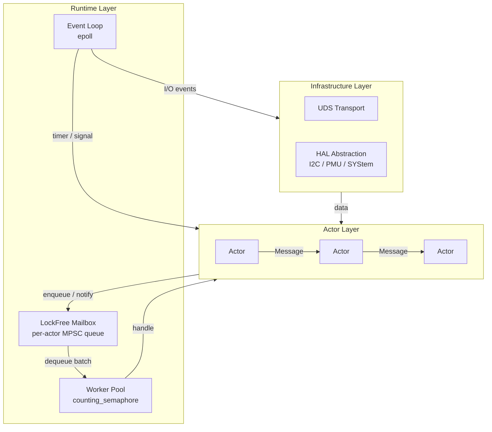
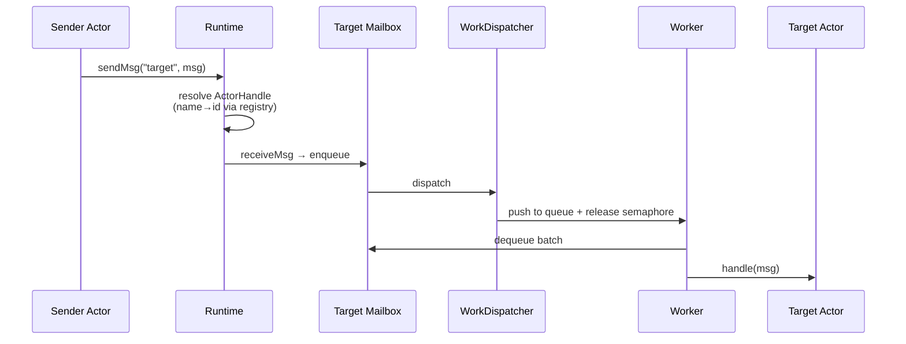
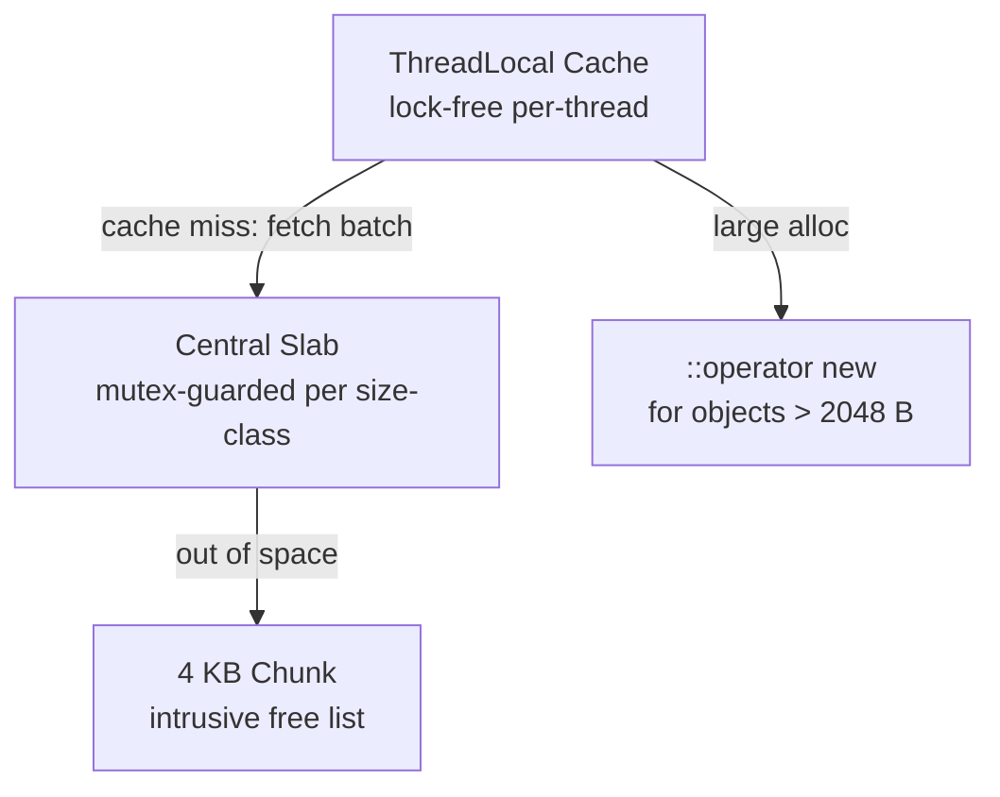
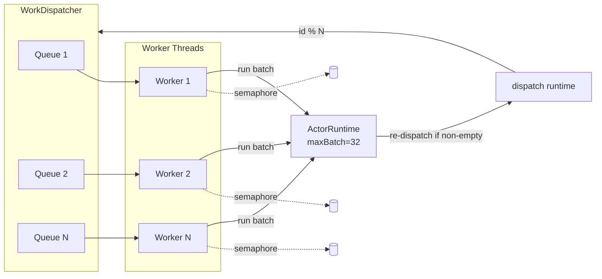
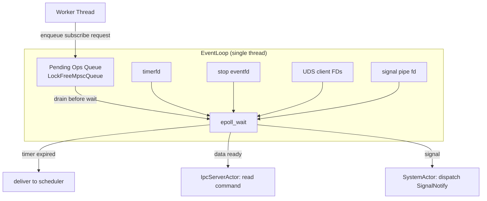
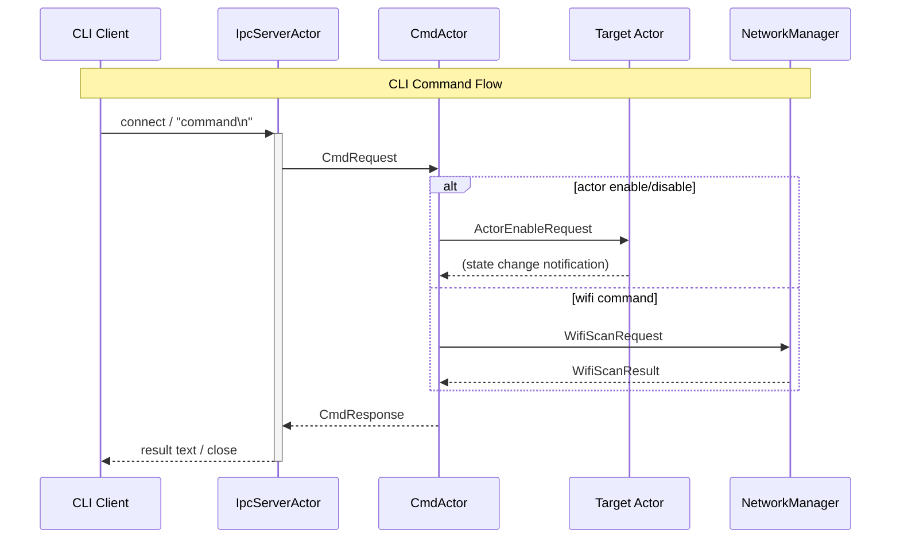
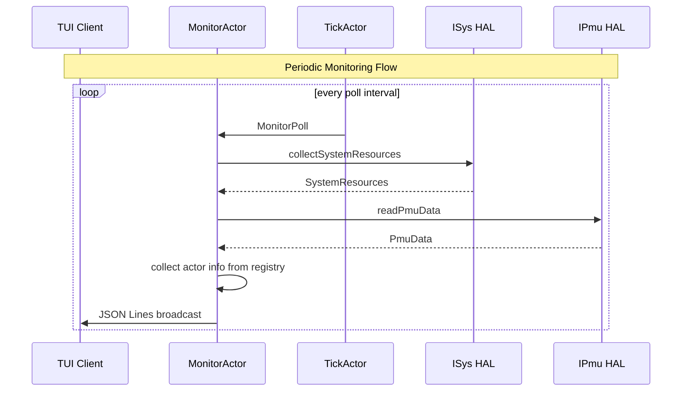
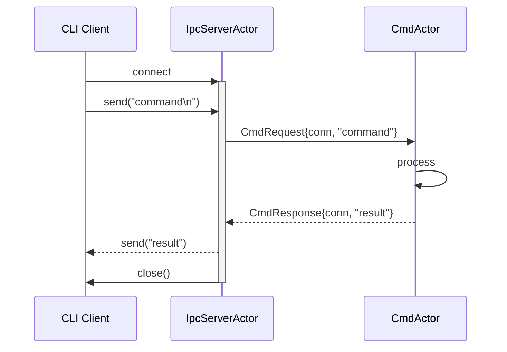

<p align="center">
  
  
  
  
</p>

<h1 align="center">V<sup>2</sup> Engine</h1>
<p align="center">
  <b> Visionary Vision Engine</b><br>
  Actor-model runtime framework
</p>

---

## Table of Contents

- [Overview](#overview)
- [Architecture](#architecture)
  - [System Layers](#system-layers)
  - [Actor Communication](#actor-communication)
  - [Threading Model](#threading-model)
- [Core System](#core-system)
  - [Actor Model](#actor-model)
  - [Message System](#message-system)
  - [Memory Model](#memory-model)
  - [Scheduling & Worker Pool](#scheduling--worker-pool)
  - [Event Loop](#event-loop)
- [Performance](#performance)
- [Service Actors](#service-actors)
- [Transport & HAL Layer](#transport--hal-layer)
- [Quick Start](#quick-start)
- [Project Structure](#project-structure)
- [Build & Dependencies](#build--dependencies)

---

## Overview

V² Engine is a C++20 actor-model runtime designed for long-running system daemons on Linux. It implements an efficient actor system with lock-free message passing, a semaphore-scheduled worker pool, an epoll-based event loop, and a TCMalloc-inspired memory allocator. The system includes service-layer actors for CLI IPC, system monitoring, D-Bus integration, Wi-Fi management, and hardware device management, delivering four executables: a daemon (`v2_main`), a CLI client (`v2_cli`), a TUI monitor (`v2_tui`), and a standalone benchmark CLI (`v2_bench_cli`). The core (`v2_core`) is a dependency-free C++20 subproject buildable and runnable on its own.

**Core design principles:**

- Every component is an isolated actor communicating via asynchronous message passing
- Lock-free data structures throughout the hot path — no mutex contention in message delivery
- Single-threaded event loop with thread-safe cross-thread operations via lock-free queues
- Cooperative scheduling with batch processing to amortize dispatch overhead

---

## Architecture

### System Layers

V² Engine is organized into three layers. The **Actor Layer** contains business logic actors with private mailboxes. The **Runtime Layer** provides message delivery, scheduling, and I/O multiplexing. The **Infrastructure Layer** abstracts transport and hardware access.


```mermaid
flowchart TB
    subgraph AL["Actor Layer"]
        direction LR
        A1[Actor] -->|Message| A2[Actor]
        A2 -->|Message| A3[Actor]
    end

    subgraph RL["Runtime Layer"]
        Mailbox[LockFree Mailbox<br/>per-actor MPSC queue]
        Worker[Worker Pool<br/>counting_semaphore]
        EL[Event Loop<br/>epoll]
    end

    subgraph IL["Infrastructure Layer"]
        UDS[UDS Transport]
        HAL[HAL Abstraction<br/>I2C / PMU / SYStem]
    end

    AL -->|enqueue / notify| Mailbox
    Mailbox -->|dequeue batch| Worker
    Worker -->|handle| AL
    EL -->|I/O events| IL
    EL -->|timer / signal| AL
    IL -->|data| AL
```

### Actor Communication

Actors communicate exclusively through asynchronous message passing. Each actor owns a private lock-free MPSC mailbox. A message travels from sender to receiver through four stages:


```mermaid
sequenceDiagram
    participant S as Sender Actor
    participant RT as Runtime
    participant MB as Target Mailbox
    participant WD as WorkDispatcher
    participant W as Worker
    participant T as Target Actor

    S->>RT: sendMsg("target", msg)
    RT->>RT: resolve ActorHandle<br/>(name→id via registry)
    RT->>MB: receiveMsg → enqueue
    MB->>WD: dispatch
    WD->>W: push to queue + release semaphore
    W->>MB: dequeue batch
    W->>T: handle(msg)
```

All inter-actor communication is **asynchronous and non-blocking** for the sender. The sender enqueues a message and continues immediately; the receiver processes it later on a worker thread.

### Threading Model

| Thread | Count | Role |
|--------|-------|------|
| Event Loop | 1 | `epoll_wait`, I/O dispatch, timerfd management |
| Worker | N (configurable) | `semaphore::acquire` → actor `run(batch)` loop |
| Timer | 0–1 | Portable core `Timer` (thread + semaphore); infra `LinuxTimer` (timerfd) overrides on Linux |

On Linux the composition root injects `EventLoopEpoll` + `LinuxTimer` together ("epoll injection = Linux detection"). Core defaults — a blocking mock loop and the portable thread-based `Timer` — keep `v2_core` standalone-buildable with messaging and timers working.

The main thread runs the event loop. Workers block on `std::counting_semaphore` and process messages in batches. All cross-thread operations (e.g., worker subscribing an FD) use lock-free MPSC queues — **no mutex contention on hot paths**.

---

## Core System

### Actor Model

Every actor derives from `Actor` and implements three hooks:

| Method | Description |
|--------|-------------|
| `int open()` | Lifecycle start |
| `int close()` | Lifecycle stop |
| `void handle(const Message&)` | Inbound message handler |

**Lifecycle:** `Closed → Opening → Opened → Closing → Closed`

Actors are identified by name (string) and ID (uint64\_t). References use `ActorHandle` — a weak reference `{id, generation, registry*}` where generation counters prevent use-after-free on recycled IDs.

**Communication API:**

```cpp
sendMsg("target", CmdRequest{conn, command});               // payload → Message auto-wrapped
sendMsg("target", Message::make(CmdRequest{conn, cmd}));    // explicit Message (equivalent)
sendMsgAfter("target", CmdRequest{conn, cmd}, 100);          // delayed
receiveMsg(CmdRequest{conn, cmd});                           // self-enqueue
startTimer(Tick{}, 1000, true);                              // repeating timer
```

Payload-typed overloads (via `static constexpr MessageId kId` on each message type) hide `Message::make` — the message id and allocator decision happen inside. `Message`-typed arguments still select the non-template overload for full compatibility.

Under the hood, `sendMsg` resolves the target via `ActorRegistry`, acquires the `ActorHandle`, enqueues into the target's mailbox, and notifies the work dispatcher.

### Message System

Messages are **type-erased, SBO-optimized, move-only** values constructed via `Message::make<T>(value)`:

```
Message {
    MessageId          id_;        // concrete type identifier
    StorageMode        mode_;      // Inline | Pool | Empty
    const MessageOps*  ops_;       // vtable: destroy / move / clone
    IMemoryAllocator*  allocator_; // pool used for Pool-stored payloads
    union {                        // 64-byte inline or heap pointer
        std::byte      inline_[64];
        void*          ptr_;
    };
}
```

**Dispatch pattern** — actors switch on `msg.id()` and extract via `msg.as<T>()`:

```cpp
void handle(const Message& msg) override {
    switch (msg.id()) {
    case MessageId::CmdRequest:
        handleCmd(msg.as<CmdRequest>());
        break;
    // ...
    }
}
```

**Storage strategy:**
- `sizeof(T) ≤ 64` and `alignof(T) ≤ alignof(max_align_t)` → stored **inline** (zero heap)
- Otherwise → allocator allocation via `defaultMemoryPool()` (or injected `IMemoryAllocator*`)
- 34 `MessageId` values across 10 categories (system, lifecycle, tick, IPC, monitor, D-Bus, device, command, network, Wi-Fi)

### Memory Model

The `MemoryPool` is a TCMalloc-inspired tiered allocator optimized for objects ≤ 2048 B. It implements the `IMemoryAllocator` port and is **instance-based** — a process-lifetime default instance is provided by `defaultMemoryPool()`, and the port contract allows tests/subsystems to swap in their own allocator.


```mermaid
flowchart TB
    TLS[ThreadLocal Cache<br/>lock-free per-thread]
    Slab[Central Slab<br/>mutex-guarded per size-class]
    Chunk[4 KB Chunk<br/>intrusive free list]
    Fallback[::operator new<br/>for objects > 2048 B]

    TLS -->|cache miss: fetch batch| Slab
    Slab -->|out of space| Chunk
    TLS -->|large alloc| Fallback
```

**9 size classes:**

| Index | Block Size | Batch | Chunk Utilization |
|-------|-----------|-------|-------------------|
| 0     | 8 B       | 64    | 512 B             |
| 1     | 16 B      | 64    | 1 KB              |
| 2     | 32 B      | 32    | 1 KB              |
| 3     | 64 B      | 32    | 2 KB              |
| 4     | 128 B     | 16    | 2 KB              |
| 5     | 256 B     | 16    | 4 KB              |
| 6     | 512 B     | 8     | 4 KB              |
| 7     | 1024 B    | 4     | 4 KB              |
| 8     | 2048 B    | 2     | 4 KB              |

**Allocation path:**
1. Thread-local cache hit → O(1), no atomics
2. Cache miss → fetch batch from central Slab (mutex), keep N-1 locally
3. Slab miss → allocate new 4 KB Chunk, divide into blocks
4. ≥ 2048 B → `::operator new`

Deallocation reverses the path. Excess blocks return to the central Slab when the thread-local cache exceeds the batch size. **No lock contention on the common path.**

> **Message allocation**: `Message::make<T>` uses the `defaultMemoryPool()` fallback (or the `IMemoryAllocator*` carried by the message) for payloads exceeding the 64-byte inline buffer.

### Scheduling & Worker Pool

The `WorkDispatcher` assigns each actor to a fixed worker via `actor->id() % N`:


```mermaid
flowchart LR
    subgraph Dispatcher["WorkDispatcher"]
        Q1[Queue 1]
        Q2[Queue 2]
        QN[Queue N]
    end
    subgraph Workers["Worker Threads"]
        W1[Worker 1]
        W2[Worker 2]
        WN[Worker N]
    end
    Dispatch[dispatch runtime] -->|id % N| Dispatcher
    Q1 --> W1
    Q2 --> W2
    QN --> WN
    W1 -.->|semaphore| S1[( )]
    W2 -.->|semaphore| S2[( )]
    WN -.->|semaphore| SN[( )]
    W1 -->|run batch| RT[ActorRuntime<br/>maxBatch=32]
    W2 -->|run batch| RT
    WN -->|run batch| RT
    RT -->|re-dispatch if non-empty| Dispatch
```

```
worker(id):
    while running:
        semaphore->acquire()                 // block
        runtime = queue[id]->pop()           // dequeue
        count = runtime->run(maxBatch)       // process up to N messages
        if runtime->mailbox not empty:
            dispatch(runtime)                // work-conserving
```

Key design decisions:
- **Cooperative scheduling** — actors yield after their batch, no preemption
- **Batch processing** — maxBatch=32 amortizes semaphore overhead
- **Continuation dispatch** — non-empty mailboxes are immediately re-dispatched

### Event Loop

The `EventLoopEpoll` is a single-threaded epoll multiplexer. It monitors four FD categories:


```mermaid
flowchart TB
    subgraph EL["EventLoop (single thread)"]
        EP[epoll_wait]
        PQ[Pending Ops Queue<br/>LockFreeMpscQueue]
        TF[timerfd]
        SF[stop eventfd]
        UF[UDS client FDs]
        PF[signal pipe fd]
    end
    WorkerThread[Worker Thread] -->|enqueue subscribe request| PQ
    PQ -->|drain before wait| EP
    TF --> EP
    SF --> EP
    UF --> EP
    PF --> EP
    EP -->|timer expired| Timer[deliver to scheduler]
    EP -->|data ready| Ipc[IpcServerActor: read command]
    EP -->|signal| Sys[SystemActor: dispatch SignalNotify]
```

**Thread-safe subscription:** If called from the event-loop thread, `epoll_ctl` runs immediately. Otherwise, the operation is enqueued to the lock-free `Pending Ops Queue` and the event loop is woken via `eventfd`. `EventLoopEpoll`, `LinuxTimer`, and the self-pipe `SignalHandler` live in `infra/platform/linux/` and are injected into the core via the `IEventLoop` port.

**Timer system** is exposed through the `ITimer` port. Core provides a portable `Timer` (thread + semaphore, std-only) as the default implementation; on Linux the composition root injects `LinuxTimer`, a `TimerBase`-derived override using `timerfd_create(CLOCK_MONOTONIC)` — no polling, no extra threads. Internally: min-heap of pool-allocated `TimerNode` (free-list for slot reuse). Expired callbacks execute outside the lock to prevent reentrancy deadlocks.

---

## Performance

Benchmark suite: `v2_bench_cli <name>` (standalone benchmark CLI)

```
Throughput : 7.1M msgs/sec   (workers=2, LockFreeMailbox)
P50 Latency: 378 ns           (workers=1)
P99 Latency: 641 ns           (workers=1)
Concurrent : 7.97M push/sec   (producers=2, multi-producer contention)
Timer Acc. : 98%+             (100ms interval, ±2ms jitter)
Timer Add  : 775 ns           (single timer insertion)
Timer Batch: 20.6M/s          (256-batch insertion)
Timer Dispatch: 15.3M/s       (256-batch dispatch)
```

| Benchmark | Objective | Methodology | Result |
|-----------|-----------|-------------|--------|
| [throughput](docs/benchmark/throughput.md) | End-to-end message throughput | N actors sending `Tick` round-robin, measure completion time | 7.1M msg/s |
| [latency](docs/benchmark/latency.md) | Single-message tail latency | Ping-pong with timestamp, sort 100k samples | P50=378ns, P99=641ns |
| [contention](docs/benchmark/contention.md) | Multi-producer concurrent push | N threads flooding single actor mailbox | 7.97M push/s |
| [scaling](docs/benchmark/scaling.md) | Worker/actor scaling efficiency | Throughput sweep, worker count 1→64 | Single-worker optimal (lock-free contention tradeoff) |
| [backpressure](docs/benchmark/backpressure.md) | Mailbox overflow behavior | Flood beyond capacity at various `maxBatch` | 0% drop at maxBatch ≥ 32 |
| [scheduler](docs/benchmark/scheduler.md) | Timer scheduling precision | Repeating timer (100ms), measure inter-fire intervals | 100% accuracy |

```bash
# Run individual benchmarks
v2_bench_cli throughput --workers 4 --actors 1
v2_bench_cli latency --iterations 50000
v2_bench_cli contention --producers 8
v2_bench_cli scaling
v2_bench_cli backpressure
v2_bench_cli scheduler --interval 50 --duration 5000
v2_bench_cli list      # list available benchmarks
v2_bench_cli all       # run all benchmarks
```

All benchmarks disable the metrics subsystem during execution to eliminate measurement perturbation.

---

## Service Actors

| Actor | Role | Handles | Sends |
|-------|------|---------|-------|
| **CmdActor** | CLI command parser and dispatcher | `CmdRequest`, `WifiScanResult`, `WifiStatusResult`, `WifiConnectResult`, `WifiDisconnectResult` | `CmdResponse`, `ActorEnable/DisableRequest`, `Wifi{Scan,Connect,Disconnect,AutoReconnect}Request` |
| **IpcServerActor** | UDS IPC server — receives CLI commands, returns responses | `IpcNewConnection`, `IpcDataReceived`, `CmdResponse` | `CmdRequest` |
| **MonitorActor** | Periodic system resource + PMU data collection, JSON broadcast | `MonitorPoll`, `MonitorNewConnection`, `MonitorClientDisconnected` | — (writes directly to UDS clients) |
| **TickActor** | Periodic heartbeat generator | `Tick` | — |
| **DbusActor** | D-Bus gateway — exposes methods, calls external services, subscribes signals | `DbusRegister/UnregisterMethod`, `DbusIncomingMethodCall`, `DbusMethodCallResult`, `DbusProxyCallRequest`, `DbusSubscribeSignal` | `DbusRegisterResult`, `DbusIncomingMethodCall`, `DbusProxyCallResult`, `DbusSignalEvent` |
| **DeviceManagerActor** | In-memory HAL device registry | `DeviceRegister`, `DeviceUnregister`, `DeviceEnumerate` | `DeviceList` |
| **NetworkManagerActor** | Wi-Fi management via NetworkManager D-Bus API | `Tick`, `WifiScan/Connect/Disconnect/AutoReconnectRequest`, `NmStatusRequest` | `WifiScan/Status/Connect/DisconnectResult` |
| **SystemActor** | OS signal handling via self-pipe trick, actor state notifications | `SignalNotify` | — |

### Message Flow


```mermaid
sequenceDiagram
    participant CLI as CLI Client
    participant IPC as IpcServerActor
    participant CMD as CmdActor
    participant TGT as Target Actor
    participant NM as NetworkManager

    Note over CLI,NM: CLI Command Flow
    CLI->>+IPC: connect / "command\n"
    IPC->>CMD: CmdRequest
    
    alt actor enable/disable
        CMD->>TGT: ActorEnableRequest
        TGT-->>CMD: (state change notification)
    else wifi command
        CMD->>NM: WifiScanRequest
        NM-->>CMD: WifiScanResult
    end
    
    CMD-->>IPC: CmdResponse
    IPC-->>-CLI: result text / close
```


```mermaid
sequenceDiagram
    participant CLI as TUI Client
    participant Mon as MonitorActor
    participant Tick as TickActor
    participant SYS as ISys HAL
    participant PMU as IPmu HAL

    Note over CLI,PMU: Periodic Monitoring Flow
    loop every poll interval
        Tick->>Mon: MonitorPoll
        Mon->>SYS: collectSystemResources
        SYS-->>Mon: SystemResources
        Mon->>PMU: readPmuData
        PMU-->>Mon: PmuData
        Mon->>Mon: collect actor info from registry
        Mon->>CLI: JSON Lines broadcast
    end
```

```mermaid
sequenceDiagram
    participant Ext as External D-Bus Client
    participant Dbus as DbusActor
    participant Srv as DbusServerHandler
    participant Own as OwnerActor
    participant Cli as DbusClientHandler
    participant NM as NetworkManager

    Note over Ext,NM: D-Bus Server Flow (exposing methods)
    Ext->>+Dbus: method call on com.v2.engine
    Srv->>Own: DbusIncomingMethodCall
    Own-->>Srv: DbusMethodCallResult
    Srv-->>-Ext: reply

    Note over Ext,NM: D-Bus Client Flow (calling external services)
    Own->>+Dbus: DbusProxyCallRequest
    Cli->>NM: D-Bus method call
    NM-->>Cli: result
    Dbus-->>-Own: DbusProxyCallResult
```

### IPC Protocol

The CLI communicates with the daemon over **Unix Domain Socket** using a simple request-response protocol:


```mermaid
sequenceDiagram
    participant Client as CLI Client
    participant Server as IpcServerActor
    participant Cmd as CmdActor

    Client->>+Server: connect
    
    Client->>Server: send("command\n")
    Server->>Cmd: CmdRequest{conn, "command"}
    Cmd->>Cmd: process
    Cmd-->>Server: CmdResponse{conn, "result"}
    Server-->>Client: send("result")
    Server->>Client: close()
    deactivate Server
```

A separate **monitor channel** uses **JSON Lines** (`\n`-delimited JSON objects) for real-time system monitoring data pushed to all connected TUI clients.

---

## Transport & HAL Layer

| Module | Implementation | Backend |
|--------|---------------|---------|
| **UDS Server** | `UdsServer` — stream-oriented, accept/subscribe pattern | `AF_UNIX`/`SOCK_STREAM`, epoll-integrated |
| **UDS Client** | `UdsClient` — connect/send/recv | `AF_UNIX`/`SOCK_STREAM` |
| **I2C HAL** | `i2c_linux` — combined write+read transactions | Linux `/dev/i2c-N`, `ioctl(I2C_RDWR)` |
| **PMU HAL** | `pmu_rsp5` — vcgencmd subprocess, 9 calls per read | RPi `vcgencmd` CLI |
| **PMU Mock** | `pmu_mock` — hardcoded values | — |
| **ISys HAL** | `sys_linux` — procfs parsing, per-process CPU via sliding window | `/proc/self/status`, `/proc/stat`, `/proc/loadavg`, `/proc/meminfo` |
| **ISys Mock** | `sys_mock` — hardcoded values | — |

The `DbusActor` uses `sdbus-c++` for D-Bus integration. The `NetworkManagerActor` borrows the `DbusActor`'s connection to create its own proxy to `org.freedesktop.NetworkManager`, avoiding a second system bus connection.

---

## Quick Start

```bash
# Build
cmake -B build -G Ninja
cmake --build build

# Run (manual)
./build/v2_main              # start daemon
./build/v2_cli actor list    # list actors
./build/v2_cli pmu status    # query PMU data
./build/v2_cli -m            # TUI monitor

# Install (systemd service + D-Bus policy + symlinks)
./install.sh
v2 actor list
```

### CLI Commands

```
Usage: v2 <command>

Commands:
  actor list                    List all actors (ID, name, state, essential)
  actor enable  <name>          Enable a disabled actor
  actor disable <name>          Disable a non-essential actor
  pmu status                    PMU clock/temp/voltage/throttle data
  wifi scan                     Trigger Wi-Fi scan
  wifi list                     List access points from last scan
  wifi connect <ssid> [pass]    Connect to a Wi-Fi network
  wifi disconnect               Disconnect current Wi-Fi
  wifi status                   Current Wi-Fi state
  wifi autoconnect <on|off>     Toggle auto-reconnect
  metrics enable|disable|snapshot|reset
  status / -s                   Check daemon status
  monitor / -m                  Launch TUI monitor
  version / -v                  Print version
```

---

## Project Structure

```
src/
├── core/                       # Standalone subproject (v2_core) — C++20, std-only, no external links
│   ├── CMakeLists.txt          #   independent buildable; messaging + portable timer work standalone
│   ├── actor_system/           #   Core actor framework
│   │   ├── actor/              #     Actor base, ActorHandle (generation-based), ActorRegistry
│   │   ├── messages/           #     Message, MessageTraits, SystemMessages (engine-only types)
│   │   ├── runtime/            #     ActorRuntime, Scheduler, WorkDispatcher, Worker, Supervisor,
│   │   │                       #     Mailbox adapter + IMailbox port
│   │   └── actor_system.hpp    #     ActorSystem + createDefaultActorSystem factory
│   ├── common/                 #   Pure std-only domain utilities
│   │   ├── container/          #     LockFreeMpscQueue, RingBuffer, CacheLine
│   │   ├── di/                 #     ServiceContainer (lightweight DI)
│   │   ├── memory/             #     IMemoryAllocator port, MemoryPool, SizeClass, Slab, Chunk,
│   │   │                       #     FreeList, ThreadLocalCache
│   │   ├── log/                #     Logger (instance + activeLogger handle)
│   │   ├── timer/              #     ITimer port, TimerBase, portable Timer (thread + semaphore)
│   │   ├── time/               #     Time, Sleep
│   │   └── util/               #     Debug (V2_ASSERT/V2_PANIC), Return
│   └── perf/metrics/           #   Metrics (instance + activeMetrics handle)
├── service/                    # Business actors (use cases — core + own ports only)
│   ├── cmd/                    #   Command routing (CmdActor) + cmd_messages
│   ├── dbus/                   #   D-Bus gateway (DbusActor + handlers) + dbus_messages
│   ├── device_manager/         #   Device registry (DeviceManagerActor) + device_manager_messages
│   ├── ipc/                    #   UDS IPC server (IpcServerActor) + ipc_messages
│   ├── monitor/                #   System monitoring (MonitorActor) + monitor_messages
│   ├── network_manager/        #   Wi-Fi management (NetworkManagerActor + WifiHandler)
│   ├── system/                 #   Signal handling (SystemActor)
│   ├── tick/                   #   Tick generator (TickActor) + tick_messages
│   └── ports/                  #   Service-owned ports: IPmu, ISys, II2c (consumer-owned)
├── infra/                      # Adapters — OS / 3rd-party implementations only
│   ├── platform/linux/         #   EventLoopEpoll (IEventLoop), LinuxTimer (timerfd), SignalHandler, Epoll
│   ├── threading/              #   PosixThread (worker naming)
│   ├── memory/                 #   MemoryPoolAllocator (IMemoryAllocator adapter)
│   ├── config/                 #   JsonConfigLoader (nlohmann parsing)
│   ├── ui/                     #   FtxuiRenderer
│   ├── transport/uds/          #   UdsServer / UdsClient
│   ├── hal/                    #   I2C, PMU (RPi vcgencmd), ISys (procfs), Dummy
│   └── mock/                   #   MockAllocator, MockTimeSource, TestRegistry
└── app/                        # Executables — Composition Root
    ├── main/                   #   v2_main — daemon
    ├── cli/                    #   v2_cli — command-line client
    └── tui/                    #   v2_tui — FTXUI-based monitor

bench/                          # Standalone benchmark CLI (v2_bench_cli) + 6 benchmarks
test/                           # GoogleTest suite
├── unit/                       #   Pure core unit tests (no infra links)
├── integration/                #   Infra-dependent integration tests
└── standalone/                 #   v2_core_smoke — links v2_core only, proves std-only boundary

Dependency direction (inward, enforced by CMake targets):
  app → service → core ← infra;  infra implements core + service-owned ports
```

> **v2_core standalone**: `cmake -S src/core -B <dir>` builds the core layer alone. The boundary is enforced at link time by `test/standalone` (`v2_core_smoke`, linked against `v2_core` only) plus the compile-flag checks in the refactoring roadmap.

---

## Build & Dependencies

### Requirements

| Tool | Version |
|------|---------|
| C++20 compiler | GCC 14+ (std::format; Ubuntu 22.04: `ubuntu-toolchain-r/test` PPA) |
| CMake | 3.14+ |
| Ninja | — |
| gold linker | `binutils-gold` |
| libsystemd-dev | sdbus-c++ system dependency |

### Build Options

```bash
# Debug — AddressSanitizer + UndefinedBehaviorSanitizer
cmake -B build -G Ninja -DCMAKE_BUILD_TYPE=Debug

# Release — LTO/IPO optimized
cmake -B build -G Ninja -DCMAKE_BUILD_TYPE=Release

# Tests (on by default; disable for a lean build)
cmake -B build -G Ninja -DBUILD_TESTING=OFF
```

> Log level (0=Verbose .. 5=Fatal) and other runtime settings are configured per-app via JSON files in `config/` (e.g. `config/v2_main.json` → `log_level`), not via CMake flags.

### Dependencies (FetchContent)

| Library | Version | Use |
|---------|---------|-----|
| [FTXUI](https://github.com/ArthurSonzogni/FTXUI) | v7.0.0 | Terminal UI framework |
| [nlohmann/json](https://github.com/nlohmann/json) | v3.12.0 | JSON parsing/serialization |
| [sdbus-c++](https://github.com/Kistler-Group/sdbus-cpp) | v2.3.1 | D-Bus C++ binding |
| GoogleTest | v1.17.0 | Unit testing (optional) |

### Platform Support

| Platform | Status |
|----------|--------|
| Linux | ✅ Full support (epoll, D-Bus, I2C, UDS, timerfd) |
| macOS | ⚠️ Build only (limited functionality) |
| Windows | ❌ Not supported |

---

## Uninstall

```bash
./uninstall.sh    # stops systemd service, removes D-Bus policy
```

---

## Related Documentation

- [Roadmap](docs/plans/roadmap.md) — development roadmap and phase status
- [Refactoring roadmap](docs/plans/refactoring_roadmap.md) — clean-architecture refactor of core/service/infra (phases, decisions, status)
- [Benchmark details](docs/benchmark/) — per-benchmark methodology and results
- [Mailbox comparison](docs/architecture/mailbox_comparison.md) — lock-free vs mutex mailbox analysis
- [Configuration](config/) — per-app JSON configuration files under `config/`
