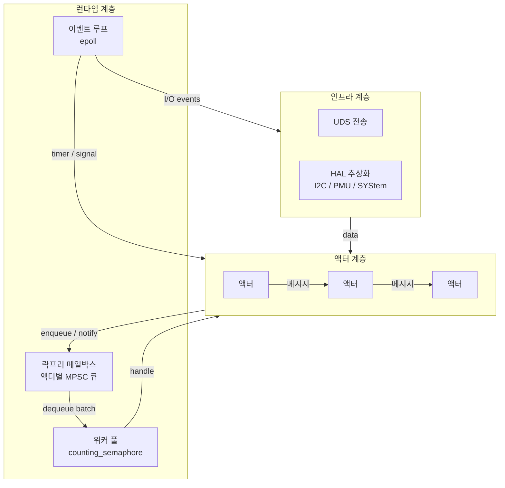
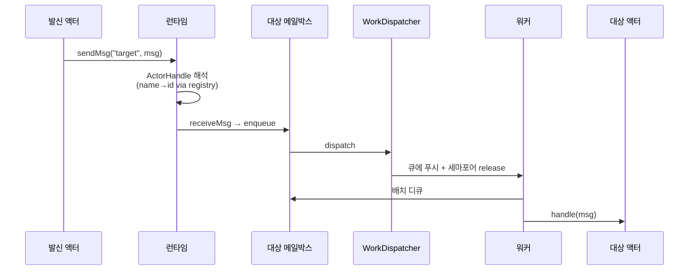
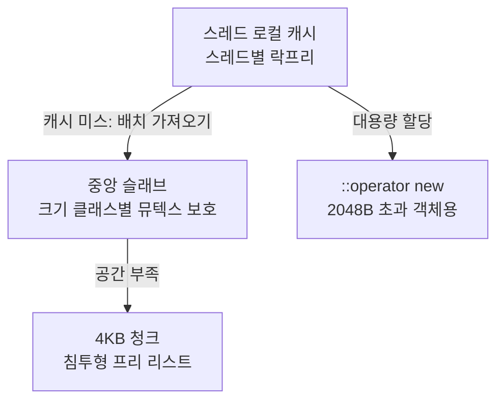
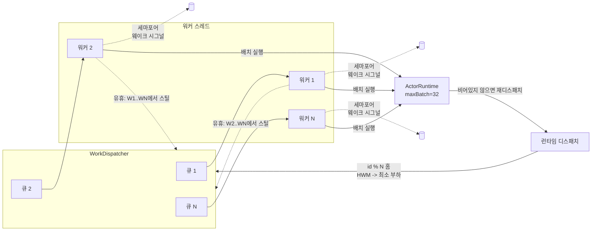
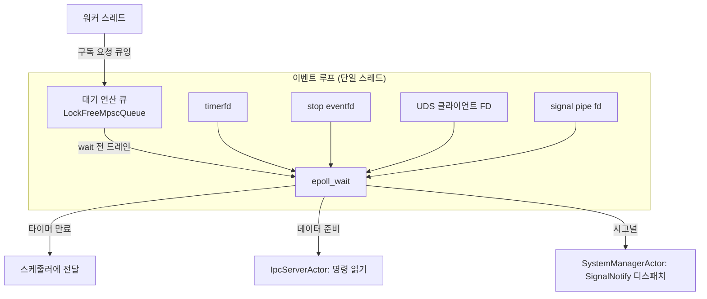
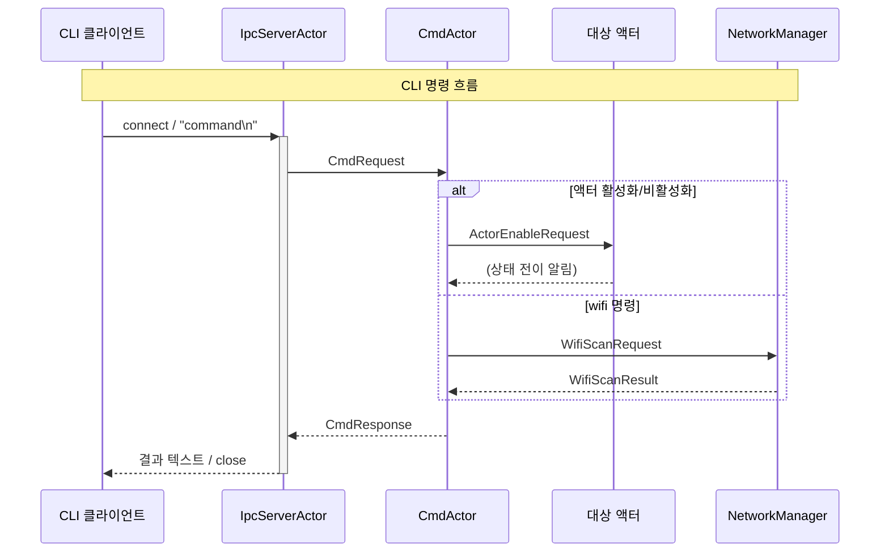
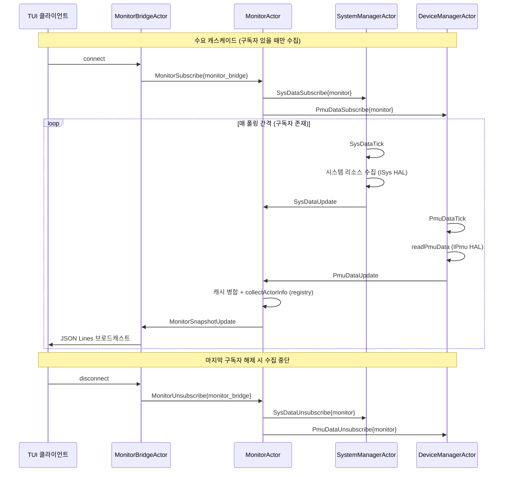
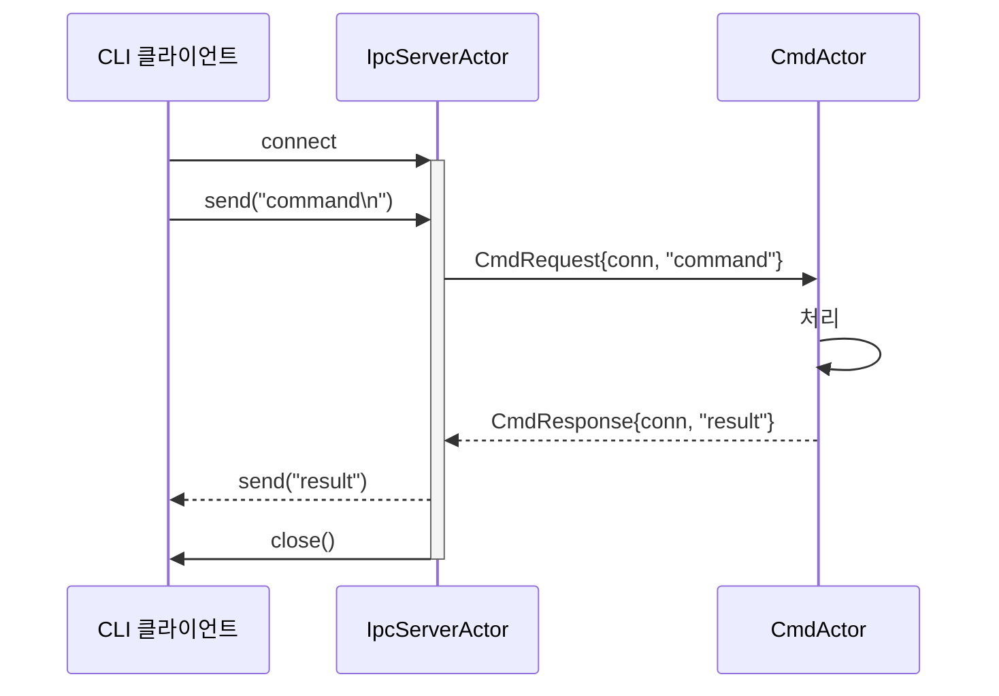

<p align="center">
  
  
  
  
</p>

<h1 align="center">V<sup>2</sup> Engine</h1>
<p align="center">
  <b> Visionary Vision Engine</b><br>
  액터 모델 런타임 프레임워크
</p>

---

## 목차

- [개요](#개요)
- [프로젝트 메트릭](#프로젝트-메트릭)
- [아키텍처](#아키텍처)
  - [시스템 계층](#시스템-계층)
  - [액터 통신](#액터-통신)
  - [스레딩 모델](#스레딩-모델)
- [코어 시스템](#코어-시스템)
  - [액터 모델](#액터-모델)
  - [메시지 시스템](#메시지-시스템)
  - [메모리 모델](#메모리-모델)
  - [스케줄링 & 워커 풀](#스케줄링--워커-풀)
  - [이벤트 루프](#이벤트-루프)
- [성능](#성능)
- [서비스 액터](#서비스-액터)
- [전송 & HAL 계층](#전송--hal-계층)
- [빠른 시작](#빠른-시작)
- [프로젝트 구조](#프로젝트-구조)
- [빌드 & 의존성](#빌드--의존성)

---

## 개요

V² Engine은 리눅스에서 장시간 실행되는 시스템 데몬을 위해 설계된 C++20 액터 모델 런타임입니다. 락프리 메시지 전달, 세마포어 스케줄링 워커 풀, epoll 기반 이벤트 루프, TCMalloc 기반 메모리 할당자를 갖춘 효율적인 액터 시스템을 구현합니다. CLI IPC, 시스템 모니터링, D-Bus 통합, Wi-Fi 관리, 하드웨어 디바이스 관리를 위한 서비스 계층 액터를 포함하며, 데몬(`v2_main`), CLI 클라이언트(`v2_cli`), TUI 모니터(`v2_tui`), 독립 벤치마크 CLI(`v2_bench_cli`) 4개 실행 파일을 제공합니다. D-Bus와 Wi-Fi 관리는 컴파일되지만 **기본적으로 비활성화**됩니다 — `config/v2_main.json`을 통해 다시 활성화하세요. 코어(`v2_core`)는 외부 의존성이 없는 독립 빌드·실행 가능한 C++20 서브프로젝트입니다.

**핵심 설계 원칙:**

- 모든 구성 요소는 비동기 메시지 전달을 통해 통신하는 격리된 액터
- 핫 패스 전반에 락프리 데이터 구조 — 메시지 전달에서 뮤텍스 경쟁 없음
- 락프리 큐를 통한 스레드 안전 스레드 간 연산을 지원하는 단일 스레드 이벤트 루프
- 디스패치 오버헤드를 경감하는 배치 처리 기반 협력 스케줄링

---

## 프로젝트 메트릭

| 항목 | 값 |
|------|---|
| 개발 기간 | 2026-05-25 → 2026-08-15 (82일, ~2.7개월) |
| 커밋 | 320 (활성 52일 기준) |
| 전체 LOC | ~13,297 (187개 파일) |
| 소스 LOC | ~9,386 (src/) |
| 코어 LOC | ~3,994 (src/core/) |
| 서비스 LOC | ~2,600 (src/service/) |
| 인프라 LOC | ~1,299 (src/infra/) |
| 앱 LOC | ~1,493 (src/app/) |
| 벤치 LOC | ~1,328 (bench/) |
| 테스트 LOC | ~2,583 (test/) |
| 실행 파일 | 4개 (`v2_main`, `v2_cli`, `v2_tui`, `v2_bench_cli`) |
| 테스트 스위트 | 143개 (`ctest`) |

```bash
# LOC 수치 재현
find src bench test -type f \( -name "*.cpp" -o -name "*.hpp" -o -name "*.h" -o -name "*.c" \) | xargs wc -l | tail -1
```

---

## 아키텍처

### 시스템 계층

V² Engine은 세 계층으로 구성됩니다. **액터 계층**은 전용 메일박스를 가진 비즈니스 로직 액터를 포함합니다. **런타임 계층**은 메시지 전달, 스케줄링, I/O 멀티플렉싱을 제공합니다. **인프라 계층**은 전송 및 하드웨어 접근을 추상화합니다.


```mermaid
flowchart TB
    subgraph AL["액터 계층"]
        direction LR
        A1[액터] -->|메시지| A2[액터]
        A2 -->|메시지| A3[액터]
    end

    subgraph RL["런타임 계층"]
        Mailbox[락프리 메일박스<br/>액터별 MPSC 큐]
        Worker[워커 풀<br/>counting_semaphore]
        EL[이벤트 루프<br/>epoll]
    end

    subgraph IL["인프라 계층"]
        UDS[UDS 전송]
        HAL[HAL 추상화<br/>I2C / PMU / SYStem]
    end

    AL -->|enqueue / notify| Mailbox
    Mailbox -->|dequeue batch| Worker
    Worker -->|handle| AL
    EL -->|I/O events| IL
    EL -->|timer / signal| AL
    IL -->|data| AL
```

### 액터 통신

액터는 비동기 메시지 전달을 통해서만 통신합니다. 각 액터는 락프리 MPSC 메일박스를 소유합니다. 메시지는 발신자에서 수신자까지 네 단계를 거칩니다:


```mermaid
sequenceDiagram
    participant S as 발신 액터
    participant RT as 런타임
    participant MB as 대상 메일박스
    participant WD as WorkDispatcher
    participant W as 워커
    participant T as 대상 액터

    S->>RT: sendMsg("target", msg)
    RT->>RT: ActorHandle 해석<br/>(name→id via registry)
    RT->>MB: receiveMsg → enqueue
    MB->>WD: dispatch
    WD->>W: 큐에 푸시 + 세마포어 release
    W->>MB: 배치 디큐
    W->>T: handle(msg)
```

모든 액터 간 통신은 발신자에게 **비동기적이고 논블로킹**입니다. 발신자는 메시지를 큐잉하고 즉시 계속합니다; 수신자는 워커 스레드에서 나중에 처리합니다.

### 스레딩 모델

| 스레드 | 수 | 역할 |
|--------|---|------|
| 이벤트 루프 | 1 | `epoll_wait`, I/O 디스패치, timerfd 관리 |
| 워커 | N (설정 가능) | `semaphore::try_acquire_for` → 자체 큐 팝 → 스틸 → 액터 `run(batch)` 루프 |
| 타이머 | 0–1 | 이동 가능한 코어 `Timer` (스레드 + 세마포어); 인프라 `LinuxTimer` (timerfd)가 리눅스에서 오버라이드 |

리눅스에서는 조합 루트가 `EventLoopEpoll` + `LinuxTimer`를 함께 주입합니다("epoll 주입 = 리눅스 감지"). 코어 기본값 — 차단 모의 루프와 이동 가능한 스레드 기반 `Timer` — 는 `v2_core`가 독립 빌드 가능하고 메시징·타이머가 동작하도록 보장합니다.

메인 스레드가 이벤트 루프를 실행합니다. 워커는 `std::counting_semaphore`에서 차단되고 메시지를 배치로 처리합니다. 모든 스레드 간 연산(예: 워커가 FD 구독)에 락프리 MPSC 큐를 사용합니다 — **핫 패스에 뮤텍스 경쟁 없음**.

---

## 코어 시스템

### 액터 모델

모든 액터는 `Actor`를 파생하고 세 가지 훅을 구현합니다:

| 메서드 | 설명 |
|--------|------|
| `int open()` | 생명주기 개시 |
| `int close()` | 생명주기 종료 |
| `void handle(const Message&)` | 인바운드 메시지 핸들러 |

**생명주기:** `Closed → Opening → Opened → Closing → Closed`

액터는 이름(string)과 ID(uint64_t)로 식별됩니다. 참조는 `ActorHandle`을 사용합니다 — 재활용된 ID에서 use-after-free를 방지하는 세대 카운터를 가진 약한 참조 `{id, generation, registry*}`입니다.

**통신 API:**

```cpp
sendMsg("target", CmdRequest{conn, command});               // payload → Message 자동 래핑
sendMsg("target", Message::make(CmdRequest{conn, cmd}));    // 명시적 Message (동일)
sendMsgAfter("target", CmdRequest{conn, cmd}, 100);          // 지연
receiveMsg(CmdRequest{conn, cmd});                           // 셀프 큐잉
startTimer(Tick{}, 1000, true);                              // 반복 타이머
```

페이로드 타입 오버로드(각 메시지 타입의 `static constexpr MessageId kId` 경유)는 `Message::make`를 숨깁니다 — 메시지 ID와 할당자 판정이 내부에서 일어납니다. `Message` 타입 인자는 완전한 호환성을 위해 여전히 비템플릿 오버로드를 선택합니다.

내부적으로 `sendMsg`는 `ActorRegistry`를 통해 대상을 해석하고, `ActorHandle`을 획득하며, 대상 메일박스에 큐잉하고, 워커 디스패처에 알림합니다.

### 메시지 시스템

메시지는 `Message::make<T>(value)`를 통해 생성되는 **타입 소거·SBO 최적화·이동 전용** 값입니다:

```
Message {
    MessageId          id_;        // concrete type identifier
    StorageMode        mode_;      // Inline | Pool | Empty
    const MessageOps*  ops_;       // vtable: destroy / move / clone
    IMemoryAllocator*  allocator_; // pool used for Pool-stored payloads
    union {                        // 64-byte inline or heap pointer
        std::byte      inline_[64];
        void*          ptr_;
    };
}
```

**디스패치 패턴** — 액터가 `msg.id()`로 스위칭하고 `msg.as<T>()`로 추출합니다:

```cpp
void handle(const Message& msg) override {
    switch (msg.id()) {
    case MessageId::CmdRequest:
        handleCmd(msg.as<CmdRequest>());
        break;
    // ...
    }
}
```

**저장 전략:**

- `sizeof(T) ≤ 64` AND `alignof(T) ≤ alignof(max_align_t)` → **인라인** 저장 (힙 제로)
- 그 외 → `defaultMemoryPool()`(또는 주입된 `IMemoryAllocator*`) 경유 할당자 할당
- 11개 카테고리에 걸친 40개 `MessageId` 값 (시그널, 생명주기, 틱, 명령, IPC, 모니터, D-Bus, 네트워크, Wi-Fi, PMU 데이터, 시스템 데이터)

### 메모리 모델

`MemoryPool`은 2048B 이하 객체에 최적화된 TCMalloc 기반 계층형 할당자입니다. `IMemoryAllocator` 포트를 구현하며 **인스턴스 기반**입니다 — 프로세스 생명주기 기본 인스턴스는 `defaultMemoryPool()`이 제공하고, 포트 계약은 테스트/서브시스템이 자체 할당자를 교체할 수 있게 합니다.


```mermaid
flowchart TB
    TLS[스레드 로컬 캐시<br/>스레드별 락프리]
    Slab[중앙 슬래브<br/>크기 클래스별 뮤텍스 보호]
    Chunk[4KB 청크<br/>침투형 프리 리스트]
    Fallback[::operator new<br/>2048B 초과 객체용]

    TLS -->|캐시 미스: 배치 가져오기| Slab
    Slab -->|공간 부족| Chunk
    TLS -->|대용량 할당| Fallback
```

**9개 크기 클래스:**

| 인덱스 | 블록 크기 | 배치 | 청크 활용률 |
|--------|-----------|------|------------|
| 0 | 8B | 64 | 512B |
| 1 | 16B | 64 | 1KB |
| 2 | 32B | 32 | 1KB |
| 3 | 64B | 32 | 2KB |
| 4 | 128B | 16 | 2KB |
| 5 | 256B | 16 | 4KB |
| 6 | 512B | 8 | 4KB |
| 7 | 1024B | 4 | 4KB |
| 8 | 2048B | 2 | 4KB |

**할당 경로:**

1. 스레드 로컬 캐시 히트 → O(1), 원자 없음
2. 캐시 미스 → 중앙 슬래브에서 배치 가져오기 (뮤텍스), N-1개를 로컬에 보유
3. 슬래브 미스 → 새 4KB 청크 할당, 블록으로 분할
4. ≥ 2048B → `::operator new`

해제는 경로를 역추적합니다. 스레드 로컬 캐시가 배치 크기를 초과하면 나머지 블록이 중앙 슬래브로 반환됩니다. **일반 경로에 락 경쟁 없음.**

> **메시지 할당**: `Message::make<T>`는 64바이트 인라인 버퍼를 초과하는 페이로드에 대해 `defaultMemoryPool()` 폴백(또는 메시지가 보유한 `IMemoryAllocator*`)을 사용합니다.

### 스케줄링 & 워커 풀

`WorkDispatcher`는 `actor->id() % N`을 통해 각 액터를 **홈 워커**에 할당한 후, 두 가지 상호 보완적인 메커니즘으로 풀의 균형을 유지합니다:

- **부하 인식 디스패치 (예방적)** — 홈 워커의 큐가 하이 워터마크(용량의 70%)를 초과하면, 토큰이 대신 최소 부하 워커로 라우팅되어 백프레셔와 큐 포화를 방지합니다.
- **적응형 작업 스틸링 (반응적)** — 자체 큐가 비어있는 워커는 유휴 타임아웃으로 세마포어에서 대기한 후, 활성 인접 워커의 큐에서 토큰을 스틸합니다; 백오프 간격이 활성/유휴 모드 사이에서 적응합니다.


```mermaid
flowchart LR
    subgraph Dispatcher["WorkDispatcher"]
        Q1[큐 1]
        Q2[큐 2]
        QN[큐 N]
    end
    subgraph Workers["워커 스레드"]
        W1[워커 1]
        W2[워커 2]
        WN[워커 N]
    end
    Dispatch[런타임 디스패치] -->|id % N 홈<br/>HWM -> 최소 부하| Dispatcher
    Q1 --> W1
    Q2 --> W2
    QN --> WN
    W1 -.->|세마포어<br/>웨이크 시그널| S1[( )]
    W2 -.->|세마포어<br/>웨이크 시그널| S2[( )]
    WN -.->|세마포어<br/>웨이크 시그널| SN[( )]
    W1 -->|배치 실행| RT[ActorRuntime<br/>maxBatch=32]
    W2 -->|배치 실행| RT
    WN -->|배치 실행| RT
    RT -->|비어있지 않으면 재디스패치| Dispatch
    W1 -.->|유휴: W2..WN에서 스틸| Dispatcher
    W2 -.->|유휴: W1..WN에서 스틸| Dispatcher
```

```
worker(id):
    while running:
        semaphore->try_acquire_for(idle backoff) // 깨우기 또는 타임아웃까지 차단
        if queue[id]->pop(runtime):              // 자체 큐
            backoff = 0
        else if steal(runtime from busiest peer): // 유휴 → 스틸
            backoff = 0
        else: backoff = 1                        // 다음 라운드 스틸 간격 2배
        count = runtime->run(maxBatch)           // 최대 N개 메시지 처리
        if runtime->mailbox not empty:
            dispatch(runtime)                    // 워크 컨저빙
```

핵심 설계 결정:

- **홈 친화성 우선** — 토큰은 `actorId % N`을 선호하고, 불균형 시에만 스틸/라우팅
- **부하 인식 라우팅** — 70% 하이 워터마크에서 최소 부하 워커 라우팅 트리거 (백프레셔 방지)
- **적응형 작업 스틸링** — 워커별 백오프가 적용된 활성/유휴 스틸 간격; 세마포어는 순수 웨이크 시그널이므로 토큰이 고립되지 않음
- **협력 스케줄링** — 액터가 배치 후 양보, 선점 없음
- **배치 처리** — maxBatch=32로 세마포어 오버헤드 경감
- **컨티뉴에이션 디스패치** — 비어있지 않은 메일박스는 즉시 재디스패치

### 이벤트 루프

`EventLoopEpoll`은 단일 스레드 epoll 멀티플렉서입니다. 네 가지 FD 카테고리를 모니터링합니다:


```mermaid
flowchart TB
    subgraph EL["이벤트 루프 (단일 스레드)"]
        EP[epoll_wait]
        PQ[대기 연산 큐<br/>LockFreeMpscQueue]
        TF[timerfd]
        SF[stop eventfd]
        UF[UDS 클라이언트 FD]
        PF[signal pipe fd]
    end
    WorkerThread[워커 스레드] -->|구독 요청 큐잉| PQ
    PQ -->|wait 전 드레인| EP
    TF --> EP
    SF --> EP
    UF --> EP
    PF --> EP
    EP -->|타이머 만료| Timer[스케줄러에 전달]
    EP -->|데이터 준비| Ipc[IpcServerActor: 명령 읽기]
    EP -->|시그널| Sys[SystemManagerActor: SignalNotify 디스패치]
```

**스레드 안전 구독:** 이벤트 루프 스레드에서 호출되면 `epoll_ctl`이 즉시 실행됩니다. 그렇지 않으면 해당 연산이 락프리 `대기 연산 큐`에 큐잉되고 `eventfd`를 통해 이벤트 루프가 깨어납니다. `EventLoopEpoll`, `LinuxTimer`, 셀프파이프 `SignalHandler`는 `infra/platform/linux/`에 위치하며 `IEventLoop` 포트를 통해 코어에 주입됩니다.

**타이머 시스템**은 `ITimer` 포트를 통해 노출됩니다. 코어는 이동 가능한 `Timer`(스레드 + 세마포어, std 전용)를 기본 구현으로 제공합니다; 리눅스에서는 조합 루트가 `timerfd_create(CLOCK_MONOTONIC)`를 사용하는 `TimerBase` 파생 오버라이드인 `LinuxTimer`를 주입합니다 — 폴링 없음, 추가 스레드 없음. 내부적으로: 풀 할당된 `TimerNode`(슬롯 재사용을 위한 프리 리스트)의 min-heap. 만료된 콜백은 재진입 데드락을 방지하기 위해 락 외부에서 실행됩니다.

---

## 성능

벤치마크 스위트: `v2_bench_cli <name>` (독립 벤치마크 CLI)

```
쓰루풋   : 7.1M msgs/sec   (workers=2, 락프리 메일박스)
P50 레이턴시: 378 ns           (workers=1)
P99 레이턴시: 641 ns           (workers=1)
동시성   : 7.97M push/sec   (producers=2, 멀티 프로듀서 경쟁)
타이머 정확도: 98%+             (100ms 간격, ±2ms 지터)
타이머 추가: 775 ns           (단일 타이머 삽입)
타이머 배치: 20.6M/s          (256 배치 삽입)
타이머 디스패치: 15.3M/s       (256 배치 디스패치)
```

> 최신 실측(2026-08-24, 스핀 티어 적용·멀티 프로듀서 벤치) 및 방법론은 docs/benchmark/ 참고.

| 벤치마크 | 목적 | 방법론 | 결과 |
|----------|------|--------|------|
| [throughput](docs/benchmark/throughput.md) | End-to-end 메시지 쓰루풋 | N개 액터가 `Tick`을 라운드로빈 전송, 완료 시간 측정 | 7.1M msg/s |
| [latency](docs/benchmark/latency.md) | 단일 메시지 꼬리 레이턴시 | 타임스탬프가 포함된 핑퐁, 100k 샘플 정렬 | P50=378ns, P99=641ns |
| [contention](docs/benchmark/contention.md) | 멀티 프로듀서 동시 push | N개 스레드가 단일 액터 메일박스를 플러드 | 7.97M push/s |
| [scaling](docs/benchmark/scaling.md) | 워커/액터 스케일링 효율 | 쓰루풋 스윕, 워커 수 1→64 | 단일 워커 최적 (락프리 경쟁 트레이드오프) |
| [backpressure](docs/benchmark/backpressure.md) | 메일박스 오버플로 동작 | 다양한 `maxBatch`에서 용량 초과 플러드 | maxBatch ≥ 32에서 0% 드롭 |
| [scheduler](docs/benchmark/scheduler.md) | 타이머 스케줄링 정밀도 | 반복 타이머(100ms), 발사 간격 측정 | 100% 정확도 |

```bash
# 개별 벤치마크 실행
v2_bench_cli throughput --workers 4 --actors 1
v2_bench_cli latency --iterations 50000
v2_bench_cli contention --producers 8
v2_bench_cli scaling
v2_bench_cli backpressure
v2_bench_cli scheduler --interval 50 --duration 5000
v2_bench_cli list      # 사용 가능한 벤치마크 목록
v2_bench_cli all       # 모든 벤치마크 실행
```

모든 벤치마크는 측정 왜곡을 제거하기 위해 실행 중 메트릭 서브시스템을 비활성화합니다.

---

## 서비스 액터

| 액터 | 역할 | 처리 메시지 | 전송 메시지 |
|------|------|-------------|-------------|
| **CmdActor** | CLI 명령 파서 및 디스패처 | `CmdRequest`, `PmuDataUpdate`, `WifiScanResult`, `WifiStatusResult`, `WifiConnectResult`, `WifiDisconnectResult` | `CmdResponse`, `ActorEnable/DisableRequest`, `PmuDataSubscribe/Unsubscribe`, `Wifi{Scan,Connect,Disconnect,AutoReconnect}Request` |
| **IpcServerActor** | UDS IPC 서버 — CLI 명령 수신, 응답 반환 | `IpcNewConnection`, `IpcDataReceived`, `CmdResponse` | `CmdRequest` |
| **SystemManagerActor** | OS 시그널 처리(셀프파이프) **및** 시스템 리소스 데이터 소유자 | `SignalNotify`, `SysDataTick`, `SysDataSubscribe`, `SysDataUnsubscribe` | `SysDataUpdate` |
| **DeviceManagerActor** | PMU 데이터 소유자 — 구독자 주도 수집 | `PmuDataTick`, `PmuDataSubscribe`, `PmuDataUnsubscribe` | `PmuDataUpdate` |
| **MonitorActor** | 집계기 — sys/pmu 캐시를 병합하고 구독자에게 스냅샷 재발행 | `MonitorSubscribe`, `MonitorUnsubscribe`, `SysDataUpdate`, `PmuDataUpdate` | `MonitorSnapshotUpdate`, `SysDataSubscribe/Unsubscribe`, `PmuDataSubscribe/Unsubscribe` |
| **MonitorBridgeActor** | UDS 브릿지 — TUI 클라이언트에 대한 JSON Lines 브로드캐스트 | `MonitorNewConnection`, `MonitorClientDisconnected`, `MonitorSnapshotUpdate` | `MonitorSubscribe/Unsubscribe` (수요 캐스케이드) |
| **TickActor** | 주기적 하트비트 생성기 | `Tick` | — |
| **DbusActor** | D-Bus 게이트웨이 — 메서드 노출, 외부 서비스 호출, 시그널 구독 | `DbusRegister/UnregisterMethod`, `DbusIncomingMethodCall`, `DbusMethodCallResult`, `DbusProxyCallRequest`, `DbusSubscribeSignal` | `DbusRegisterResult`, `DbusIncomingMethodCall`, `DbusProxyCallResult`, `DbusSignalEvent` |
| **NetworkManagerActor** | NetworkManager D-Bus API를 통한 Wi-Fi 관리 | `Tick`, `WifiScan/Connect/Disconnect/AutoReconnectRequest`, `NmStatusRequest` | `WifiScan/Status/Connect/DisconnectResult` |

> **기본 비활성화**: `DbusActor`와 `NetworkManagerActor`는 컴파일되지만 스폰되지 않습니다 — `config/v2_main.json`(`enable_dbus`, `enable_network_manager`)을 통해 다시 활성화하세요. `DeviceManagerActor`(PMU 데이터 소유자)는 PMU 백엔드를 사용할 수 있는 플랫폼에서 **활성화**됩니다. D-Bus/Wi-Fi가 비활성화된 동안 `v2_cli` `wifi *` 명령은 조용히 무시됩니다.

### 메시지 흐름


```mermaid
sequenceDiagram
    participant CLI as CLI 클라이언트
    participant IPC as IpcServerActor
    participant CMD as CmdActor
    participant TGT as 대상 액터
    participant NM as NetworkManager

    Note over CLI,NM: CLI 명령 흐름
    CLI->>+IPC: connect / "command\n"
    IPC->>CMD: CmdRequest

    alt 액터 활성화/비활성화
        CMD->>TGT: ActorEnableRequest
        TGT-->>CMD: (상태 전이 알림)
    else wifi 명령
        CMD->>NM: WifiScanRequest
        NM-->>CMD: WifiScanResult
    end

    CMD-->>IPC: CmdResponse
    IPC-->>-CLI: 결과 텍스트 / close
```


```mermaid
sequenceDiagram
    participant CLI as TUI 클라이언트
    participant BR as MonitorBridgeActor
    participant Mon as MonitorActor
    participant SYS as SystemManagerActor
    participant PMU as DeviceManagerActor

    Note over CLI,PMU: 수요 캐스케이드 (구독자 있을 때만 수집)
    CLI->>BR: connect
    BR->>Mon: MonitorSubscribe{monitor_bridge}
    Mon->>SYS: SysDataSubscribe{monitor}
    Mon->>PMU: PmuDataSubscribe{monitor}

    loop 매 폴링 간격 (구독자 존재)
        SYS->>SYS: SysDataTick
        SYS->>SYS: 시스템 리소스 수집 (ISys HAL)
        SYS->>Mon: SysDataUpdate
        PMU->>PMU: PmuDataTick
        PMU->>PMU: readPmuData (IPmu HAL)
        PMU->>Mon: PmuDataUpdate
        Mon->>Mon: 캐시 병합 + collectActorInfo (registry)
        Mon->>BR: MonitorSnapshotUpdate
        BR->>CLI: JSON Lines 브로드캐스트
    end

    Note over CLI,PMU: 마지막 구독자 해제 시 수집 중단
    CLI->>BR: disconnect
    BR->>Mon: MonitorUnsubscribe{monitor_bridge}
    Mon->>SYS: SysDataUnsubscribe{monitor}
    Mon->>PMU: PmuDataUnsubscribe{monitor}
```

```mermaid
sequenceDiagram
    participant Ext as 외부 D-Bus 클라이언트
    participant Dbus as DbusActor
    participant Srv as DbusServerHandler
    participant Own as OwnerActor
    participant Cli as DbusClientHandler
    participant NM as NetworkManager

    Note over Ext,NM: D-Bus 서버 흐름 (메서드 노출)
    Ext->>+Dbus: com.v2.engine에 대한 method call
    Srv->>Own: DbusIncomingMethodCall
    Own-->>Srv: DbusMethodCallResult
    Srv-->>-Ext: reply

    Note over Ext,NM: D-Bus 클라이언트 흐름 (외부 서비스 호출)
    Own->>+Dbus: DbusProxyCallRequest
    Cli->>NM: D-Bus method call
    NM-->>Cli: result
    Dbus-->>-Own: DbusProxyCallResult
```

### IPC 프로토콜

CLI는 데몬과 **유닉스 도메인 소켓**을 통해 간단한 요청-응답 프로토콜로 통신합니다:


```mermaid
sequenceDiagram
    participant Client as CLI 클라이언트
    participant Server as IpcServerActor
    participant Cmd as CmdActor

    Client->>+Server: connect

    Client->>Server: send("command\n")
    Server->>Cmd: CmdRequest{conn, "command"}
    Cmd->>Cmd: 처리
    Cmd-->>Server: CmdResponse{conn, "result"}
    Server-->>Client: send("result")
    Server->>Client: close()
    deactivate Server
```

별도의 **모니터 채널**은 연결된 모든 TUI 클라이언트에게 실시간 시스템 모니터링 데이터를 푸시하기 위해 **JSON Lines**(`\n`으로 구분된 JSON 객체)를 사용합니다.

---

## 전송 & HAL 계층

| 모듈 | 구현 | 백엔드 |
|------|------|--------|
| **UDS 서버** | `UdsServer` — 스트림 지향, accept/subscribe 패턴 | `AF_UNIX`/`SOCK_STREAM`, epoll 통합 |
| **UDS 클라이언트** | `UdsClient` — connect/send/recv | `AF_UNIX`/`SOCK_STREAM` |
| **I2C HAL** | `i2c_linux` — 결합된 write+read 트랜잭션 | 리눅스 `/dev/i2c-N`, `ioctl(I2C_RDWR)` |
| **PMU HAL** | `pmu_rsp5` — vcgencmd 서브프로세스, 읽기당 9회 호출 | RPi `vcgencmd` CLI |
| **PMU Mock** | `pmu_mock` — 하드코딩된 값 | — |
| **ISys HAL** | `sys_linux` — procfs 파싱, 슬라이딩 윈도우 기반 프로세스별 CPU | `/proc/self/status`, `/proc/stat`, `/proc/loadavg`, `/proc/meminfo` |
| **ISys Mock** | `sys_mock` — 하드코딩된 값 | — |

`DbusActor`는 D-Bus 통합을 위해 `sdbus-c++`를 사용합니다. `NetworkManagerActor`는 두 번째 시스템 버스 연결을 피하기 위해 `DbusActor`의 연결을 빌려 `org.freedesktop.NetworkManager`에 대한 자체 프록시를 생성합니다. 두 액터 모두 현재 기본적으로 비활성화됩니다.

---

## 빠른 시작

```bash
# 빌드
cmake -B build -G Ninja
cmake --build build

# 실행 (수동)
./build/v2_main              # 데몬 시작
./build/v2_cli actor list    # 액터 목록
./build/v2_cli pmu status    # PMU 데이터 조회
./build/v2_cli -m            # TUI 모니터

# 설치 (systemd 서비스 + D-Bus 정책 + 심링크)
./install.sh
v2 actor list
```

### CLI 명령

```
사용법: v2 <command>

명령:
  actor list                    모든 액터 목록 (ID, 이름, 상태, essential)
  actor enable  <name>          비활성화된 액터 활성화
  actor disable <name>          essential 아닌 액터 비활성화
  pmu status                    PMU 클록/온도/전압/쓰로틀링 데이터
  wifi scan                     Wi-Fi 스캔 트리거
  wifi list                     마지막 스캔의 액세스 포인트 목록
  wifi connect <ssid> [pass]    Wi-Fi 네트워크에 연결
  wifi disconnect               현재 Wi-Fi 연결 해제
  wifi status                   현재 Wi-Fi 상태
  wifi autoconnect <on|off>     자동 재연결 토글
                                (wifi 명령은 network_manager 활성화 필요)
  metrics enable|disable|snapshot|reset
  status / -s                   데몬 상태 확인
  monitor / -m                  TUI 모니터 시작
  version / -v                  버전 출력
```

---

## 프로젝트 구조

```
src/
├── core/                       # 독립 서브프로젝트 (v2_core) — C++20, std 전용, 외부 링크 없음
│   ├── CMakeLists.txt          #   독립 빌드 가능; 메시징 + 이동 가능한 타이머가 독립 동작
│   ├── actor_system/           #   핵심 액터 프레임워크
│   │   ├── actor/              #     액터 기본, ActorHandle (세대 기반), ActorRegistry
│   │   ├── messages/           #     Message, MessageTraits, SystemMessages (엔진 전용 타입)
│   │   ├── runtime/            #     ActorRuntime, Scheduler, WorkDispatcher, Worker, Supervisor,
│   │   │                       #     Mailbox 어댑터 + IMailbox 포트
│   │   └── actor_system.hpp    #     ActorSystem + createDefaultActorSystem 팩토리
│   ├── common/                 #   순수 std 전용 도메인 유틸리티
│   │   ├── container/          #     LockFreeMpscQueue, RingBuffer, CacheLine
│   │   ├── di/                 #     ServiceContainer (경량 DI)
│   │   ├── memory/             #     IMemoryAllocator 포트, MemoryPool, SizeClass, Slab, Chunk,
│   │   │                       #     FreeList, ThreadLocalCache
│   │   ├── log/                #     로거 (인스턴스 + activeLogger 핸들)
│   │   ├── timer/              #     ITimer 포트, TimerBase, 이동 가능한 Timer (스레드 + 세마포어)
│   │   ├── time/               #     Time, Sleep
│   │   └── util/               #     Debug (V2_ASSERT/V2_PANIC), Return
│   └── perf/metrics/           #   메트릭 (인스턴스 + activeMetrics 핸들)
├── service/                    # 비즈니스 액터 (유스케이스 — 코어 + 자체 포트만)
│   ├── cmd/                    #   명령 라우팅 (CmdActor) + cmd_messages
│   ├── dbus/                   #   D-Bus 게이트웨이 (DbusActor + 핸들러) + dbus_messages
│   ├── device_manager/         #   PMU 데이터 소유자 (DeviceManagerActor) + device_manager_messages
│   ├── ipc/                    #   UDS IPC 서버 (IpcServerActor) + ipc_messages
│   ├── monitor/                #   스냅샷 집계기 (MonitorActor) + 브릿지 + monitor_messages
│   ├── network_manager/        #   Wi-Fi 관리 (NetworkManagerActor + WifiHandler)
│   ├── system_manager/         #   시그널 처리 + sys 데이터 소유자 (SystemManagerActor)
│   ├── tick/                   #   틱 생성기 (TickActor) + tick_messages
│   └── ports/                  #   서비스 소유 포트: IPmu, ISys, II2c (소비자 소유)
├── infra/                      # 어댑터 — OS/서드파티 구현만
│   ├── platform/linux/         #   EventLoopEpoll (IEventLoop), LinuxTimer (timerfd), SignalHandler, Epoll
│   ├── threading/              #   PosixThread (워커 네이밍)
│   ├── memory/                 #   MemoryPoolAllocator (IMemoryAllocator 어댑터)
│   ├── config/                 #   JsonConfigLoader (nlohmann 파싱)
│   ├── ui/                     #   FtxuiRenderer
│   ├── transport/uds/          #   UdsServer / UdsClient
│   ├── hal/                    #   I2C, PMU (RPi vcgencmd), ISys (procfs), Dummy
│   └── mock/                   #   MockAllocator, MockTimeSource, TestRegistry
└── app/                        # 실행 파일 — 조합 루트
    ├── main/                   #   v2_main — 데몬
    ├── cli/                    #   v2_cli — 명령줄 클라이언트
    └── tui/                    #   v2_tui — FTXUI 기반 모니터

bench/                          # 독립 벤치마크 CLI (v2_bench_cli) + 6개 벤치마크
test/                           # GoogleTest 스위트
├── unit/                       #   순수 코어 단위 테스트 (인프라 링크 없음)
├── integration/                #   인프라 의존 통합 테스트
└── standalone/                 #   v2_core_smoke — v2_core만 링크, std 전용 경계 증명

의존성 방향 (내부, CMake 타겟으로 강제):
  app → service → core ← infra;  infra가 core + 서비스 소유 포트를 구현
```

> **v2_core 독립 빌드**: `cmake -S src/core -B <dir>`로 코어 계층만 빌드 가능합니다. 경계는 `test/standalone`(`v2_core_smoke`, `v2_core`만 링크)과 리팩토링 로드맵의 컴파일 플래그 검사로 링크 타임에 강제됩니다.

---

## 빌드 & 의존성

### 요구사항

| 도구 | 버전 |
|------|------|
| C++20 컴파일러 | GCC 14+ (std::format; Ubuntu 22.04: `ubuntu-toolchain-r/test` PPA) |
| CMake | 3.14+ |
| Ninja | — |
| gold 링커 | `binutils-gold` |
| libsystemd-dev | sdbus-c++ 시스템 의존성 |

### 빌드 옵션

```bash
# 디버그 — AddressSanitizer + UndefinedBehaviorSanitizer
cmake -B build -G Ninja -DCMAKE_BUILD_TYPE=Debug

# 릴리스 — LTO/IPO 최적화
cmake -B build -G Ninja -DCMAKE_BUILD_TYPE=Release

# 테스트 (기본 활성화; 린 빌드를 위해 비활성화)
cmake -B build -G Ninja -DBUILD_TESTING=OFF
```

> 로그 레벨(0=Verbose .. 5=Fatal) 및 기타 런타임 설정은 CMake 플래그가 아닌 `config/`의 JSON 파일을 통해 앱별로 구성됩니다 (예: `config/v2_main.json` → `log_level`).

### 의존성 (FetchContent)

| 라이브러리 | 버전 | 용도 |
|-----------|------|------|
| [FTXUI](https://github.com/ArthurSonzogni/FTXUI) | v7.0.0 | 터미널 UI 프레임워크 |
| [nlohmann/json](https://github.com/nlohmann/json) | v3.12.0 | JSON 파싱/직렬화 |
| [sdbus-c++](https://github.com/Kistler-Group/sdbus-cpp) | v2.3.1 | D-Bus C++ 바인딩 |
| GoogleTest | v1.17.0 | 단위 테스트 (선택적) |

### 플랫폼 지원

| 플랫폼 | 상태 |
|--------|------|
| 리눅스 | ✅ 완전 지원 (epoll, D-Bus, I2C, UDS, timerfd) |
| macOS | ⚠️ 빌드만 (제한된 기능) |
| Windows | ❌ 지원하지 않음 |

---

## 제거

```bash
./uninstall.sh    # systemd 서비스 중지, D-Bus 정책 제거
```

---

## 추가 문서

- [로드맵](docs/plans/roadmap.md) — 개발 로드맵 및 단계 상태 (코어/서비스/인프라 리팩토링 이력 포함)
- [벤치마크 상세](docs/benchmark/) — 벤치마크별 방법론 및 결과
- [메일박스 비교](docs/architecture/mailbox_comparison.md) vs 뮤텍스 메일박스 분석
