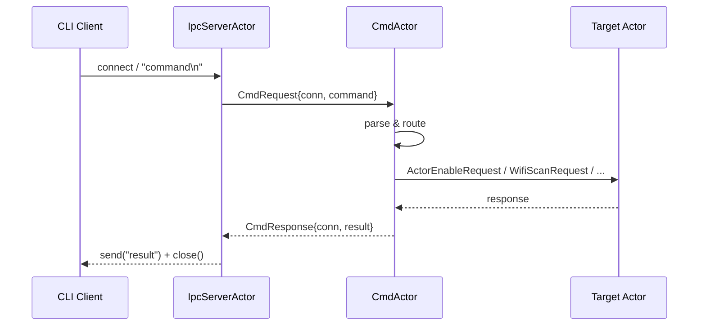
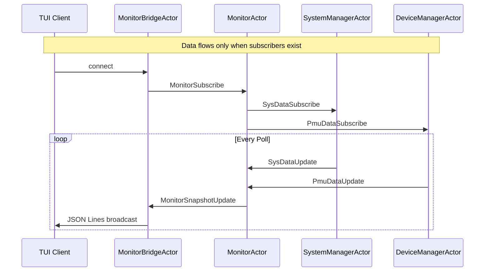

# V² Engine Architecture

---

## Table of Contents

- [Overview](#overview)
- [System Architecture](#system-architecture)
- [Layer Architecture](#layer-architecture)
  - [Core Layer](#core-layer-srccore)
  - [Infrastructure Layer](#infrastructure-layer-srcinfra)
  - [Service Layer](#service-layer-srcservice)
  - [Application Layer](#application-layer-srcapp)
- [Core Components](#core-components)
  - [Actor Model](#actor-model)
  - [Message System](#message-system)
  - [Concurrency](#concurrency)
  - [Memory Management](#memory-management)
  - [Scheduling & Work Distribution](#scheduling--work-distribution)
  - [Supervision](#supervision)
- [Message Flow](#message-flow)
- [Threading Model](#threading-model)
- [Further Reading](#further-reading)

---

## Overview

V² Engine is a C++20 actor-model runtime designed for long-running system daemons on Linux. The architecture follows a clean separation of concerns with four distinct layers, each with well-defined responsibilities and dependency directions.

**Core design principles:**

- **Actor isolation** — Every component is an isolated actor communicating via asynchronous message passing
- **Lock-free hot path** — No mutex contention in message delivery; all queues are lock-free
- **Single-threaded event loop** — Thread-safe cross-thread operations via lock-free queues
- **Dependency inversion** — Core defines ports; infrastructure implements adapters

---

## System Architecture

```
┌─────────────────────────────────────────────────────────────────────┐
│                        APPLICATION LAYER                            │
│   ┌───────────┐     ┌───────────┐     ┌───────────┐                 │
│   │  v2_main  │     │  v2_cli   │     │  v2_tui   │                 │
│   │  Daemon   │     │CLI Client │     │TUI Monitor│                 │
│   └─────┬─────┘     └─────┬─────┘     └─────┬─────┘                 │
└─────────┼─────────────────┼─────────────────┼───────────────────────┘
          │                 │                 │
          ▼                 ▼                 ▼
┌─────────────────────────────────────────────────────────────────────┐
│                         SERVICE LAYER                               │
│ ┌─────────┐ ┌─────────┐ ┌─────────┐ ┌─────────┐ ┌─────────┐         │
│ │  Cmd    │ │  Ipc    │ │ Monitor │ │System   │ │ Device  │         │
│ │  Actor  │ │ Server  │ │  Actor  │ │Manager  │ │ Manager │         │
│ │         │ │  Actor  │ │         │ │  Actor  │ │  Actor  │         │
│ └────┬────┘ └────┬────┘ └────┬────┘ └────┬────┘ └────┬────┘         │
└──────┼───────────┼───────────┼───────────┼───────────┼──────────────┘
       │           │           │           │           │
       ▼           ▼           ▼           ▼           ▼
┌─────────────────────────────────────────────────────────────────────┐
│                           CORE LAYER                                │
│   ┌───────────────┐ ┌───────────────┐ ┌───────────────┐             │
│   │  ActorSystem  │ │    Message    │ │  MemoryPool   │             │
│   └───────────────┘ └───────────────┘ └───────────────┘             │
└─────────────────────────────────────────────────────────────────────┘
                                     ▲
                                     │
┌─────────────────────────────────────────────────────────────────────┐
│                      INFRASTRUCTURE LAYER                           │
│ ┌───────────────┐ ┌───────────────┐ ┌───────────────┐               │
│ │   EventLoop   │ │  Uds Server   │ │  Linux Timer  │               │
│ │     Epoll     │ │               │ │               │               │
│ └───────────────┘ └───────────────┘ └───────────────┘               │
└─────────────────────────────────────────────────────────────────────┘
```

**Dependency direction:** Application → Service → Core ← Infrastructure. Dependencies flow inward — Core has no outgoing dependencies to other layers. Infrastructure implements Core's ports.

---

## Layer Architecture

### Core Layer (`src/core/`)

The standalone heart of the engine. A self-contained C++20 subproject with **zero external dependencies** — links only `Threads::Threads`.

**Responsibilities:**
- Actor framework (lifecycle, messaging, registry)
- Lock-free data structures (MPSC/MPMC queues, ring buffer)
- Type-erased message system with SBO optimization
- TCMalloc-inspired tiered memory allocator
- Scheduler, dispatcher, and worker pool
- Supervisor with restart strategies

**Key files:**
- `actor_system/` — Actor base class, registry, runtime
- `common/` — Containers, memory, timers, logging
- `perf/metrics/` — Performance metrics

→ See [Core Layer Details](layers/core.md)

---

### Infrastructure Layer (`src/infra/`)

Adapters that implement core ports with OS-specific or third-party implementations. This layer is the only place that touches system calls and external libraries.

**Modules:**

| Module | Implementation |
|--------|----------------|
| Event Loop | `EventLoopEpoll` — epoll-based I/O multiplexer |
| Timer | `LinuxTimer` — timerfd-based timer |
| Transport | `UdsServer` / `UdsClient` — Unix Domain Socket |
| HAL | I2C, PMU (vcgencmd), System (procfs) |
| Config | `JsonConfigLoader` — nlohmann/json parsing |
| UI | `FtxuiRenderer` — FTXUI terminal rendering |

→ See [Infrastructure Layer Details](layers/infra.md)

---

### Service Layer (`src/service/`)

Business logic actors that implement specific use cases. Each actor owns its domain and communicates exclusively through messages.

**Actors:**

| Actor | Role |
|-------|------|
| CmdActor | CLI command parsing and dispatch |
| IpcServerActor | Unix Domain Socket IPC server |
| MonitorActor | Snapshot aggregator for system/pmu data |
| MonitorBridgeActor | JSON Lines broadcast to TUI clients |
| SystemManagerActor | OS signal handling + system resource data |
| DeviceManagerActor | PMU data collection (subscriber-driven) |
| TickActor | Periodic heartbeat generator |
| DbusActor | D-Bus gateway (disabled by default) |
| NetworkManagerActor | Wi-Fi management (disabled by default) |

→ See [Service Layer Details](layers/service.md)

---

### Application Layer (`src/app/`)

Composition roots that wire all components together. Each executable is a thin entry point that creates the actor system, registers actors, and starts the event loop.

| Executable | Purpose |
|------------|---------|
| `v2_main` | Daemon — full actor system with all services |
| `v2_cli` | CLI client — connects via UDS, sends commands |
| `v2_tui` | TUI monitor — real-time system visualization |

→ See [Application Layer Details](layers/app.md)

---

## Core Components

### Actor Model

Actors are the fundamental unit of computation. Each actor:
- Owns a private lock-free MPSC mailbox
- Processes messages sequentially (no concurrency within an actor)
- Has a lifecycle: `Closed → Opening → Opened → Closing → Closed`
- Is identified by name (string) and ID (uint64_t)

**References:** `ActorHandle` provides generation-based weak references to prevent use-after-free on recycled actor IDs.

→ See [Actor Model](concepts/actor_model.md)

---

### Message System

Messages are type-erased, SBO-optimized, move-only values:

```
Message (72 bytes) {
    MessageId          id_;        // type identifier
    StorageMode        mode_;      // Inline | Pool | Empty
    const MessageOps*  ops_;       // vtable: destroy/move/clone
    IMemoryAllocator*  allocator_;
    union {                        // 64-byte inline buffer
        std::byte      inline_[64];
        void*          ptr_;
    };
}
```

**Storage strategy:**
- `sizeof(T) ≤ 64` and proper alignment → **inline** (zero heap)
- Otherwise → `MemoryPool` allocation

39 message types across 11 categories (signal, lifecycle, tick, command, IPC, monitor, D-Bus, network, Wi-Fi, PMU data, system data).

→ See [Messaging](concepts/messaging.md)

---

### Concurrency

Lock-free data structures are used throughout the hot path:

| Structure | Use Case |
|-----------|----------|
| `LockFreeMpscQueue` | Actor mailboxes (single consumer) |
| `LockFreeMpmcQueue` | Work dispatcher queues (work stealing) |
| `RingBuffer` | IPC byte streams |

→ See [Concurrency](concepts/concurrency.md)

---

### Memory Management

TCMalloc-inspired tiered allocator optimized for objects ≤ 2048 B:

```
ThreadLocal Cache (lock-free)
    ↓ cache miss
Central Slab (mutex-guarded, per size-class)
    ↓ out of space
4 KB Chunk (intrusive free list)
    ↓ large alloc
::operator new
```

**9 size classes:** 8B, 16B, 32B, 64B, 128B, 256B, 512B, 1024B, 2048B

→ See [Memory Management](concepts/memory.md)

---

### Scheduling & Work Distribution

The `WorkDispatcher` uses two complementary mechanisms:

1. **Load-aware dispatch (preventive)** — Routes to least-loaded worker when home worker exceeds 70% high-watermark
2. **Adaptive work stealing (reactive)** — Idle workers steal from busy neighbors with adaptive backoff

**Worker loop:**
```
semaphore → own queue pop → steal if empty → run(batch) → re-dispatch if non-empty
```

→ See [Scheduling](concepts/scheduling.md)

---

### Supervision

Fault tolerance through restart strategies:

| Strategy | Behavior |
|----------|----------|
| OneForOne | Restart only the failed actor |
| OneForAll | Restart all actors in the group |
| None | Permanent shutdown |

Each actor has a restart budget (default: 5). Exceeding the budget triggers permanent shutdown.

→ See [Supervision](concepts/supervision.md)

---

## Message Flow

### CLI Command Flow



### Monitor Data Flow (Demand Cascade)



---

## Threading Model

| Thread | Count | Role |
|--------|-------|------|
| Event Loop | 1 | `epoll_wait`, I/O dispatch, timerfd management |
| Worker | N (configurable) | Message processing with batch optimization |
| Timer | 0–1 | Portable `Timer` (std-only) or `LinuxTimer` (timerfd) |

**Key properties:**
- Workers block on `std::counting_semaphore` for efficient wake-up
- Batch processing (maxBatch=32) amortizes dispatch overhead
- Cooperative scheduling — actors yield after their batch
- All cross-thread operations use lock-free queues — **no mutex contention on hot paths**

→ See [Scheduling](concepts/scheduling.md)

---

## Further Reading

- [Project README](../../README.md) — Quick start, build instructions, CLI commands
- [Roadmap](../plans/roadmap.md) — Development phases and progress
- [Benchmarks](../benchmark/) — Performance methodology and results
