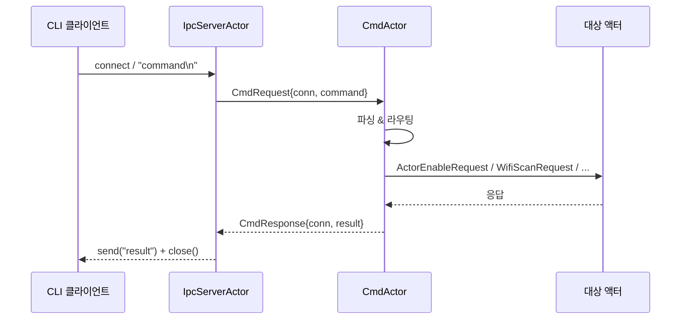
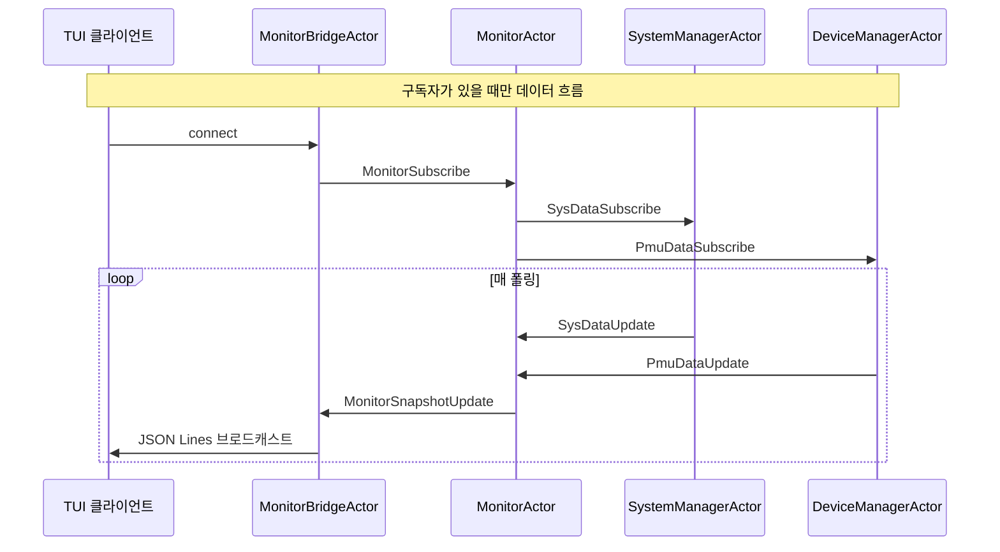

# V² Engine 아키텍처

---

## 목차

- [개요](#개요)
- [시스템 아키텍처](#시스템-아키텍처)
- [계층 아키텍처](#계층-아키텍처)
  - [코어 계층](#코어-계층-srccore)
  - [인프라 계층](#인프라-계층-srcinfra)
  - [서비스 계층](#서비스-계층-srcservice)
  - [애플리케이션 계층](#애플리케이션-계층-srcapp)
- [핵심 구성 요소](#핵심-구성-요소)
  - [액터 모델](#액터-모델)
  - [메시지 시스템](#메시지-시스템)
  - [동시성](#동시성)
  - [메모리 관리](#메모리-관리)
  - [스케줄링 & 작업 분배](#스케줄링--작업-분배)
  - [슈퍼바이저](#슈퍼바이저)
- [메시지 흐름](#메시지-흐름)
- [스레딩 모델](#스레딩-모델)
- [추가 읽을거리](#추가-읽을거리)

---

## 개요

V² Engine은 리눅스에서 장시간 실행되는 시스템 데몬을 위해 설계된 C++20 액터 모델 런타임입니다. 아키텍처는 네 가지 명확한 계층으로 관심사를 분리하며, 각 계층은 명확한 책임과 의존성 방향을 가집니다.

**핵심 설계 원칙:**

- **액터 격리** — 모든 구성 요소는 비동기 메시지 전달을 통해 통신하는 격리된 액터
- **핫 패스 락프리** — 메시지 전달에서 뮤텍스 경쟁 없음; 모든 큐가 락프리
- **단일 스레드 이벤트 루프** — 락프리 큐를 통한 스레드 안전 스레드 간 연산
- **의존성 역전** — 코어가 포트를 정의; 인프라가 어댑터를 구현

---

## 시스템 아키텍처

```
┌─────────────────────────────────────────────────────────────────────┐
│                       애플리케이션 계층                              │
│   ┌───────────┐     ┌───────────┐     ┌───────────┐                 │
│   │  v2_main  │     │  v2_cli   │     │  v2_tui   │                 │
│   │  데몬     │     │CLI 클라이언트│    │TUI 모니터 │                 │
│   └─────┬─────┘     └─────┬─────┘     └─────┬─────┘                 │
└─────────┼─────────────────┼─────────────────┼───────────────────────┘
          │                 │                 │
          ▼                 ▼                 ▼
┌─────────────────────────────────────────────────────────────────────┐
│                         서비스 계층                                  │
│ ┌─────────┐ ┌─────────┐ ┌─────────┐ ┌─────────┐ ┌─────────┐         │
│ │  Cmd    │ │  Ipc    │ │ Monitor │ │System   │ │ Device  │         │
│ │  액터   │ │ 서버    │ │  액터   │ │Manager  │ │ Manager │         │
│ │         │ │  액터   │ │         │ │  액터   │ │  액터   │         │
│ └────┬────┘ └────┬────┘ └────┬────┘ └────┬────┘ └────┬────┘         │
└──────┼───────────┼───────────┼───────────┼───────────┼──────────────┘
       │           │           │           │           │
       ▼           ▼           ▼           ▼           ▼
┌─────────────────────────────────────────────────────────────────────┐
│                           코어 계층                                  │
│   ┌───────────────┐ ┌───────────────┐ ┌───────────────┐             │
│   │  ActorSystem  │ │    Message    │ │  MemoryPool   │             │
│   └───────────────┘ └───────────────┘ └───────────────┘             │
└─────────────────────────────────────────────────────────────────────┘
                                     ▲
                                     │
┌─────────────────────────────────────────────────────────────────────┐
│                      인프라 계층                                     │
│ ┌───────────────┐ ┌───────────────┐ ┌───────────────┐               │
│ │   EventLoop   │ │  Uds Server   │ │  Linux Timer  │               │
│ │     Epoll     │ │               │ │               │               │
│ └───────────────┘ └───────────────┘ └───────────────┘               │
└─────────────────────────────────────────────────────────────────────┘
```

**의존성 방향:** 애플리케이션 → 서비스 → 코어 ← 인프라. 의존성은 내부로 흐릅니다 — 코어는 다른 계층에 대한 외부 의존성이 없습니다. 인프라가 코어의 포트를 구현합니다.

---

## 계층 아키텍처

### 코어 계층 (`src/core/`)

엔진의 독립적인 핵심. **외부 의존성 제로**의 자체 완결적 C++20 서브프로젝트 — `Threads::Threads`만 링크합니다.

**책임:**
- 액터 프레임워크 (생명주기, 메시지, 레지스트리)
- 락프리 데이터 구조 (MPSC/MPMC 큐, 링 버퍼)
- SBO 최적화가 적용된 타입 소거 메시지 시스템
- TCMalloc에서 영감을 받은 계층형 메모리 할당자
- 스케줄러, 디스패처, 워커 풀
- 재시작 전략을 지원하는 슈퍼바이저

**핵심 파일:**
- `actor_system/` — 액터 기본 클래스, 레지스트리, 런타임
- `common/` — 컨테이너, 메모리, 타이머, 로깅
- `perf/metrics/` — 성능 메트릭

→ [코어 계층 상세](layers/core/README.md) 참고

---

### 인프라 계층 (`src/infra/`)

OS별 또는 서드파티 구현으로 코어 포트를 구현하는 어댑터입니다. 이 계층은 시스템 콜과 외부 라이브러리에 접근하는 유일한 곳입니다.

**모듈:**

| 모듈 | 구현 |
|------|------|
| 이벤트 루프 | `EventLoopEpoll` — epoll 기반 I/O 멀티플렉서 |
| 타이머 | `LinuxTimer` — timerfd 기반 타이머 |
| 전송 | `UdsServer` / `UdsClient` — 유닉스 도메인 소켓 |
| HAL | I2C, PMU (vcgencmd), System (procfs) |
| 설정 | `JsonConfigLoader` — nlohmann/json 파싱 |
| UI | `FtxuiRenderer` — FTXUI 터미널 렌더링 |

→ [인프라 계층 상세](layers/infra.md) 참고

---

### 서비스 계층 (`src/service/`)

특정 유스케이스를 구현하는 비즈니스 로직 액터. 각 액터는 자체 도메인을 소유하고 메시지를 통해서만 통신합니다.

**액터:**

| 액터 | 역할 |
|------|------|
| CmdActor | CLI 명령 파싱 및 디스패치 |
| IpcServerActor | 유닉스 도메인 소켓 IPC 서버 |
| MonitorActor | 시스템/PMU 데이터 스냅샷 집계 |
| MonitorBridgeActor | TUI 클라이언트에 대한 JSON Lines 브로드캐스트 |
| SystemManagerActor | OS 시그널 처리 + 시스템 리소스 데이터 |
| DeviceManagerActor | PMU 데이터 수집 (구독자 주도) |
| TickActor | 주기적 하트비트 생성기 |
| DbusActor | D-Bus 게이트웨이 (기본 비활성화) |
| NetworkManagerActor | Wi-Fi 관리 (기본 비활성화) |

→ [서비스 계층 상세](layers/service.md) 참고

---

### 애플리케이션 계층 (`src/app/`)

모든 구성 요소를 연결하는 조합 루트. 각 실행 파일은 액터 시스템을 생성하고, 액터를 등록하며, 이벤트 루프를 시작하는 얇은 진입점입니다.

| 실행 파일 | 목적 |
|-----------|------|
| `v2_main` | 데몬 — 모든 서비스를 갖춘 완전한 액터 시스템 |
| `v2_cli` | CLI 클라이언트 — UDS를 통해 연결, 명령 전송 |
| `v2_tui` | TUI 모니터 — 실시간 시스템 시각화 |

→ [애플리케이션 계층 상세](layers/app.md) 참고

---

## 핵심 구성 요소

### 액터 모델

액터는 계산의 기본 단위입니다. 각 액터는:
- 락프리 MPSC 메일박스를 소유
- 메시지를 순차적으로 처리 (액터 내부 동시성 없음)
- 생명주기를 가짐: `Closed → Opening → Opened → Closing → Closed`
- 이름(string)과 ID(uint64_t)로 식별

**참조:** `ActorHandle`은 재활용된 액터 ID의 use-after-free를 방지하기 위한 세대 기반 약한 참조를 제공합니다.

→ [액터 모델](concepts/actor_model.md) 참고

---

### 메시지 시스템

메시지는 타입 소거·SBO 최적화·이동 전용 값입니다:

```
Message (72 bytes) {
    MessageId          id_;        // type identifier
    StorageMode        mode_;      // Inline | Pool | Empty
    const MessageOps*  ops_;       // vtable: destroy/move/clone
    IMemoryAllocator*  allocator_;
    union {                        // 64-byte inline buffer
        std::byte      inline_[64];
        void*          ptr_;
    };
}
```

**저장 전략:**
- `sizeof(T) ≤ 64` 및 적절한 정렬 → **인라인** (힙 제로)
- 그 외 → `MemoryPool` 할당

11개 카테고리에 걸친 40개 메시지 타입 (시그널, 생명주기, 틱, 명령, IPC, 모니터, D-Bus, 네트워크, Wi-Fi, PMU 데이터, 시스템 데이터).

→ [메시지 시스템](concepts/messaging.md) 참고

---

### 동시성

핫 패스 전반에 락프리 데이터 구조가 사용됩니다:

| 구조 | 유스케이스 |
|------|-----------|
| `LockFreeMpscQueue` | 액터 메일박스 (단일 소비자) |
| `LockFreeMpmcQueue` | 워커 디스패처 큐 (작업 스틸링) |
| `RingBuffer` | IPC 바이트 스트림 |

→ [동시성](concepts/concurrency.md) 참고

---

### 메모리 관리

2048B 이하 객체에 최적화된 TCMalloc 기반 계층형 할당자:

```
ThreadLocal Cache (lock-free)
    ↓ cache miss
Central Slab (mutex-guarded, per size-class)
    ↓ out of space
4 KB Chunk (intrusive free list)
    ↓ large alloc
::operator new
```

**9개 크기 클래스:** 8B, 16B, 32B, 64B, 128B, 256B, 512B, 1024B, 2048B

→ [메모리 관리](concepts/memory.md) 참고

---

### 스케줄링 & 작업 분배

`WorkDispatcher`는 두 가지 상호 보완적인 메커니즘을 사용합니다:

1. **부하 인식 디스패치 (예방적)** — 홈 워커가 70% 하이 워터마크를 초과하면 최소 부하 워커로 라우팅
2. **적응형 작업 스틸링 (반응적)** — 유휴 워커가 적응형 백오프로 인접 활성 워커에서 스틸

**워커 루프:**
```
세마포어 → 자체 큐 팝 → 비어있으면 스틸 → run(batch) → 비어있지 않으면 재디스패치
```

→ [작업 분배](concepts/work_dispatch.md) 참고

---

### 슈퍼바이저

재시작 전략을 통한 결함 내성:

| 전략 | 동작 |
|------|------|
| OneForOne | 결함이 발생한 액터만 재시작 |
| OneForAll | 그룹의 모든 액터 재시작 |
| None | 영구 종료 |

각 액터는 재시작 예산(기본값: 5)을 가집니다. 예산 초과 시 영구 종료가 트리거됩니다.

→ [슈퍼바이저](concepts/supervision.md) 참고

---

## 메시지 흐름

### CLI 명령 흐름



### 모니터 데이터 흐름 (수요 캐스케이드)



---

## 스레딩 모델

| 스레드 | 수 | 역할 |
|--------|---|------|
| 이벤트 루프 | 1 | `epoll_wait`, I/O 디스패치, timerfd 관리 |
| 워커 | N (설정 가능) | 배치 최적화가 적용된 메시지 처리 |
| 타이머 | 0–1 | 이동 가능한 `Timer` (std 전용) 또는 `LinuxTimer` (timerfd) |

**핵심 특성:**
- 워커가 효율적 웨이크업을 위해 `std::counting_semaphore`에서 차단
- 배치 처리(maxBatch=32)로 디스패치 오버헤드 경감
- 협력 스케줄링 — 액터가 배치 후 양보
- 모든 스레드 간 연산에 락프리 큐 사용 — **핫 패스에 뮤텍스 경쟁 없음**

→ [작업 분배](concepts/work_dispatch.md) 참고

---

## 추가 읽을거리

- [프로젝트 README](../../README.md) — 빠른 시작, 빌드 지침, CLI 명령
- [로드맵](../plans/roadmap.md) — 개발 단계 및 진행 상황
- [벤치마크](../benchmark/) — 성능 방법론 및 결과
