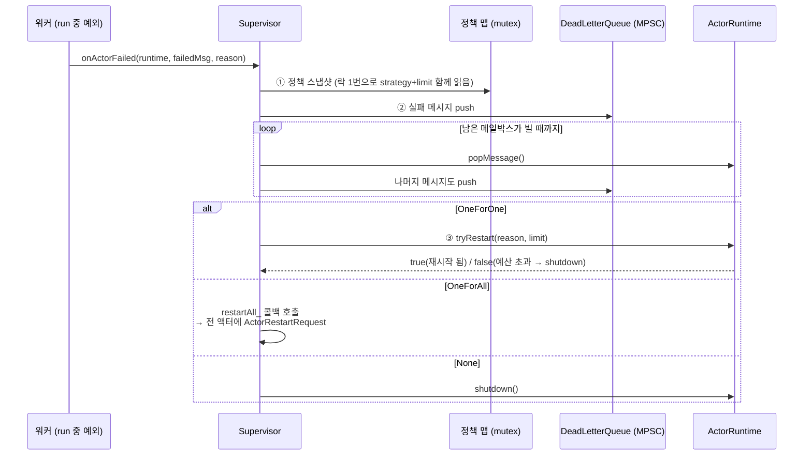

# 슈퍼바이저 (결함 내성)

액터가 실행 중에 죽었을 때(예외 발생 등) 시스템 전체를 살려두고 복구하는 장치인
**Supervisor**와 **DeadLetterQueue**를 처음 읽는 사람도 따라올 수 있게 정리한 문서.

---

## 목차

- [개요](#개요)
- [핵심 아이디어 — 현장 감독자](#핵심-아이디어--현장-감독자)
- [구성 요소](#구성-요소)
  - [Supervisor](#supervisor)
  - [DeadLetterQueue — 사고 기록 보관함](#deadletterqueue--사고-기록-보관함)
  - [ISupervised 인터페이스](#isupervised-인터페이스)
- [재시작 전략 3종](#재시작-전략-3종)
- [onActorFailed 처리 흐름](#onactorfailed-처리-흐름)
  - [1단계: 정책 스냅샷](#1단계-정책-스냅샷)
  - [2단계: 데드 레터 이관](#2단계-데드-레터-이관)
  - [3단계: 전략 적용](#3단계-전략-적용)
- [재시작 예산 — maxRestarts](#재시작-예산--maxrestarts)
- [스레드 안전성](#스레드-안전성)
- [정책 설정 API](#정책-설정-api)
- [통계 조회](#통계-조회)
- [설정](#설정)
- [요약](#요약)

---

## 개요

> 📌 액터 생명주기 자체는 [Actor Model](actor_model.md)을, 재시작 카운터의 원자 연산
> 상세는 [Concurrency](concurrency.md)의 "재시작 카운터 CAS 루프" 절을 먼저 보면 좋습니다.

V² Engine은 수일~수월간 멈추지 않고 도는 시스템 데몬을 목표로 합니다. 그런 환경에서
"한 액터의 핸들러에서 예외가 났다"는 이유로 프로세스 전체가 내려가면 안 됩니다.
반대로 "아무 조치 없이 예외만 삼키면" 상태가 이미 깨진 액터가 계속 돌아 더 큰 사고를 부릅니다.

정답은 **격리와 복구**입니다:

1. 액터 하나의 실패는 그 액터 안에 가둔다 (메시지 처리 중 예외 = 그 배치만 중단)
2. 감독자(Supervisor)가 정책에 따라 **재시작 또는 영구 종료**를 결정한다
3. 유실된 메시지는 **데드 레터 큐**에 보존해 나중에 추적할 수 있게 한다

이 스타일은 Erlang/OTP의 슈퍼비전 트리에서 온 검증된 패턴입니다. 다만 V² Engine은
부모-자식 계층 대신 **단일 글로벌 Supervisor**가 모든 액터를 관리하는 평면 구조를 씁니다.

---

## 핵심 아이디어 — 현장 감독자

공사장에 비유하면 이해가 빠릅니다.

| 요소 | 비유 |
|------|------|
| 액터 | 작업자 |
| `handle()` 중 예외 | 작업자 사고 |
| Supervisor | 현장 감독자 — 사고 보고를 받고 복구 방침을 결정 |
| DeadLetterQueue | 사고 기록 보관함 — 당시 서류(메시지)를 그대로 보관 |
| maxRestarts | "같은 작업자를 몇 번까지 복직시킬까" 예산 |

감독자는 직접 일하지 않습니다. 판단과 명령만 합니다. 실제 재시작 작업은 해당 액터의
집(홈 워커 스레드)에서 이뤄집니다.

---

## 구성 요소

### Supervisor

**파일:** `src/core/actor_system/runtime/supervisor/supervisor.hpp:30`

실패 보고를 받아 정책을 적용하는 단일 객체. `ActorSystem`이 하나 소유하며,
모든 워커 스레드가 동시에 실패 보고(`onActorFailed()`)를 할 수 있습니다.

```cpp
class Supervisor : public ISupervisor {
public:
    void setDefaultStrategy(RestartStrategy strategy);          // 시스템 기본값
    void setStrategy(uint64_t actorId, RestartStrategy s);      // 액터별 오버라이드
    void removePolicy(uint64_t actorId);
    void setMaxRestarts(int maxRestarts);                       // 재시작 예산
    void setRestartAll(std::function<int()> restartAll);        // OneForAll용 브로드캐스트

    // 실패 보고 진입점 — 여러 워커에서 동시 호출 가능
    void onActorFailed(ISupervised* runtime, Message failedMsg, const std::string& reason);
};
```

### DeadLetterQueue — 사고 기록 보관함

**파일:** `src/core/actor_system/runtime/supervisor/dead_letter_queue.hpp`

실패한 메시지와 그 액터에 밀려있던 나머지 메시지를 보관하는 큐입니다.
내부는 [동시성 문서](concurrency.md)의 **락프리 MPSC 큐**(기본 용량 128)라서
여러 워커가 동시에 넣어도 경쟁이 없습니다.

```cpp
struct DeadLetter {
    uint64_t actorId;      // 죽은 액터 ID
    std::string actorName; // 죽은 액터 이름
    std::string reason;    // 실패 원문 ("exception: ..." 등)
    uint64_t timestampNs;  // 실패 시각(나노초)
    Message msg;           // 당시 처리 중이던 메시지(유실 방지)
};
```

> ⚠️ **가득 차면?** 새 데드 레터를 드롭하고 경고 로그를 남깁니다. 데드 레터는
> "디버깅용 증거"이지 데이터 파이프라인이 아니므로, 관측 가능성보다 시스템 가용성을
> 우선한 의도적 설계입니다.

### ISupervised 인터페이스

**파일:** `src/core/actor_system/runtime/supervisor/i_supervised.hpp`

Supervisor가 액터에게 명령할 때 쓰는 최소 인터페이스입니다. `ActorRuntime`이 구현하며,
덕분에 Supervisor는 ActorRuntime 내부를 몰라도 되고 테스트에서 Mock으로 대체됩니다.

```cpp
class ISupervised{
public:
    virtual bool tryRestart(const std::string& reason, int maxRestarts) = 0;
        // OneForOne 경로. 예산 안에서만 원자적으로 재시작. 성공 여부 반환.
    virtual void shutdown() = 0;
        // None 정책·예산 초과 시. close 후 더 이상 디스패치하지 않음.
    virtual bool popMessage(Message& msg) = 0;
        // 메일박스를 하나씩 비워 dead letter로 이관할 때 사용.
    virtual int restartCount() const = 0;
    virtual uint64_t actorId() const = 0;
    virtual const std::string& actorName() const = 0;
};
```

---

## 재시작 전략 3종

**파일:** `src/core/actor_system/runtime/supervisor/supervisor.hpp:13`

```cpp
enum class RestartStrategy{
    OneForOne,   // 실패한 액터만 재시작 (기본값)
    OneForAll,   // 모든 액터 재시작 (ActorRestartRequest 브로드캐스트)
    None         // 재시작 없음, 영구 중단
};
```

| 전략 | 동작 | 언제 쓰나 |
|------|------|-----------|
| **OneForOne** (기본) | 죽은 액터만 `open()`부터 다시 시작 | 액터들이 서로 독립적일 때 — 대부분의 경우 |
| **OneForAll** | 시스템의 모든 액터에 `ActorRestartRequest`를 브로드캐스트해 각자 자기 워커에서 재시작 | 액터들이 공유 상태를 미러링해서 한 곳이 깨지면 전체가 의심스러울 때 |
| **None** | 재시작하지 않고 즉시 영구 종료(shutdown) | 재시작이 위험하거나 치명적이지 않은 선택적 액터 |

OneForAll의 브로드캐스트도 "메시지"입니다. 각 액터는 자기 홈 워커에서
`ActorRestartRequest`를 받아 순서대로 재시작되므로, 감독자가 다른 워커의 액터를
직접 만질 필요가 없어 레이스가 원천적으로 없습니다.

---

## onActorFailed 처리 흐름

메시지 처리 중 예외가 나면 `ActorRuntime::run()`이 이를 잡아 `Supervisor::onActorFailed()`를
호출합니다. 전체 흐름은 3단계입니다.



### 1단계: 정책 스냅샷

```cpp
std::lock_guard lock(mutex_);
strategy = defaultStrategy_;
limit = maxRestarts_;
auto it = perActorStrategy_.find(runtime->actorId());
if(it != perActorStrategy_.end()) strategy = it->second;   // 액터별 오버라이드 적용
```

전략과 예산을 **반드시 한 번의 락으로 함께** 읽습니다. 따로 읽으면 "예산은 낮은데
전략은 오래된 값" 같은 불일치 스냅샷이 나올 수 있습니다. 액터별 오버라이드가 있으면
기본값 대신 그것을 씁니다.

### 2단계: 데드 레터 이관

정책과 무관하게 **항상** 수행됩니다:

1. 실패 당시 처리 중이던 메시지를 `DeadLetter`로 포장해 push
2. `popMessage()`로 메일박스를 완전히 비우며 남은 메시지도 전부 push
3. 타임스탬프(`Time::nowNs()`)와 사유를 함께 기록

왜 남은 메시지까지 옮길까? 재시작하면 액터의 메일박스는 초기화됩니다. 밀린 메시지를
그냥 두면 **조용히 사라지는 유실**이 됩니다. 전부 데드 레터로 옮겨야 "무엇이
처리 못 됐는지"를 나중에 감사할 수 있습니다.

### 3단계: 전략 적용

| 전략 | 코드 경로 | 예산 초과 시 |
|------|-----------|--------------|
| OneForOne | `runtime->tryRestart(reason, limit)` — CAS로 예산 원자 검사 | 로그 + `shutdown()` |
| OneForAll | `oneForAllRestartCount_[actorId]++` 후 `restartAll_()` 콜백 | 로그 + 해당 액터 `shutdown()` |
| None | — | 즉시 `shutdown()` |

OneForAll의 콜백은 외부 예외가 튀어나올 수 있어 `try/catch`로 감싸여 있습니다 —
감독자 자체가 죽으면 아무도 복구하지 못하기 때문입니다.

---

## 재시작 예산 — maxRestarts

기본값은 **5회**입니다. 무한 재시작은 "죽었다 살아나기를 무한 반복하는 좀비"를
만들므로, 예산을 초과하면 그 액터는 영구 종료됩니다.

예산 검사는 두 전략이 서로 다른 방식으로 카운트합니다:

- **OneForOne**: `ActorRuntime::restartCount_`(원자 변수)를 CAS 루프로 증가.
  여러 워커가 동시에 같은 액터의 실패를 보고해도 정확히 예산 회수만큼만 재시작이
  통과됩니다. 상세는 [Concurrency](concurrency.md)의 "재시작 카운터 CAS 루프" 참고.
- **OneForAll**: Supervisor 내부 `oneForAllRestartCount_`(뮤텍스 보호)를 액터별로 추적.
  브로드캐스트 재시작은 각 액터의 `restartCount()`를 올리지 않아, OneForOne 예산과
  섞이지 않습니다.

`removePolicy(actorId)`로 액터별 정책을 지우면 OneForAll 카운터도 함께 초기화됩니다.

---

## 스레드 안전성

**파일:** `src/core/actor_system/runtime/supervisor/supervisor.hpp:20-29` 주석에 설계 의도가 기록되어 있습니다.

| 요소 | 동시성 처리 |
|------|-------------|
| `onActorFailed()` 동시 호출 | 정상 — 여러 워커가 서로 다른 액터의 실패를 동시 보고 가능 |
| 통계 카운터 (`totalFailures_` 등) | relaxed 원자 연산 — 정확한 순간값이 아니라 근사 통계면 충분 |
| 데드 레터 push | 락프리 MPSC 큐 — 프로듀서 경쟁 없음 |
| 정책 읽기 | 뮤텍스 1번으로 스냅샷 (§1단계) |
| 실제 재시작 | 해당 액터의 홈 워커에서 수행 — 워커 간 충돌 구조적으로 없음 |
| 정책 설정 | 뮤텍스로 보호되지만 `start()` 이전 단일 스레드 설정 권장 |

핵심 통찰: **재시작이 필요한 액터는 언제나 자기 홈 워커 위에 있다**([액터 친화성](concurrency.md))는
점입니다. 덕분에 Supervisor는 복잡한 락 없이도 "두 워커가 같은 액터를 동시에 재시작하는"
레이스를 신경 쓰지 않아 됩니다.

---

## 정책 설정 API

```cpp
auto* sup = system.supervisor();

// 시스템 기본값: 실패하면 혼자 다시 일어난다 (5회까지)
sup->setDefaultStrategy(RestartStrategy::OneForOne);

// 특정 액터만 재시작 금지 — 죽으면 그대로 영구 종료
sup->setStrategy(deviceManagerId, RestartStrategy::None);

// 예산 변경
sup->setMaxRestarts(10);

// OneForAll용 전체 재시작 콜백 (ActorSystem이 실제 구현을 주입)
sup->setRestartAll([&]{ return system.broadcastRestart(); });
```

운영 팁:

- 필수 서비스(SystemManager 등)는 `setEssential(true)`로 메시지 비활성화부터 막고
  ([Actor Model](actor_model.md)), 정책은 기본값(OneForOne)에 두는 것이 안전합니다.
- 실험적/부가 기능 액터는 `None`으로 바꿔 실패 시 조용히 물러나게 하는 편이 낫습니다.

---

## 통계 조회

```cpp
sup->totalFailures();        // 누적 실패 보고 수
sup->totalRestarts();        // 누적 재시작 수 (브로드캐스트로 재시작된 액터 수 포함)
sup->oneForAllBroadcasts();  // OneForAll 브로드캐스트 실행 횟수
sup->deadLetterCount();      // 현재 데드 레터 큐에 쌓인 수
```

모두 relaxed 읽기입니다 — 디버깅/모니터링 스냅샷 용도이며 정확한 순간 일치를 보장하지 않습니다.
데드 레터는 `IDeadLetterQueue::pop()`으로 꺼내 원인 분석에 쓸 수 있습니다.

---

## 설정

`config/v2_main.json`(RuntimeConfig) 관련 키:

| 키 | 기본값 | 설명 |
|----|--------|------|
| `supervisor_max_restarts` | 5 | 재시작 예산. 초과 시 영구 종료 |
| `supervisor_default_strategy` | `"OneForOne"` | 시스템 기본 전략 |
| `dead_letter_queue_capacity` | 128 | 데드 레터 큐 용량. 넘치면 드롭+경고 |

---

## 요약

| 항목 | 설명 |
|------|------|
| **패턴 계열** | Erlang/OTP 스타일 슈퍼비전 (평면 구조 변형) |
| **감독 범위** | 단일 글로벌 Supervisor가 모든 액터 감독 |
| **전략** | OneForOne(기본) / OneForAll / None + 액터별 오버라이드 |
| **재시작 예산** | maxRestarts(기본 5). 초과 시 영구 종료 |
| **유실 방지** | 실패 메시지 + 메일박스 잔량 전체를 DeadLetterQueue로 이관 |
| **데드 레터 큐** | 락프리 MPSC, 기본 용량 128, 가득 차면 드롭+경고 |
| **동시성** | 워커 어디서든 보고 가능; 재시작은 홈 워커에서 — 레이스 없음 |
| **결합도** | ISupervised 최소 인터페이스로 ActorRuntime과 느슨하게 결합 |
