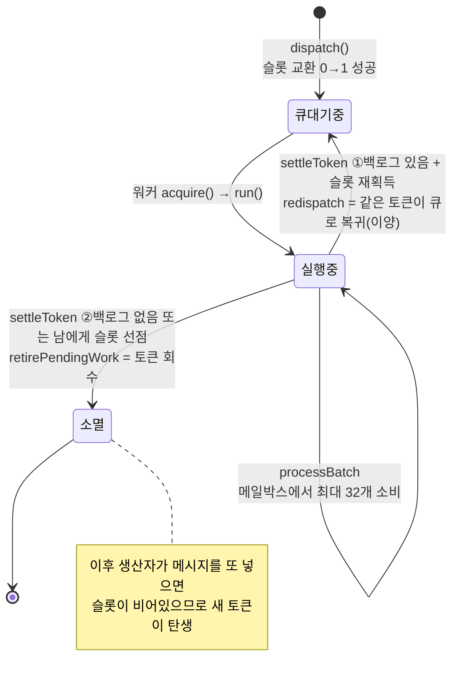
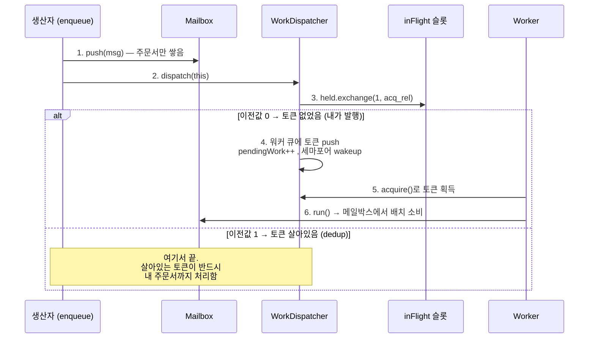
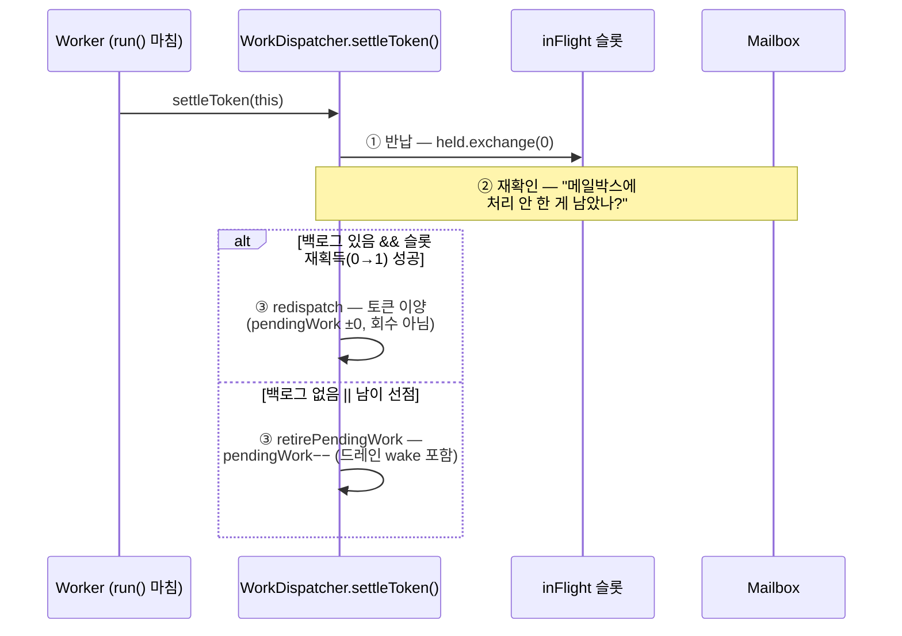

# 작업 분배 (Work Dispatch)

V² Engine이 어떻게 액터에게 실행 기회를 분배하는지, 그리고 그 과정에서 어떤 성능 문제를 만났고 어떻게 해결했는지를 처음 읽는 사람도 따라올 수 있게 정리한 문서.

---

## 목차

- [1. 요약 (세 문장)](#1-요약-세-문장)
- [2. 기본 개념 — 주문서, 호출표, 스티커](#2-기본-개념--주문서-호출표-스티커)
- [3. 컴포넌트 지도](#3-컴포넌트-지도)
- [4. 토큰의 일생](#4-토큰의-일생)
- [5. 왜 액터당 토큰은 1개인가](#5-왜-액터당-토큰은-1개인가)
- [6. settleToken 정산 프로토콜 — 유실 없는 반납](#6-settletoken-정산-프로토콜--유실-없는-반납)
- [7. 계층형 대기 — 스핀-던-파크](#7-계층형-대기--스핀-던-파크)
- [8. 회계 규칙 — pendingWork_](#8-회계-규칙--pendingwork_)
- [9. 케이스 스터디: 스케일링 붕괴 진단기](#9-케이스-스터디-스케일링-붕괴-진단기)
- [10. 벤치마크 읽는 법](#10-벤치마크-읽는-법)
- [11. 용어집](#11-용어집)

---

## 1. 요약 (세 문장)

1. **메시지**는 마음껏 쌓아도 되지만, **실행 토큰**(처리해달라는 신호)은 액터당 **딱 1개**만 존재한다.
2. 워커는 배치 처리가 끝나면 `settleToken()`로 토큰을 **정산**한다 — 밀린 게 있으면 재사용, 없으면 회수.
3. 짧은 주기의 sleep/wake(OS futex)가 성능을 깎아먹으므로, **스핀 → 파킹** 계층형 대기로 최소화한다.

---

## 2. 기본 개념 — 주문서, 호출표, 스티커

식당 비유로 세 가지를 구분하면 전체 그림이 보입니다.

| 것 | 역할 | 비유 |
|---|---|---|
| **메시지** (`Message`) | 처리할 데이터. 액터의 **메일박스**에 줄지어 쌓임 | 주방에 쌓이는 **주문서** |
| **실행 토큰** | "이 액터 좀 처리해라"라는 신호. 워커 큐를 돌아다님 | 주방을 부르는 **호출표** |
| **inFlight 슬롯** | 액터별 "호출표 이미 발행됨" 표시 | 게시판의 **스티커** |

주문서가 열 장 쌓여도 호출표는 한 장이면 충분합니다. 이 **"토큰 ≤ 액터당 1개"** 가 전체 설계의 핵심 불변식입니다.

왜 이렇게 분리했을까? 메시지 발행(생산자)과 실행 권한 부여(스케줄러)를 분리하면:

- 생산자는 슬롯 확인 한 번으로 끝 — 빠름
- 워커는 호출표 하나로 메일박스를 **배치 단위**로 처리 — wakeup 횟수 최소화
- 두 생산자가 동시에 같은 액터에게 보내도 토큰 중복이 원천 차단됨

---

## 3. 컴포넌트 지도

```
생산자 (sendMsg/receiveMsg)
    │
    ▼
ActorRuntime::enqueue()            메시지 → 메일박스 push 후 dispatch() 호출
    │
    ▼
WorkDispatcher                     ┌─ inFlightSlots_[] : 스티커 (액터별 토큰 보유 플래그)
    │                              ├─ queues_[]       : 워커별 실행 토큰 큐 (MPMC)
    │                              ├─ semas_[]        : 워커 wakeup 신호
    │                              └─ pendingWork_    : 살아있는 토큰 수 (회계)
    ▼
Worker::runLoop()                  acquire() → run(maxBatch=32) 반복
    │
    ▼
ActorRuntime::run()
    └─ processBatch()              메일박스에서 최대 32개 처리
    └─ settleToken()                  배치 종료 후 토큰 정산 (§6)
```

| 클래스 | 아는 것 | 모르는 것 |
|---|---|---|
| `ActorRuntime` | 메일박스 상태 (언제 끝나는가) | 중복 방지 존재조차 모름 |
| `WorkDispatcher` | 슬롯·큐·회계 (어떻게 중복 막고 세는가) | 메일박스 내용물 (`count()`만 조회) |
| `Worker` | acquire → run | 회계·플래그 완전 무관 |

---

## 4. 토큰의 일생

### 4.1 상태 다이어그램



### 4.2 생성 — 생산자 쪽은 한 방



생산자 입장에서는 **3번 한 방**이 전부입니다. 스티커 붙이기에 성공하면 표 발행, 실패하면 손 뗌.

### 4.3 소비와 정산 — `settleToken()`

워커가 배치를 끝내면 토큰의 운명을 결정해야 합니다.



---

## 5. 왜 액터당 토큰은 1개인가

액터 모델의 3대 보증 중 하나는 **"액터의 상태는 한 번에 한 스레드만 만진다"**입니다.

토큰이 2개면, 두 워커가 같은 액터의 `handle()`을 동시에 실행하게 되고:

- 액터 멤버 변수에 데이터 레이스 발생
- 메일박스(MPSC = 단일 소비자) 규약 위반

슬롯의 `held` 플래그는 `exchange()`(원자적 교환)로만 건드리기 때문에, N개 스레드가 동시에 시도해도 **정확히 한 명만** 승자가 됩니다. 패자는 토큰을 안 만들고 돌아갈 뿐 — 살아있는 토큰이 자기 몫까지 처리합니다.

---

## 6. settleToken 정산 프로토콜 — 유실 없는 반납

가장 섬세한 부분입니다. **"반납(①)을 재확인(②)보다 먼저"** 하는 이유가 핵심입니다.

순서를 반대로 하면 이런 사고가 납니다:

```
워커:   "메일박스 비었네?" (확인 먼저) → "반납"
생산자: 그 찰나에 push → 슬롯이 아직 set이라 dedup → 토큰 안 만듦
결과:   주문서는 있는데 토큰 0개 → 액터 영구 좀비 💀
```

반납을 **먼저** 하면 두 갈래 모두 안전합니다:

| 생산자의 슬롯 교환이 | 결과 |
|---|---|
| ①보다 **먼저** (1을 읽음 → dedup) | 워커의 ② 재확인이 그 메시지를 **반드시 봄** → 재획득 → 이양 ✓ |
| ①보다 **나중** (0을 읽음 → 슬롯+토큰 획득) | 생산자 토큰이 처리 → 워커는 회수만 ✓ |

**즉 "누가 이겼는가"가 곧 "누가 책임지는가"입니다.** 어느 쪽이든 메시지 유실이 없습니다.

### 왜 fence 없이 가능한가 (깊이 알고 싶은 사람용)

슬롯 연산이 전부 `exchange`(read-modify-write, acq_rel)이기 때문입니다. 같은 원자 변수에 대한 RMW들은 전역적으로 순서가 정해지고, 그 수정 순서가 곧 인과 순서(happens-before 체인)가 됩니다. 그래서 옛 설계(`scheduled_` flag + seq_cst fence 4회/메시지)와 같은 보장을 훨씬 싼 가격에 얻습니다.
**주의: 슬롯에 plain `store()`를 쓰면 RMW 체인이 끊겨 유실 창이 생깁니다. exchange만 사용할 것.**

---

## 7. 계층형 대기 — 스핀-던-파크

### 7.1 왜 필요한가 — 규모의 격차

측정으로 확인된 비용 구조:

```
메시지 1개 처리     ~0.1μs   (액터 핸들러)
토큰 1사이클        ~1μs     (큐 push/pop + 슬롯 교환)
OS 웨이크 1회       ~7μs     (futex sleep/wake, 커널 스케줄링)  ← 70배 이격
```

소비자가 생산 속도를 앞서면(트리클 레짐) 메일박스가 항상 얕아져 배치가 1~2개로 붕괴하고, 토큰이 매번 죽고 태어나면서 **작업 시간보다 sleep/wake 비용이 더 커집니다.**

- 실측 예 (w=4, a=16): 평균 배치 18.5개 → 1.41개, 워커 유휴율 0.4% → **94%.**
- 사이클 8.6μs 중 7.4μs가 sleep/wake 비용.

futex 자체는 잘못이 아닙니다 — 진짜 오랫동안 놀 때는 잠들어야 코어도 전력도 아낍니다.
정답은 **계층형 대기**: 짧은 틈은 스핀으로 흡수하고, 긴 침묵만 파킹한다.

### 7.2 두 개의 스핀 지점

| Site | 위치 | 하는 일 | 파라미터 |
|---|---|---|---|
| **A** | `acquire()` — 세마포어 대기 직전 | 새로 발행된 토큰을 syscall 없이 즉시 포획 | `parkSpinNs` (기본 3μs) |
| **B** | `settleToken()` 초입 — 슬롯 반납 **전** | 빈 메일박스에 다음 메시지 도착을 짧게 대기 → 기존 토큰이 그대로 재사용 | `tokenGraceNs` (기본 5μs) |

Site B가 특히 깔끔한 이유: **releaseInFlight 이전에** 기다리므로 lost-wakeup 프로토콜과 충돌할 여지가 원천적으로 없습니다. 백로그가 이미 있으면 즉시 탈출하므로 바쁜 레짐에서 비용 0.

두 스핀 모두 조기 탈출 조건(`running_`/`stopped_`/`draining_`)을 가져 종료 경로를 막지 않습니다. 스핀 프리미티브는 포터블(`cpuRelax`: x86 pause / ARM yield / fallback fence).

### 7.3 튜닝

json 설정 키: `park_spin_ns`, `token_grace_ns` (`config/v2_main.json`).
벤치에서는 `--park-spin-ns`, `--token-grace-ns`로 재빌드 없이 스윕 가능.

---

## 8. 회계 규칙 — pendingWork_

`pendingWork_` = 현재 살아있는 실행 토큰 수. 드레인(종료 시 "다 끝났나?") 판정 기준입니다.

```
큐 진입 시     +1   (dispatch 성공, 파킹 부활 drainPendedActor)
토큰 이양 시   ±0   (redispatch — 같은 토큰, 새 표 아님)
토큰 소멸 시   −1   (settleToken의 retirePendingWork)
```

**불변식**: "+1 = 토큰의 워커 큐 진입", "−1 = settleToken의 은퇴". 이 짝이 어긋나면 드레인이 영원히 끝나지 않거나 조기 종료됩니다. 회귀 테스트: `SettleTokenRetiresExactlyOnce`.

---

## 9. 케이스 스터디: 스케일링 붕괴 진단기

실제로 겪은 문제와 해결 과정 — 성능 문제를 만났을 때의 접근법 예시로 읽어주세요.

### 9.1 증상

워커를 늘릴수록 처리량이 급감:

```
w=1: 19.6M msg/s  →  w=4: 446K (46배 붕괴!)  →  w=8~32: ~100K
```

### 9.2 가설 → 실험 → 기각/확정

| 단계 | 가설 | 실험 | 판정 |
|---|---|---|---|
| 1 | seq_cst fence 비용 | 제거(inFlight 전환) → w=1은 21% ↑, 붕괴는 잔존 | 부분 요인일 뿐 |
| 2 | 스틸 프로브 폭격 | 스틸 간격 50배 상향(E1) → 변화 없음 | **기각** |
| 3 | w×a 그리드 | 붕괴가 `a≥2 ∧ w≥2`에서만 발생 | 토큰 수×활성 워커 관련으로 국소화 |
| 4 | **수면 진동** | `V2_DIAG=1` 메트릭: 평균 배치 18.5→1.41, 유휴 94% | **확정** |

교훈: 추측으로 고치지 말고, **카운터를 달아 원인을 숫자로 고정**한 뒤 고친다.

### 9.3 해결과 결과

inFlight 슬롯 전환(§4~6) + 스핀-던-파크(§7) 적용 후:

| 구성 | 이전 | 이후 |
|---|---|---|
| w=4, A=16 | 446K | **18.9M** (42배) |
| w≤8 worker sweep | 급락 | **flat 0.74~0.96x** |
| 멀티 프로듀서 액터 스윕 (p=4) | — | **a=1→8에서 2.98x 양의 확장** ✅ |

### 9.4 추가로 배운 것 — 벤치 방법론

- **단일 프로듀서 캡**: 부하 발행도 1스레드면 시스템 전체가 그 속도로 묶임(~24M/s). 양의 스케일링 입증엔 `--producers N` 필수. 엔진은 이미 MPSC라 복수 발행자 지원함.
- **완료 폴링 오염**: 드라이버가 처리량 카운터를 무휴면 읽으면 워커의 캐시라인을 계속 무효화해 고W에서 과소 측정 → 폴링 사이 50μs 휴면 삽입.
- **하이브리드 CPU 주의**: P/E 코어 혼용 칩에선 스케줄러 배치에 따라 요동. 비교는 같은 조건에서.

---

## 10. 벤치마크 읽는 법

```bash
V2_DIAG=1 ./build/Bench/v2_bench_cli throughput --workers 4 --actors 16 --iterations 200000 --producers 4
```

출력의 `[Diag]` 블록 해석:

| 지표 | 의미 | 건강한 상태 |
|---|---|---|
| avgBatch | 토큰 1사이클당 처리 메시지 수 | 클수록 좋음 (maxBatch=32에 근접) |
| busyMs | 실제 run() 시간 합 | — |
| idleMs | acquire 대기 시간 합 | 작을수록 좋음 (크면 wakeup 비용 의심) |
| dedup | 중복 토큰 발행 거절 수 | 트래픽 몰림 정도의 자연 스케일 |

판별 규칙: **idleMs↑ = wakeup 비용 문제** / **busyMs↑ + 낮은 처리량 = 캐시·라우팅 문제**.

---

## 11. 용어집

| 용어 | 뜻 |
|---|---|
| 실행 토큰(token) | 액터 메일박스 처리 권한. 액터당 최대 1개 |
| inFlight 슬롯 | 토큰 보유 표시 플래그(캐시라인 정렬). dedup의 핵심 |
| settleToken | 배치 종료 후 토큰 정산(반납→재확인→재획득/회수). `IWorkDispatcher::settleToken` |
| redispatch | 토큰 이양 — 같은 토큰을 큐에 재등록 (회계 ±0) |
| retire | 토큰 소멸 — pendingWork −1 |
| dedup | 이미 토큰이 살아있어 새 토큰 발행을 거절하는 것 |
| futex | Linux 커널의 대기/각성 프리미티브. 잠들고 깨는 데 ~μs |
| 스핀-던-파크 | 잠들기 전 잠깐 바쁘게 기다리는 계층형 대기 전략 |
| 트리클 레짐 | 소비가 생산을 앞서 메일박스가 항상 얕은 상태 |
| lost wakeup | 일이 생겼는데 깨울 주체가 없어 영구 대기하는 버그 |
