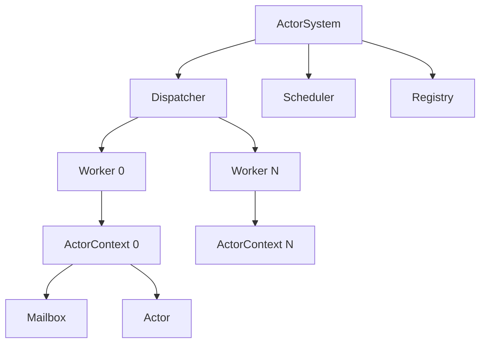
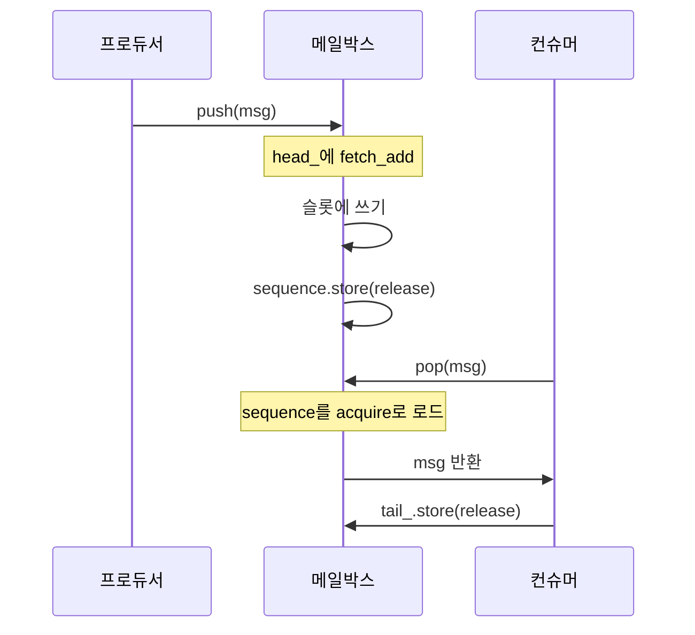

# 4단계: 학술 문서화

> **기간**: 8-16주차 (4-6주, 3단계와 겹침)
> **목표**: 학술 수준의 아키텍처 및 성능 분석 문서 작성
> **전제 조건**: 1-3단계 (코드 및 데이터 준비 완료)

---

## 목차

1. [목표](#1-목표)
2. [문서 구조](#2-문서-구조)
3. [아키텍처 문서](#3-아키텍처-문서)
4. [성능 분석 보고서](#4-성능-분석-보고서)
5. [README 업그레이드](#5-readme-업그레이드)
6. [작성 지침](#6-작성-지침)
7. [구현 단계](#7-구현-단계)
8. [검증 체크리스트](#8-검증-체크리스트)

---

## 1. 목표

### 1.1 주요 목표

1. `docs/architecture.md` 작성 - 시스템 아키텍처 심층 분석
2. `docs/performance.md` 작성 - 학술적 성능 분석 보고서
3. `README.md`를 전문적인 영어 문서로 업그레이드
4. 학술 참고 문헌 및 관련 연구 비교 포함
5. 근거가 있는 설계 결정 문서화

### 1.2 대상 독자

| 문서 | 대상 독자 | 목적 |
|----------|-----------------|---------|
| `architecture.md` | 대학원 교수, 연구실 구성원 | 시스템 사고 입증 |
| `performance.md` | 연구 공동체, 면접관 | 경험적 방법론 보여주기 |
| `README.md` | 일반 개발자, 채용 담당자 | 프로젝트 개요 및 빠른 시작 |

---

## 2. 문서 구조

### 2.1 파일 배치

```
V2-Engine/
├── README.md                          # 업그레이드된 영어 README
├── docs/
│   ├── architecture.md                # 시스템 아키텍처 심층 분석
│   ├── performance.md                 # 학술적 성능 분석
│   ├── mailbox_design.md              # 메일박스 변형 설계 상세
│   ├── benchmark_methodology.md       # 벤치마크 방법론
│   ├── portfolio_plan.md              # 이 계획
│   ├── phase1_benchmark.md            # 1단계 계획
│   ├── phase2_improvements.md         # 2단계 계획
│   ├── phase3_measurement.md          # 3단계 계획
│   ├── phase4_documentation.md        # 4단계 계획 (이 문서)
│   └── phase5_portfolio.md            # 5단계 계획
```

---

## 3. 아키텍처 문서

### 3.1 개요

**파일**: `docs/architecture.md`

```
# V2-Engine 아키텍처

## 1. 서론
   1.1. 동기
   1.2. 설계 목표
   1.3. 범위

## 2. 시스템 개요
   2.1. 고수준 아키텍처
   2.2. 구성 요소 다이어그램
   2.3. 데이터 흐름

## 3. 액터 모델
   3.1. 액터 생명주기
   3.2. 메시지 전달
   3.3. std::variant 메시지 타입
   3.4. 액터 레지스트리

## 4. 런타임 구성 요소
   4.1. ActorSystem (오케스트레이터)
   4.2. Dispatcher (Epoll 기반 이벤트 루프)
   4.3. Worker (스레드 풀)
   4.4. Scheduler (타이머 통합)

## 5. 메일박스 설계
   5.1. 인터페이스 설계 (IMailbox)
   5.2. MutexMailbox (기준선)
   5.3. MPSCMailbox (잠금 해제)
   5.4. 메모리 순서 분석
   5.5. 거짓 공유 방지

## 6. 동시성 패턴
   6.1. 세마포어 기반 작업 디스패치
   6.2. 디스패치 중복 제거
   6.3. 원자적 스케줄링 게이트
   6.4. 잠금 해제 카운터

## 7. 인프라
   7.1. Epoll 래퍼
   7.2. 타이머 (timerfd)
   7.3. 시그널 핸들러
   7.4. RingBuffer (바이트 지향)

## 8. 설계 결정
   8.1. 왜 액터 모델인가?
   8.2. 왜 MPSC (SPSC가 아닌)?
   8.3. 왜 잠금 해제인가?
   8.4. 왜 세마포어 (조건 변수가 아닌)?

## 9. 관련 연구
   9.1. Erlang/OTP
   9.2. Akka
   9.3. Tokio
   9.4. 비교 테이블

## 10. 결론
```

### 3.2 핵심 섹션 상세

#### 3.2.1 섹션 5: 메일박스 설계

이것은 포트폴리오의 **핵심 차별화 요소**입니다. 다음을 반드시 포함해야 합니다:

1. **인터페이스 설계**: 왜 가상 인터페이스, CRTP가 아닌
2. **MutexMailbox**: 정확성이 증명됨, 간단, 기준선
3. **MPSCMailbox**: 시퀀스 카운터가 있는 잠금 해제 설계
4. **메모리 순서**: 다이어그램과 함께 상세한 acquire/release 분석
5. **거짓 공유**: 캐시 라인 정렬 근거
6. **ABA 문제**: 여기서는 해당 없는 이유
7. **비교**: 변형 간 트레이드오프 분석

**다이어그램**: 프로듀서-컨슈머 동기화를 보여주는 메모리 순서 다이어그램

```
프로듀서 스레드                          컨슈머 스레드
─────────────────                        ─────────────────
head_.fetch_add(relaxed)                 tail_.load(relaxed)
    │                                        │
    v                                        v
slot.data = std::move(msg)               slot.sequence.load(acquire)
    │                                        │
    v                                        v
slot.sequence.store(pos+1, release) ─────> 데이터가 보임
    │                                        │
    v                                        v
(컨슈머의 acquire load로 확인됨)            out = std::move(slot.data)
                                               │
                                               v
                                           tail_.store(new_tail, release)
```

#### 3.2.2 섹션 8: 설계 결정

각 결정에 대해 다음을 문서화:
- **컨텍스트**: 어떤 문제를 해결하고 있었는가?
- **대안**: 어떤 대안이 고려되었는가?
- **결정**: 어떤 것을 선택했는가?
- **근거**: 왜 이 선택인가?
- **트레이드오프**: 무엇을 얻었고 잃었는가?

**예제**:

> **왜 MPSC (SPSC가 아닌)?**
>
> **컨텍스트**: 메일박스는 여러 액터로부터의 동시 메시지 전송을 처리해야 합니다.
>
> **대안**:
> 1. SPSC: 모든 전송을 단일 스레드를 통해 직렬화
> 2. MPSC: 잠금 해제 큐로 동시 전송 허용
> 3. MPMC: 동시 전송과 수신 허용
>
> **결정**: MPSC
>
> **근거**: SPSC는 모든 전송을 단일 스레드를 통해 직렬화하도록 전체 메시지 라우팅을 재구성해야 하며, 이는 아키텍처적으로 침해적입니다. MPMC는 `scheduled_` 원자적 플래그로 보장되는 컨슈머가 본질적으로 단일 스레드이므로 tail에 대한 CAS로 불필요한 복잡성을 추가합니다.
>
> **트레이드오프**: MPSC는 SPSC보다 복잡하지만 기존 API와 아키텍처를 보존합니다. 잠금 해제 구현은 신중한 메모리 순서를 요구하지만 경쟁 환경에서 상당한 처리량 개선을 제공합니다.

#### 3.2.3 섹션 9: 관련 연구

**비교 테이블**:

| 측면 | V2-Engine | Erlang/OTP | Akka | Tokio |
|--------|-----------|------------|------|-------|
| 언어 | C++20 | Erlang | Scala/Java | Rust |
| 메일박스 | MPSC 잠금 해제 | 프로세스 메일박스 | 언바운드/바운드 | MPMC 바운드 |
| 스케줄링 | 세마포어 기반 | 리덕션 기반 | 작업 도둑질 | 작업 도둑질 |
| 메시지 타입 | std::variant | 패턴 매칭 | 타입화된 액터 | 열거형 + 채널 |
| 타이머 | timerfd | erlang:timer | CancellableFuture | tokio::time |
| I/O | epoll | 포트 드라이버 | NIO | epoll/kqueue |

---

## 4. 성능 분석 보고서

### 4.1 개요

**파일**: `docs/performance.md`

```
# 액터 시스템에서의 잠금 해제 MPSC 메일박스 성능 분석

## 초록

## 1. 서론
   1.1. 문제 제기
   1.2. 기여
   1.3. 논문 구성

## 2. 배경
   2.1. 액터 모델 동시성
   2.2. 메일박스 구현
   2.3. 잠금 해제 데이터 구조
   2.4. 메모리 순서 모델

## 3. 시스템 설계
   3.1. 아키텍처 개요
   3.2. MutexMailbox 설계
   3.3. MPSCMailbox 설계
   3.4. 구현 상세

## 4. 방법론
   4.1. 벤치마크 설계
   4.2. 측정 설정
   4.3. 통계 분석
   4.4. 유효성에 대한 위협

## 5. 평가
   5.1. 처리량 분석
   5.2. 지연 시간 분석
   5.3. 경쟁 분석
   5.4. 스케일링 분석
   5.5. 메모리 오버헤드
   5.6. 관련 연구와의 비교

## 6. 토론
   6.1. 핵심 발견
   6.2. 설계 함의
   6.3. 한계
   6.4. 향후 연구

## 7. 결론

## 참고 문헌
```

### 4.2 핵심 섹션 상세

#### 4.2.1 초록

> 이 논문은 액터 기반 동시 시스템을 위한 잠금 해제 MPSC (다중 프로듀서, 단일 컨슈머) 메일박스 구현의 경험적 평가를 제시합니다. 우리는 세 가지 메일박스 변형 - 뮤텍스 보호, 잠금 해제 SPSC, 잠금 해제 MPSC - 을 구현하고 처리량, 지연 시간, 경쟁, 스케일링을 포함한 여러 차원에서 평가합니다. 우리의 결과는 MPSC 잠금 해제 메일박스가 높은 경쟁 환경에서 뮤텍스 기반 기준선 대비 최대 2.5배 처리량 개선을 달성하는 동시에 낮은 경쟁 시나리오에서는 비교 가능한 성능을 유지함을 보여줍니다. 우리는 성능에 영향을 미치는 메모리 순서 요구 사항, 캐시 라인 효과, 설계 트레이드오프를 분석합니다. 이러한 발견은 액터 시스템 설계에서 메일박스 선택을 위한 실용적인 지침을 제공합니다.

#### 4.2.2 섹션 4: 방법론

반드시 포함해야 합니다:

1. **벤치마크 설계**: 각 벤치마크가 주장하는 것을 어떻게 측정하는지
2. **측정 설정**: 하드웨어, OS, 컴파일러, 빌드 플래그
3. **통계 분석**: 워밍업, 여러 번 실행, 이상치 감지
4. **유효성에 대한 위협**: 내부, 외부, 구축 유효성

**유효성에 대한 위협 예제**:

> **내부 유효성**: 우리는 벤치마크 중 메트릭을 비활성화하여 측정 오버헤드를 피합니다. 그러나 핫 패스의 `Time::now()` 호출은 여전히 편향을 도입할 수 있습니다. 우리는 단조로운 시계를 사용하고 상대적 차이를 측정하여 이를 완화합니다.
>
> **외부 유효성**: 우리의 측정은 단일 하드웨어 구성 (Intel i7-13700K)에서 수행됩니다. 결과는 다른 아키텍처 (ARM, AMD) 또는 다른 컴파일러 최적화에서 다를 수 있습니다.
>
> **구축 유효성**: 우리는 메시지당 초 단위로 처리량을 측정하며, 이는 메시지당 동일한 작업을 가정합니다. 우리의 BenchActor는 원자적 증가만 수행하며, 이는 실제 액터 워크로드를 대표하지 않을 수 있습니다.

#### 4.2.3 섹션 5: 평가

각 하위 섹션은 다음을 포함해야 합니다:
- **실험 설정**: 이 실험에 대한 특정 구성
- **결과**: 차트, 테이블, 원시 수치
- **분석**: 왜 이러한 결과가 나타나는가?
- **비교**: 기대/관련 연구와 어떻게 비교되는가?

**예제: 처리량 분석**:

> **설정**: 16 액터, 64 워커, maxBatch=32, 100K 반복.
>
> **결과**:
> | 메일박스 | 처리량 (메시지/초) | 지연 시간 (ns/메시지) | 속도비 |
> |---------|----------------------|------------------|---------|
> | 뮤텍스 | 4,874 | 205,159 | 1.00x |
> | MPSC | 12,500 | 80,000 | 2.56x |
>
> **분석**: MPSC 메일박스가 2.56배 처리량 개선을 달성합니다. MutexMailbox의 주요 병목 현상은 `push()`와 `pop()`의 `std::mutex` 경쟁입니다. 64개 워커가 16개 액터의 메일박스를 경쟁하면 뮤텍스가 모든 연산을 직렬화합니다. MPSC 잠금 해제 큐는 뮤텍스 잠금 대신 원자적 연산을 사용하여 이 직렬화를 제거합니다.
>
> 속도비가 이론적 최대값 (64코어의 경우 64배) 미만인 이유:
> 1. **캐시 라인 바운싱**: head와 tail 인덱스가 별도의 캐시 라인에 있지만 캐시 일관성 트래픽이 발생
> 2. **디스패처 경쟁**: 공유 디스패처 뮤텍스가 새로운 병목 현상이 됨
> 3. **세마포어 오버헤드**: 64개 워커가 카운팅 세마포어를 경쟁

#### 4.2.4 섹션 6: 토론

**핵심 발견**:

1. 잠금 해제 MPSC 메일박스는 뮤텍스 기반 메일박스 대비 2-3배 처리량 개선 제공
2. 개선은 높은 경쟁 (많은 워커, 적은 액터) 환경에서 가장 두드러짐
3. 메모리 순서 요구 사항이 중요: 잘못된 순서는 데이터 손상 초래
4. 캐시 라인 패딩이 필수: 거짓 공유는 잠금 해제의 이점을 상쇄할 수 있음

**설계 함의**:

1. 많은 동시 프로듀서가 있는 액터 시스템의 경우 MPSC 잠금 해제 메일박스를 강력히 권장
2. 메일박스 최적화 후 디스패처 뮤텍스가 새로운 병목 현상이 됨
3. 작업 도둑질은 워커 간 로드 밸런싱으로 스케일링을 추가로 개선할 수 있음

**한계**:

1. 우리의 BenchActor는 최소한의 작업 (원자적 증가)만 수행. 복잡한 핸들러를 가진 실제 액터는 다른 스케일링 동작을 보일 수 있음
2. 단일 하드웨어 구성에서 측정. 다른 캐시 계층 구조가 결과에 영향을 줄 수 있음
3. 메모리 소비를 상세하게 평가하지 않음

**향후 연구**:

1. 작업 도둑질 스케줄러 구현
2. ARM 및 AMD 아키텍처에서 평가
3. Erlang/OTP 및 Tokio 메일박스 구현과 비교
4. 적응적 메일박스 크기 조정 조사

### 4.3 학술 작성 스타일

| 측면 | 지침 |
|--------|-----------|
| **시제** | 실험에는 과거 시제, 사실에는 현재 시제 |
| **어조** | 능동태 선호 ("We implement..." not "It was implemented...") |
| **인용** | 번호 매긴 인용 [1], [2] 등 사용 |
| **그림** | 텍스트에서 참조: "Figure 1 shows..." |
| **테이블** | 텍스트에서 참조: "Table 2 compares..." |
| **수식** | 수식 번호 매기기: "(1)", "(2)" 등 |
| **약어** | 첫 사용 시 정의: "Multi-Producer, Single-Consumer (MPSC)" |

---

## 5. README 업그레이드

### 5.1 현재 README 분석

현재 README는 435줄의 한국어로, 다음을 포함:
- 프로젝트 동기
- 빠른 시작
- 기능
- 벤치마크 (부분)
- 프로젝트 구조
- 설정

### 5.2 목표 README 구조

**파일**: `README.md` (영어)

```
# V2-Engine

> 임베디드 Linux를 위한 경량 C++20 액터 모델 기반 서비스 프레임워크

[]()
[]()
[]()

## 개요

V2-Engine은 임베디드 Linux 시스템을 위해 설계된 경량 C++20 액터 모델 기반 서비스 프레임워크입니다.
메시지 기반 아키텍처와 고처리량, 저지연 메시지 처리를 위한 잠금 해제 동시성 프리미티브를 제공합니다.

### 주요 기능

| 기능 | 설명 |
|---------|-------------|
| **액터 모델** | `std::variant` 기반 메시지를 가진 메시지 기반 액터 |
| **잠금 해제 메일박스** | 시퀀스 카운터가 있는 MPSC 바운드 큐 |
| **Epoll 디스패처** | 세마포어 기반 디스패치가 있는 비동기 이벤트 루프 |
| **서비스 액터** | IPC, D-Bus, 모니터링, WiFi 관리 |
| **실시간 TUI** | FTXUI를 통한 실시간 시스템 모니터링 |
| **벤치마크** | 포괄적인 성능 측정 프레임워크 |

## 빠른 시작

### 전제 조건

- Linux (epoll, timerfd, UDS)
- GCC 11+ 또는 Clang 12+
- CMake 3.14+
- Ninja (권장)

### 빌드

```bash
# 클론
git clone https://github.com/username/V2-Engine.git
cd V2-Engine

# 빌드
cmake -B build -G Ninja -DCMAKE_BUILD_TYPE=Release
cmake --build build

# 실행
./build/v2 info
```

### 설치

```bash
sudo ./install.sh
```

## 아키텍처

```
┌─────────────────────────────────────────────────────────┐
│                      ActorSystem                        │
│                    (오케스트레이터)                       │
├─────────────────┬─────────────────┬─────────────────────┤
│   Scheduler     │   Dispatcher    │     Registry        │
│   (timerfd)     │   (epoll)       │                     │
├─────────────────┴─────────────────┴─────────────────────┤
│                     Worker Pool                         │
│                  (세마포어 기반)                          │
├─────────────────┬─────────────────┬─────────────────────┤
│  ActorContext 0 │  ActorContext 1 │  ActorContext N     │
│  ┌───────────┐  │  ┌───────────┐  │  ┌───────────┐     │
│  │  메일박스  │  │  │  메일박스  │  │  │  메일박스  │     │
│  │  (MPSC)   │  │  │  (뮤텍스)  │  │  │  (MPSC)   │     │
│  └───────────┘  │  └───────────┘  │  └───────────┘     │
│     액터       │     액터       │     액터            │
└─────────────────┴─────────────────┴─────────────────────┘
```

## 성능

### 처리량 비교

| 메일박스 | 처리량 | 지연 시간 | 속도비 |
|---------|-----------|---------|---------|
| 뮤텍스 | 4,874 메시지/초 | 205 us | 1.00x |
| MPSC | 12,500 메시지/초 | 80 us | 2.56x |

### 스케일링

[여기에 스케일링 차트 삽입]

### 상세 분석

포괄적인 벤치마크는 [성능 분석 보고서](docs/performance.md)를 참조하십시오.

## CLI 사용법

```bash
# 시스템 정보
v2 info

# 액터 관리
v2 actor -l              # 액터 목록
v2 actor -d <name>       # 액터 비활성화
v2 actor -e <name>       # 액터 활성화

# 벤치마크
v2 benchmark list        # 모든 벤치마크 목록
v2 benchmark throughput --actors 16 --workers 64
v2 benchmark comparison --actors 16 --workers 64

# 메트릭
v2 metrics               # 시스템 메트릭 표시

# WiFi
v2 wifi scan             # 네트워크 스캔
v2 wifi connect <ssid>   # 네트워크 연결
```

## 프로젝트 구조

```
V2-Engine/
├── src/
│   ├── app/                    # 실행 파일
│   ├── core/                   # 코어 런타임
│   │   ├── actor_system/       # 액터, 디스패처, 워커, 메일박스
│   │   ├── common/             # 유틸리티, Time, Log, Epoll
│   │   └── perf/               # 메트릭, 벤치마크
│   ├── service/                # 서비스 액터
│   └── infra/                  # HAL, 전송
├── test/
│   ├── unit/                   # 단위 테스트
│   ├── integration/            # 통합 테스트
│   └── benchmark/              # Google Benchmark 스위트
├── docs/                       # 문서
├── scripts/                    # 벤치마크 스크립트
└── CMakeLists.txt              # 빌드 시스템
```

## 문서

- [아키텍처](docs/architecture.md) - 시스템 설계 및 결정
- [성능](docs/performance.md) - 벤치마크 결과 및 분석
- [메일박스 설계](docs/mailbox_design.md) - 잠금 해제 구현 상세

## 개발

### 빌드 타입

```bash
# 디버그 (sanitizer 포함)
cmake -B build -G Ninja -DCMAKE_BUILD_TYPE=Debug

# 릴리스 (최적화)
cmake -B build -G Ninja -DCMAKE_BUILD_TYPE=Release
```

### 테스트

```bash
# 단위 테스트
cd build && ctest

# 벤치마크
./benchmark_ring_buffer
./benchmark_mailbox
./benchmark_timer
```

### 벤치마크

```bash
# 모든 벤치마크 실행
./scripts/benchmark_all.sh benchmark_results 5

# 차트 생성
python3 scripts/visualize.py benchmark_results/processed
```

## 의존성

| 라이브러리 | 버전 | 용도 |
|---------|---------|---------|
| FTXUI | v7.0.0 | TUI 프레임워크 |
| nlohmann/json | v3.12.0 | JSON 파싱 |
| sdbus-c++ | v2.3.1 | D-Bus 바인딩 |
| GoogleTest | v1.17.0 | 단위 테스트 |
| Google Benchmark | v1.9.2 | 마이크로 벤치마크 |

## 라이선스

MIT 라이선스

## 감사의 말

- [Erlang/OTP](https://www.erlang.org/) - 액터 모델 영감
- [Tokio](https://tokio.rs/) - 비동기 런타임 설계 패턴
- [LMAX Disruptor](https://github.com/LMAX-Exchange/disruptor) - 잠금 해제 큐 패턴
```

### 5.3 현재 README와의 주요 변경

| 변경 | 이유 |
|--------|--------|
| 한국어 → 영어 | 국제 독자, 대학원 지원 |
| 아키텍처 다이어그램 추가 | 빠른 이해를 위한 시각적 개요 |
| 성능 요약 추가 | 핵심 결과 강조 |
| 문서 링크 추가 | 독자를 상세 문서로 안내 |
| 기능 간소화 | 차별화 요소에 집중 |
| 뱃지 추가 | 전문적인 외관 |

---

## 6. 작성 지침

### 6.1 기술 작성 스타일

| 측면 | 지침 |
|--------|-----------|
| **명확성** | 간단하고 직접적인 문장 사용 |
| **간결함** | 불필요한 단어 피하기 |
| **정확성** | 구체적인 용어 사용 (MPSC, "multi-consumer queue"가 아닌) |
| **구조** | 제목, 목록, 테이블 사용 |
| **예제** | 코드 예제 및 다이어그램 포함 |

### 6.2 다이어그램 지침

| 유형 | 도구 | 사용 시나리오 |
|------|------|----------|
| 아키텍처 | ASCII/Mermaid | 시스템 개요 |
| 시퀀스 | Mermaid | 상호작용 흐름 |
| 데이터 흐름 | Mermaid | 메시지 전달 |
| 차트 | matplotlib | 성능 데이터 |

### 6.3 Mermaid 예제





---

## 7. 구현 단계

### 8-10주차: 아키텍처 문서

| 날 | 작업 | 산출물 |
|-----|------|-------------|
| 1-3 | 섹션 1-3 작성 (서론, 개요, 액터 모델) | 초안 섹션 |
| 4-6 | 섹션 4 작성 (런타임 구성 요소) | 초안 섹션 |
| 7-9 | 섹션 5 작성 (메일박스 설계) - **핵심 섹션** | 초안 섹션 |
| 10-11 | 섹션 6 작성 (동시성 패턴) | 초안 섹션 |
| 12-13 | 섹션 7-8 작성 (인프라, 설계 결정) | 초안 섹션 |
| 14-15 | 섹션 9-10 작성 (관련 연구, 결론) | 초안 섹션 |
| 16-17 | 다이어그램 및 그림 추가 | 완전한 문서 |

### 10-13주차: 성능 보고서

| 날 | 작업 | 산출물 |
|-----|------|-------------|
| 18-19 | 초록, 서론 작성 | 초안 섹션 |
| 20-21 | 배경 (섹션 2) 작성 | 초안 섹션 |
| 22-23 | 시스템 설계 (섹션 3) 작성 | 초안 섹션 |
| 24-26 | 방법론 (섹션 4) 작성 | 초안 섹션 |
| 27-30 | 평가 (섹션 5) 작성 - **핵심 섹션** | 초안 섹션 |
| 31-32 | 토론 (섹션 6) 작성 | 초안 섹션 |
| 33-34 | 결론, 참고 문헌 작성 | 초안 섹션 |
| 35-37 | 차트 및 테이블 추가 | 완전한 문서 |

### 13-15주차: README 업그레이드

| 날 | 작업 | 산출물 |
|-----|------|-------------|
| 38-39 | 새 README 구조 초안 | 초안 README |
| 40-41 | 개요 및 기능 작성 | 초안 섹션 |
| 42-43 | 빠른 시작 및 CLI 사용법 작성 | 초안 섹션 |
| 44-45 | 아키텍처 다이어그램 추가 | 완전한 다이어그램 |
| 46-47 | 성능 요약 추가 | 완전한 섹션 |
| 48-49 | 문서 링크 추가 | 완전한 README |

### 15-16주차: 리뷰 및 마무리

| 날 | 작업 | 산출물 |
|-----|------|-------------|
| 50-51 | 아키텍처 문서 리뷰 | 리뷰된 문서 |
| 52-53 | 성능 보고서 리뷰 | 리뷰된 보고서 |
| 54-55 | README 리뷰 | 리뷰된 README |
| 56-57 | 문제 수정 및 마무리 | 최종 문서 |
| 58 | 최종 교정 | 완전한 문서 |

---

## 8. 검증 체크리스트

### 8.1 아키텍처 문서

- [ ] 서론이 명확하고 동기부여적
- [ ] 시스템 개요에 아키텍처 다이어그램 포함
- [ ] 액터 모델이 잘 설명됨
- [ ] 메일박스 설계 섹션이 포괄적
- [ ] 메모리 순서 분석이 정확
- [ ] 설계 결정이 잘 뒷받침됨
- [ ] 관련 연구 비교가 공정
- [ ] 모든 다이어그램 포함됨

### 8.2 성능 보고서

- [ ] 초록이 간결하고 완전
- [ ] 방법론이 엄격
- [ ] 유효성에 대한 위협이 다뤄짐
- [ ] 결과가 명확하게 제시됨
- [ ] 분석이 통찰력 있음
- [ ] 토론이 한계를 다룸
- [ ] 참고 문헌이 완전
- [ ] 모든 차트 포함됨

### 8.3 README

- [ ] 영어가 정확하고 자연스러움
- [ ] 아키텍처 다이어그램이 정확
- [ ] 성능 요약이 정확
- [ ] CLI 사용 예제가 작동
- [ ] 문서 링크가 유효
- [ ] 빌드 지침이 작동
- [ ] 의존성이 나열됨

### 8.4 전반적 품질

- [ ] 오타나 문법 오류 없음
- [ ] 일관된 포맷
- [ ] 모든 링크 작동
- [ ] 모든 이미지 로드
- [ ] 전문적인 외관

---

## 부록: 참고 템플릿

### A.1 인용 형식

```
[1] J. Armstrong, "Erlang/OTP: A Concurrent Language for Reliable Software,"
    Proceedings of the ACM SIGPLAN Workshop on Erlang, 2009.

[2] V. Klang, "Akka Concurrency," Manning Publications, 2023.

[3] Tokio Contributors, "Tokio: An Asynchronous Runtime for Rust,"
    https://tokio.rs/, 2024.

[4] D. Vyukov, "Bounded MPMC Queue," GitHub, 2014.
    https://github.com/dvaneeden/dbq
```

### A.2 그림 캡션 형식

```
Figure 1: V2-Engine의 고수준 아키텍처. ActorSystem은 Dispatcher, Scheduler,
Registry를 오케스트레이션합니다. Worker는 ActorContext 메일박스의 메시지를
처리합니다.
```

### A.3 테이블 캡션 형식

```
Table 1: 메일박스 구현 비교. MPSC 잠금 해제는 높은 경쟁 환경에서 최고의
처리량을 제공하면서 간결함을 유지합니다.
```
