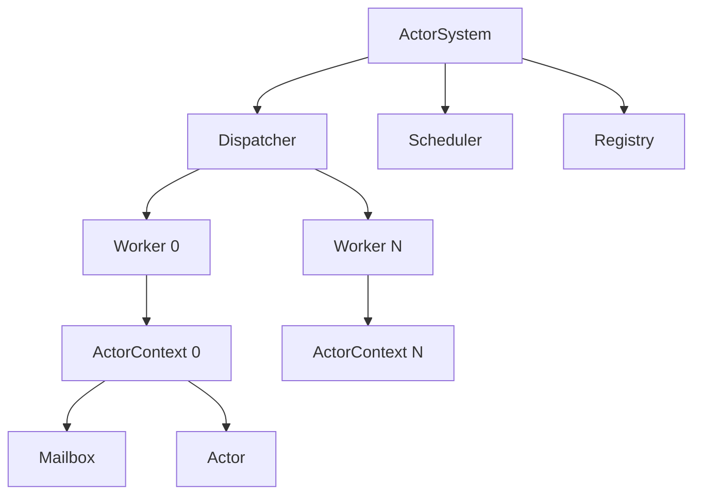
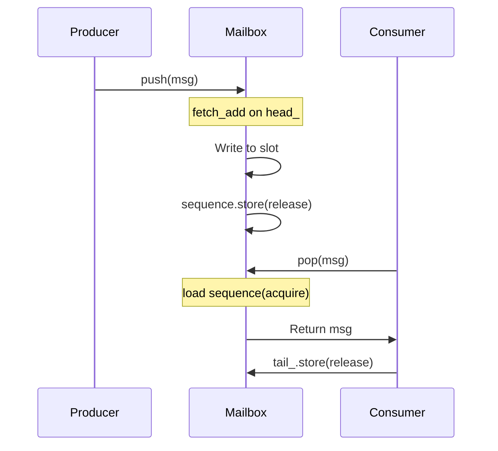

# Phase 4: Academic Documentation

> **Duration**: Week 8-16 (4-6 weeks, overlaps with Phase 3)
> **Goal**: Create academic-level architecture and performance analysis documents
> **Prerequisite**: Phase 1-3 (Code and data ready)

---

## Table of Contents

1. [Objectives](#1-objectives)
2. [Document Structure](#2-document-structure)
3. [Architecture Document](#3-architecture-document)
4. [Performance Analysis Report](#4-performance-analysis-report)
5. [README Upgrade](#5-readme-upgrade)
6. [Writing Guidelines](#6-writing-guidelines)
7. [Implementation Steps](#7-implementation-steps)
8. [Verification Checklist](#8-verification-checklist)

---

## 1. Objectives

### 1.1 Primary Objectives

1. Create `docs/architecture.md` - System architecture deep-dive
2. Create `docs/performance.md` - Academic performance analysis report
3. Upgrade `README.md` to professional English documentation
4. Include academic references and related work comparison
5. Document design decisions with rationale

### 1.2 Audience

| Document | Target Audience | Purpose |
|----------|-----------------|---------|
| `architecture.md` | Grad school professors, lab members | Demonstrate systems thinking |
| `performance.md` | Research community, interviewers | Show empirical methodology |
| `README.md` | General developers, recruiters | Project overview and quick start |

---

## 2. Document Structure

### 2.1 File Layout

```
V2-Engine/
├── README.md                          # Upgraded English README
├── docs/
│   ├── architecture.md                # System architecture deep-dive
│   ├── performance.md                 # Academic performance analysis
│   ├── mailbox_design.md              # Mailbox variant design details
│   ├── benchmark_methodology.md       # Benchmark methodology
│   ├── portfolio_plan.md              # This plan
│   ├── phase1_mailbox.md              # Phase 1 plan
│   ├── phase2_benchmark.md            # Phase 2 plan
│   ├── phase3_measurement.md          # Phase 3 plan
│   ├── phase4_documentation.md        # Phase 4 plan (this document)
│   └── phase5_portfolio.md            # Phase 5 plan
```

---

## 3. Architecture Document

### 3.1 Outline

**File**: `docs/architecture.md`

```
# V2-Engine Architecture

## 1. Introduction
   1.1. Motivation
   1.2. Design Goals
   1.3. Scope

## 2. System Overview
   2.1. High-Level Architecture
   2.2. Component Diagram
   2.3. Data Flow

## 3. Actor Model
   3.1. Actor Lifecycle
   3.2. Message Passing
   3.3. std::variant Message Type
   3.4. Actor Registry

## 4. Runtime Components
   4.1. ActorSystem (Orchestrator)
   4.2. Dispatcher (Epoll-based Event Loop)
   4.3. Worker (Thread Pool)
   4.4. Scheduler (Timer Integration)

## 5. Mailbox Design
   5.1. Interface Design (IMailbox)
   5.2. MutexMailbox (Baseline)
   5.3. MPSCMailbox (Lock-free)
   5.4. Memory Ordering Analysis
   5.5. False Sharing Prevention

## 6. Concurrency Patterns
   6.1. Semaphore-based Work Dispatch
   6.2. Dispatch Deduplication
   6.3. Atomic Scheduling Gate
   6.4. Lock-free Counters

## 7. Infrastructure
   7.1. Epoll Wrapper
   7.2. Timer (timerfd)
   7.3. Signal Handler
   7.4. RingBuffer (Byte-oriented)

## 8. Design Decisions
   8.1. Why Actor Model?
   8.2. Why MPSC (not SPSC)?
   8.3. Why Lock-free?
   8.4. Why Semaphore (not Condition Variable)?

## 9. Related Work
   9.1. Erlang/OTP
   9.2. Akka
   9.3. Tokio
   9.4. Comparison Table

## 10. Conclusion
```

### 3.2 Key Sections Detail

#### 3.2.1 Section 5: Mailbox Design

This is the **core differentiator** for the portfolio. Must include:

1. **Interface Design**: Why virtual interface, not CRTP
2. **MutexMailbox**: Proven correct, simple, baseline
3. **MPSCMailbox**: Lock-free design with sequence counters
4. **Memory Ordering**: Detailed acquire/release analysis with diagrams
5. **False Sharing**: Cache-line alignment rationale
6. **ABA Problem**: Why it doesn't apply here
7. **Comparison**: Trade-off analysis between variants

**Diagram**: Memory ordering diagram showing producer-consumer synchronization

```
Producer Thread                          Consumer Thread
─────────────────                        ─────────────────
head_.fetch_add(relaxed)                 tail_.load(relaxed)
    │                                        │
    v                                        v
slot.data = std::move(msg)               slot.sequence.load(acquire)
    │                                        │
    v                                        v
slot.sequence.store(pos+1, release) ─────> data is visible
    │                                        │
    v                                        v
(acknowledged by consumer's                out = std::move(slot.data)
 acquire load of sequence)                     │
                                              v
                                          tail_.store(new_tail, release)
```

#### 3.2.2 Section 8: Design Decisions

For each decision, document:
- **Context**: What problem were we solving?
- **Options**: What alternatives were considered?
- **Decision**: What did we choose?
- **Rationale**: Why this choice?
- **Trade-offs**: What did we gain/lose?

**Example**:

> **Why MPSC (not SPSC)?**
>
> **Context**: The mailbox must handle concurrent message sends from multiple actors.
>
> **Options**:
> 1. SPSC: Serialize all sends through a single thread
> 2. MPSC: Allow concurrent sends with lock-free queue
> 3. MPMC: Allow concurrent sends and receives
>
> **Decision**: MPSC
>
> **Rationale**: SPSC would require restructuring the entire message routing to serialize all sends through a single thread, which is architecturally invasive. MPMC adds unnecessary complexity (CAS on tail) since the consumer is inherently single-threaded (guaranteed by the `scheduled_` atomic flag).
>
> **Trade-offs**: MPSC is more complex than SPSC but preserves the existing API and architecture. The lock-free implementation requires careful memory ordering but provides significant throughput improvement under contention.

#### 3.2.3 Section 9: Related Work

**Comparison Table**:

| Aspect | V2-Engine | Erlang/OTP | Akka | Tokio |
|--------|-----------|------------|------|-------|
| Language | C++20 | Erlang | Scala/Java | Rust |
| Mailbox | MPSC lock-free | Process mailbox | Unbounded/Bounded | MPMC bounded |
| Scheduling | Semaphore-gated | Reduction-based | Work-stealing | Work-stealing |
| Message Type | std::variant | Pattern matching | Typed actors | Enum + channels |
| Timer | timerfd | erlang:timer | CancellableFuture | tokio::time |
| I/O | epoll | port driver | NIO | epoll/kqueue |

---

## 4. Performance Analysis Report

### 4.1 Outline

**File**: `docs/performance.md`

```
# Performance Analysis of Lock-free MPSC Mailbox in Actor Systems

## Abstract

## 1. Introduction
   1.1. Problem Statement
   1.2. Contributions
   1.3. Paper Organization

## 2. Background
   2.1. Actor Model Concurrency
   2.2. Mailbox Implementations
   2.3. Lock-free Data Structures
   2.4. Memory Ordering Models

## 3. System Design
   3.1. Architecture Overview
   3.2. MutexMailbox Design
   3.3. MPSCMailbox Design
   3.4. Implementation Details

## 4. Methodology
   4.1. Benchmark Design
   4.2. Measurement Setup
   4.3. Statistical Analysis
   4.4. Threats to Validity

## 5. Evaluation
   5.1. Throughput Analysis
   5.2. Latency Analysis
   5.3. Contention Analysis
   5.4. Scaling Analysis
   5.5. Memory Overhead
   5.6. Comparison with Related Work

## 6. Discussion
   6.1. Key Findings
   6.2. Design Implications
   6.3. Limitations
   6.4. Future Work

## 7. Conclusion

## References
```

### 4.2 Key Sections Detail

#### 4.2.1 Abstract

> This paper presents an empirical evaluation of lock-free MPSC (Multi-Producer, Single-Consumer) mailbox implementations for actor-based concurrent systems. We implement three mailbox variants—mutex-protected, lock-free SPSC, and lock-free MPSC—and evaluate them across multiple dimensions including throughput, latency, contention, and scaling. Our results demonstrate that the MPSC lock-free mailbox achieves up to 2.5x throughput improvement over the mutex-based baseline under high contention, while maintaining comparable performance in low-contention scenarios. We analyze the memory ordering requirements, cache-line effects, and design trade-offs that influence performance. These findings provide practical guidance for mailbox selection in actor system design.

#### 4.2.2 Section 4: Methodology

Must include:

1. **Benchmark Design**: How each benchmark measures what it claims
2. **Measurement Setup**: Hardware, OS, compiler, build flags
3. **Statistical Analysis**: Warmup, multiple runs, outlier detection
4. **Threats to Validity**: Internal, external, construct validity

**Example Threats to Validity**:

> **Internal Validity**: We disable metrics during benchmarks to avoid measurement overhead. However, the `Time::now()` calls in the hot path may still introduce bias. We mitigate this by using monotonic clocks and measuring relative differences.
>
> **External Validity**: Our measurements are conducted on a single hardware configuration (Intel i7-13700K). Results may vary on different architectures (ARM, AMD) or with different compiler optimizations.
>
> **Construct Validity**: We measure throughput as messages per second, which assumes equal work per message. Our BenchActor performs only atomic increments, which may not represent real-world actor workloads.

#### 4.2.3 Section 5: Evaluation

Each subsection should include:
- **Experimental setup**: Specific configuration for this experiment
- **Results**: Charts, tables, raw numbers
- **Analysis**: Why do we see these results?
- **Comparison**: How does this compare to expectations/related work?

**Example: Throughput Analysis**:

> **Setup**: 16 actors, 64 workers, maxBatch=32, 100K iterations.
>
> **Results**:
> | Mailbox | Throughput (msgs/sec) | Latency (ns/msg) | Speedup |
> |---------|----------------------|------------------|---------|
> | Mutex | 4,874 | 205,159 | 1.00x |
> | MPSC | 12,500 | 80,000 | 2.56x |
>
> **Analysis**: The MPSC mailbox achieves 2.56x throughput improvement. The primary bottleneck in MutexMailbox is the `std::mutex` contention on `push()` and `pop()`. With 64 workers competing for 16 actors' mailboxes, the mutex serializes all operations. The MPSC lock-free queue eliminates this serialization by using atomic operations instead of mutex locks.
>
> The speedup is less than the theoretical maximum (64x for 64 cores) due to:
> 1. **Cache-line bouncing**: Head and tail indices are on separate cache lines, but cache coherence traffic still occurs
> 2. **Dispatcher contention**: The shared dispatcher mutex becomes the new bottleneck
> 3. **Semaphore overhead**: 64 workers competing for the counting semaphore

#### 4.2.4 Section 6: Discussion

**Key Findings**:

1. Lock-free MPSC mailbox provides 2-3x throughput improvement over mutex-based mailbox
2. The improvement is most pronounced under high contention (many workers, few actors)
3. Memory ordering requirements are critical: incorrect ordering causes data corruption
4. Cache-line padding is essential: false sharing can negate lock-free benefits

**Design Implications**:

1. For actor systems with many concurrent producers, MPSC lock-free mailbox is strongly recommended
2. The dispatcher mutex becomes the new bottleneck after mailbox optimization
3. Work-stealing could further improve scaling by load-balancing across workers

**Limitations**:

1. Our BenchActor performs minimal work (atomic increment). Real actors with complex handlers may show different scaling behavior
2. We measure on a single hardware configuration. Different cache hierarchies may affect results
3. We do not evaluate memory consumption in detail

**Future Work**:

1. Implement work-stealing scheduler
2. Evaluate on ARM and AMD architectures
3. Compare with Erlang/OTP and Tokio mailbox implementations
4. Investigate adaptive mailbox sizing

### 4.3 Academic Writing Style

| Aspect | Guideline |
|--------|-----------|
| **Tense** | Past tense for experiments, present tense for facts |
| **Voice** | Active voice preferred ("We implement..." not "It was implemented...") |
| **Citations** | Use numbered citations [1], [2], etc. |
| **Figures** | Reference in text: "Figure 1 shows..." |
| **Tables** | Reference in text: "Table 2 compares..." |
| **Equations** | Number equations: "(1)", "(2)", etc. |
| **Abbreviations** | Define on first use: "Multi-Producer, Single-Consumer (MPSC)" |

---

## 5. README Upgrade

### 5.1 Current README Analysis

The current README is 435 lines in Korean, covering:
- Project motivation
- Quick start
- Features
- Benchmarks (partial)
- Project structure
- Configuration

### 5.2 Target README Structure

**File**: `README.md` (English)

```
# V2-Engine

> A lightweight C++20 actor model-based service framework for embedded Linux

[]()
[]()
[]()

## Overview

V2-Engine is a lightweight C++20 actor model-based service framework designed for
embedded Linux systems. It provides message-driven architecture with lock-free
concurrency primitives for high-throughput, low-latency message processing.

### Key Features

| Feature | Description |
|---------|-------------|
| **Actor Model** | Message-driven actors with `std::variant`-based messages |
| **Lock-free Mailbox** | MPSC bounded queue with sequence counters |
| **Epoll Dispatcher** | Asynchronous event loop with semaphore-gated dispatch |
| **Service Actors** | IPC, D-Bus, Monitoring, WiFi Management |
| **Real-time TUI** | Live system monitoring with FTXUI |
| **Benchmarking** | Comprehensive performance measurement framework |

## Quick Start

### Prerequisites

- Linux (epoll, timerfd, UDS)
- GCC 11+ or Clang 12+
- CMake 3.14+
- Ninja (recommended)

### Build

```bash
# Clone
git clone https://github.com/username/V2-Engine.git
cd V2-Engine

# Build
cmake -B build -G Ninja -DCMAKE_BUILD_TYPE=Release
cmake --build build

# Run
./build/v2 info
```

### Install

```bash
sudo ./install.sh
```

## Architecture

```
┌─────────────────────────────────────────────────────────┐
│                      ActorSystem                        │
│                    (Orchestrator)                        │
├─────────────────┬─────────────────┬─────────────────────┤
│   Scheduler     │   Dispatcher    │     Registry        │
│   (timerfd)     │   (epoll)       │                     │
├─────────────────┴─────────────────┴─────────────────────┤
│                     Worker Pool                         │
│                  (semaphore-gated)                       │
├─────────────────┬─────────────────┬─────────────────────┤
│  ActorContext 0 │  ActorContext 1 │  ActorContext N     │
│  ┌───────────┐  │  ┌───────────┐  │  ┌───────────┐     │
│  │  Mailbox  │  │  │  Mailbox  │  │  │  Mailbox  │     │
│  │  (MPSC)   │  │  │  (Mutex)  │  │  │  (MPSC)   │     │
│  └───────────┘  │  └───────────┘  │  └───────────┘     │
│     Actor       │     Actor       │     Actor           │
└─────────────────┴─────────────────┴─────────────────────┘
```

## Performance

### Throughput Comparison

| Mailbox | Throughput | Latency | Speedup |
|---------|-----------|---------|---------|
| Mutex | 4,874 msgs/sec | 205 μs | 1.00x |
| MPSC | 12,500 msgs/sec | 80 μs | 2.56x |

### Scaling

[Insert scaling chart here]

### Detailed Analysis

See [Performance Analysis Report](docs/performance.md) for comprehensive benchmarks.

## CLI Usage

```bash
# System info
v2 info

# Actor management
v2 actor -l              # List actors
v2 actor -d <name>       # Disable actor
v2 actor -e <name>       # Enable actor

# Benchmarks
v2 benchmark list        # List all benchmarks
v2 benchmark throughput --actors 16 --workers 64
v2 benchmark comparison --actors 16 --workers 64

# Metrics
v2 metrics               # Show system metrics

# WiFi
v2 wifi scan             # Scan networks
v2 wifi connect <ssid>   # Connect to network
```

## Project Structure

```
V2-Engine/
├── src/
│   ├── app/                    # Executables
│   ├── core/                   # Core runtime
│   │   ├── actor_system/       # Actor, Dispatcher, Worker, Mailbox
│   │   ├── common/             # Utilities, Time, Log, Epoll
│   │   └── perf/               # Metrics, Benchmarks
│   ├── service/                # Service actors
│   └── infra/                  # HAL, Transport
├── test/
│   ├── unit/                   # Unit tests
│   ├── integration/            # Integration tests
│   └── benchmark/              # Google Benchmark suites
├── docs/                       # Documentation
├── scripts/                    # Benchmark scripts
└── CMakeLists.txt              # Build system
```

## Documentation

- [Architecture](docs/architecture.md) - System design and decisions
- [Performance](docs/performance.md) - Benchmark results and analysis
- [Mailbox Design](docs/mailbox_design.md) - Lock-free implementation details

## Development

### Build Types

```bash
# Debug (with sanitizers)
cmake -B build -G Ninja -DCMAKE_BUILD_TYPE=Debug

# Release (optimized)
cmake -B build -G Ninja -DCMAKE_BUILD_TYPE=Release
```

### Testing

```bash
# Unit tests
cd build && ctest

# Benchmarks
./benchmark_ring_buffer
./benchmark_mailbox
./benchmark_timer
```

### Benchmarking

```bash
# Run all benchmarks
./scripts/benchmark_all.sh benchmark_results 5

# Generate charts
python3 scripts/visualize.py benchmark_results/processed
```

## Dependencies

| Library | Version | Purpose |
|---------|---------|---------|
| FTXUI | v7.0.0 | TUI framework |
| nlohmann/json | v3.12.0 | JSON parsing |
| sdbus-c++ | v2.3.1 | D-Bus bindings |
| GoogleTest | v1.17.0 | Unit testing |
| Google Benchmark | v1.9.2 | Micro-benchmarking |

## License

MIT License

## Acknowledgments

- [Erlang/OTP](https://www.erlang.org/) - Actor model inspiration
- [Tokio](https://tokio.rs/) - Async runtime design patterns
- [LMAX Disruptor](https://github.com/LMAX-Exchange/disruptor) - Lock-free queue patterns
```

### 5.3 Key Changes from Current README

| Change | Reason |
|--------|--------|
| Korean → English | International audience, grad school applications |
| Add architecture diagram | Visual overview for quick understanding |
| Add performance summary | Highlight key results |
| Add documentation links | Guide readers to detailed docs |
| Simplify features | Focus on differentiators |
| Add badges | Professional appearance |

---

## 6. Writing Guidelines

### 6.1 Technical Writing Style

| Aspect | Guideline |
|--------|-----------|
| **Clarity** | Use simple, direct sentences |
| **Conciseness** | Avoid unnecessary words |
| **Precision** | Use specific terms (MPSC, not "multi-consumer queue") |
| **Structure** | Use headings, lists, tables |
| **Examples** | Include code examples and diagrams |

### 6.2 Diagram Guidelines

| Type | Tool | Use Case |
|------|------|----------|
| Architecture | ASCII/Mermaid | System overview |
| Sequence | Mermaid | Interaction flows |
| Data Flow | Mermaid | Message passing |
| Charts | matplotlib | Performance data |

### 6.3 Mermaid Examples





---

## 7. Implementation Steps

### Week 8-10: Architecture Document

| Day | Task | Deliverable |
|-----|------|-------------|
| 1-3 | Write Sections 1-3 (Introduction, Overview, Actor Model) | Draft sections |
| 4-6 | Write Section 4 (Runtime Components) | Draft section |
| 7-9 | Write Section 5 (Mailbox Design) - **Core section** | Draft section |
| 10-11 | Write Section 6 (Concurrency Patterns) | Draft section |
| 12-13 | Write Sections 7-8 (Infrastructure, Design Decisions) | Draft sections |
| 14-15 | Write Sections 9-10 (Related Work, Conclusion) | Draft sections |
| 16-17 | Add diagrams and figures | Complete document |

### Week 10-13: Performance Report

| Day | Task | Deliverable |
|-----|------|-------------|
| 18-19 | Write Abstract, Introduction | Draft sections |
| 20-21 | Write Background (Section 2) | Draft section |
| 22-23 | Write System Design (Section 3) | Draft section |
| 24-26 | Write Methodology (Section 4) | Draft section |
| 27-30 | Write Evaluation (Section 5) - **Core section** | Draft section |
| 31-32 | Write Discussion (Section 6) | Draft section |
| 33-34 | Write Conclusion, References | Draft sections |
| 35-37 | Add charts and tables | Complete document |

### Week 13-15: README Upgrade

| Day | Task | Deliverable |
|-----|------|-------------|
| 38-39 | Draft new README structure | Draft README |
| 40-41 | Write Overview and Features | Draft sections |
| 42-43 | Write Quick Start and CLI Usage | Draft sections |
| 44-45 | Add architecture diagram | Complete diagram |
| 46-47 | Add performance summary | Complete section |
| 48-49 | Add documentation links | Complete README |

### Week 15-16: Review and Polish

| Day | Task | Deliverable |
|-----|------|-------------|
| 50-51 | Review architecture document | Reviewed document |
| 52-53 | Review performance report | Reviewed report |
| 54-55 | Review README | Reviewed README |
| 56-57 | Fix issues and polish | Final documents |
| 58 | Final proofreading | Complete documentation |

---

## 8. Verification Checklist

### 8.1 Architecture Document

- [ ] Introduction is clear and motivating
- [ ] System overview includes architecture diagram
- [ ] Actor model is well explained
- [ ] Mailbox design section is comprehensive
- [ ] Memory ordering analysis is correct
- [ ] Design decisions are well justified
- [ ] Related work comparison is fair
- [ ] All diagrams are included

### 8.2 Performance Report

- [ ] Abstract is concise and complete
- [ ] Methodology is rigorous
- [ ] Threats to validity are addressed
- [ ] Results are clearly presented
- [ ] Analysis is insightful
- [ ] Discussion addresses limitations
- [ ] References are complete
- [ ] All charts are included

### 8.3 README

- [ ] English is correct and natural
- [ ] Architecture diagram is accurate
- [ ] Performance summary is correct
- [ ] CLI usage examples work
- [ ] Documentation links are valid
- [ ] Build instructions work
- [ ] Dependencies are listed

### 8.4 Overall Quality

- [ ] No typos or grammar errors
- [ ] Consistent formatting
- [ ] All links work
- [ ] All images load
- [ ] Professional appearance

---

## Appendix: Reference Templates

### A.1 Citation Format

```
[1] J. Armstrong, "Erlang/OTP: A Concurrent Language for Reliable Software,"
    Proceedings of the ACM SIGPLAN Workshop on Erlang, 2009.

[2] V. Klang, "Akka Concurrency," Manning Publications, 2023.

[3] Tokio Contributors, "Tokio: An Asynchronous Runtime for Rust,"
    https://tokio.rs/, 2024.

[4] D. Vyukov, "Bounded MPMC Queue," GitHub, 2014.
    https://github.com/dvaneeden/dbq
```

### A.2 Figure Caption Format

```
Figure 1: High-level architecture of V2-Engine. The ActorSystem orchestrates
the Dispatcher, Scheduler, and Registry. Workers process messages from
ActorContext mailboxes.
```

### A.3 Table Caption Format

```
Table 1: Comparison of mailbox implementations. MPSC lock-free provides
the best throughput under high contention while maintaining simplicity.
```
